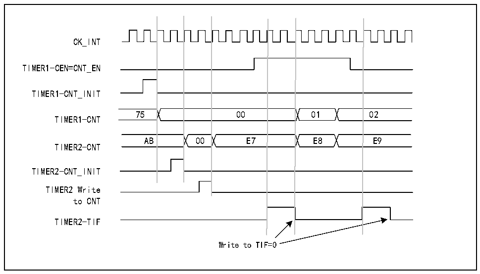
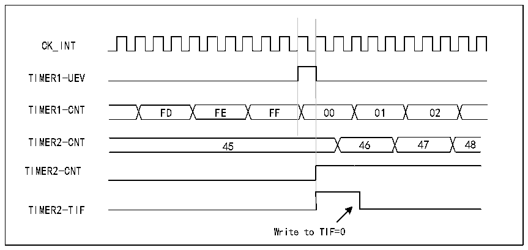

<!-- source-page: 119 -->

[← p.118](0118.md) · [index](../README.md) · [PDF p.119](https://ch32-riscv-ug.github.io/CH32X035/datasheet_zh/CH32X035RM.PDF#page=119) · [p.120 →](0120.md)

<!-- header: CH32X035系列应用手册 https://wch.cn -->

图12-12 使用定时器1的使能信号对定时器2实施门控控制  
 <!-- rendered from the PDF; verify at https://ch32-riscv-ug.github.io/CH32X035/datasheet_zh/CH32X035RM.PDF#page=119 -->

🖼 Text parsed from the figure above

CK_INT  
01E8  00  00  E7  
TIMER1-CEN=CNT_EN  
TIMER1-CNT_INIT  
TIMER1-CNT  
TIMER2-CNT  
TIMER2-CNT_INIT  
TIMER2 Write  
to CNT  
TIMER2-TIF  
Write to TIF=0  

使用一个定时器启动另一个定时器  
本例中使用定时器1的更新事件使能定时器2。只要定时器1生成更新事件，定时器2便根据  
分频后的内部时钟从当前值（可以不为0）开始计数。定时器2收到触发信号时，其CEN位自动置1，  
并且计数器开始计数，直到向R16_TIM2_CTLR1寄存器的CEN位写入“0”后停止计数。两个计数器  
的时钟频率都基于CK_INT通过预分频器执行3分频(fCK_CNT=fCK_INT/3)。  
1) 将定时器1配置为主模式，发送其更新事件(UEV)作为触发输出（R16_TIM1_CTLR2寄存器  
中的MMS=010）。  
2) 配置定时器1的周期（R16_TIM1_ATRLR寄存器）。  
3) 配置定时器2以接收来自定时器1的输入触发（R16_TIM2_SMCFGR寄存器中的TS=000）。  
4) 将定时器2配置为触发模式（R16_TIM2_SMCFGR寄存器中的SMS=110）。  
5) 通过向CEN位（R16_TIM1_CTLR1寄存器）写入“1”启动定时器 1。  

图12-13 使用定时器1的更新事件触发定时器2  
 <!-- rendered from the PDF; verify at https://ch32-riscv-ug.github.io/CH32X035/datasheet_zh/CH32X035RM.PDF#page=119 -->

🖼 Text parsed from the figure above

CK_INT  
TIMER1-UEV  
TIMER1-CNT FD FE FF 00 01 02  
TIMER2-CNT 45 46 47 48  
TIMER2-CNT  
TIMER2-TIF  
Write to TIF=0  

如上述示例所示，用户可以在开始计数之前初始化两个计数器。图12-14显示了与图12-13具  
有相同配置，只不过处于触发模式（R16_TIM2_SMCFGR寄存器中的SMS=110）而非门控模式的计数行  
<!-- image: p119-draw-image-00001 bbox=[507.84, 786.12, 527.28, 796.68] -->
<!-- footer: V1.9 119 -->
