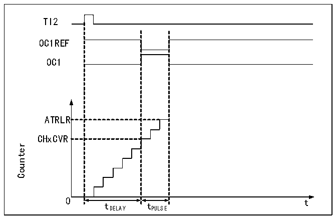

<!-- source-page: 147 -->

[← p.146](0146.md) · [index](../README.md) · [PDF p.147](https://ch32-riscv-ug.github.io/CH32X035/datasheet_zh/CH32X035RM.PDF#page=147) · [p.148 →](0148.md)

<!-- header: CH32X035系列应用手册 https://wch.cn -->

图13-4 事件产生和脉冲响应  
 <!-- rendered from the PDF; verify at https://ch32-riscv-ug.github.io/CH32X035/datasheet_zh/CH32X035RM.PDF#page=147 -->

🖼 Text parsed from the figure above

TI2  
OC1REF  
OC1  
ATRLR  
CHxCVR  
Counter  
0 t  
tDELAY tPULSE  

如图13-4所示，需要在TI2输入引脚上检测到一个上升沿开始，延迟Tdelay之后，在OC1上  
产生一个长度为Tpulse的正脉冲：  
1） 设定TI2为触发。置CC2S域为01b，把TI2FP2映射到TI2；置CC2P位为0b，TI2FP2设为  
上升沿检测；置TS域为110b，TI2FP2设为触发源；置SMS域为110b，TI2FP2被用来启动  
计数器；  
2） Tdelay由比较捕获寄存器定义，Tpulse由自动重装值寄存器的值和比较捕获寄存器的值确  
定。  

### 13.3.8 TIMx 定时器和外部触发的同步

定时器能够在复位模式、门控模式和触发模式下和一个外部触发同步。  
从模式：复位模式  
计数器及其预分频器可以响应触发输入事件而被重新初始化；如果 R16_TIMx_CTLR1 寄存器的  
URS 位为低，则产生一个更新事件 UEV；然后更新所有的预装载寄存器(R16_TIMx_ATRLR，  
R16_TIMx_CHxCVR)。  
以下示例中，当TI1输入出现上升沿，向上计数器清零：  
1) 配置通道1以检测TI1的上升沿。配置输入滤波器带宽(本例不需要任何滤波器，因此保持  
IC1F=0000)。无需配置捕获分频器，因为其不用于触发操作。CC1S位只选择输入捕获源，  
即CC1S=01（在R16_TIMx_CCMR1中）。将CC1P=0和CC1NP=&#x27;0&#x27;写入R16_TIMx_CCER寄存器  
以验证极性(只检测上升沿)。  
2) 将 SMS=100 写入 R16_TIMx_SMCFGR，配置定时器为复位模式；将 TS=101 写入  
R16_TIMx_SMCFGR，选择TI1作为输入源。  
3) 将CEN=1写入R16_TIMx_CTLR1，启动计数器。  
计数器使用内部时钟计数，然后正常运转，当出现一个TI1上升沿，计数器清零并从0开始重  
新计数。同时，触发标志TIF位置1，使能中断后，可以发送中断请求。（取决于R16_TIMx_DMAINTENR  
寄存器中TIE(中断使能位）。  
下图显示当自动重装载寄存器 R16_TIMx_ARR=0x36 时的动作。TI1 上升沿与实际计数器复位之  
间的延时是TI1输入端的重新同步电路造成的。  
<!-- image: p147-draw-image-00001 bbox=[507.84, 786.12, 527.28, 796.68] -->
<!-- footer: V1.9 147 -->
