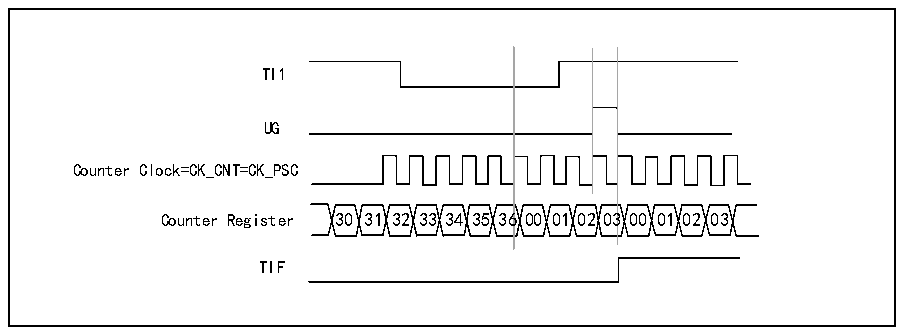
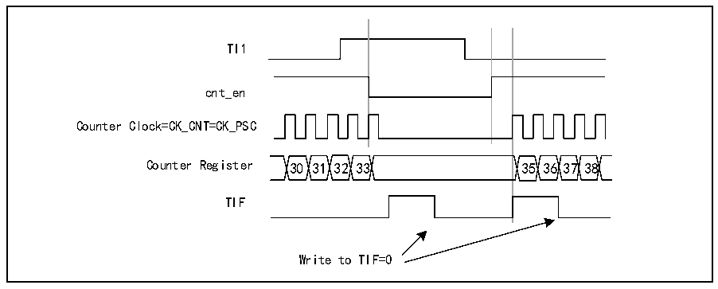

<!-- source-page: 148 -->

[← p.147](0147.md) · [index](../README.md) · [PDF p.148](https://ch32-riscv-ug.github.io/CH32X035/datasheet_zh/CH32X035RM.PDF#page=148) · [p.149 →](0149.md)

<!-- header: CH32X035系列应用手册 https://wch.cn -->

图13-5 复位模式下的控制电路  
 <!-- rendered from the PDF; verify at https://ch32-riscv-ug.github.io/CH32X035/datasheet_zh/CH32X035RM.PDF#page=148 -->

🖼 Text parsed from the figure above

TI1  
UG  
Counter Clock=CK_CNT=CK_PSC  
Counter Register 30 31 32 33 34 35 36 00 0102 03 00 01 02 03  
TIF  

从模式：门控模式  
输入信号的电平使能计数器。以下的例子中，仅TI1为低时计数器向上计数：  
1) 配置通道1以检测TI1上的低电平。配置输入滤波器带宽(本例不需要任何滤波器，因此保  
持IC1F=0000)。无需配置捕获分频器，因为其不用于触发操作。CC1S位只选择输入捕获源，  
即CC1S=01（在R16_TIMx_CCMR1中）。将CC1P=1和CC1NP=&#x27;0&#x27;写入R16_TIMx_CCER寄存器  
以验证极性(只检测低电平)。  
2) 将 SMS=101 写入 R16_TIMx_SMCFGR，配置定时器为门控模式；将 TS=101 写入  
R16_TIMx_SMCFGR，选择TI1作为输入源。  
3) 将CEN=1写入R16_TIMx_CTLR1，启动计数器。门控模式下，如果CEN=0，无论触发输入电  
平如何，计数器都不会启动。  
只要 TI1 为低，计数器开始依据内部时钟计数，TI1 变高时停止计数。当计数器开始或停止时  
都将R16_TIMx_INTFR中的TIF位置1。TI1上升沿与实际计数器复位之间的延时是TI1输入端的重  
新同步电路造成的。  

图13-6 门控模式下的控制电路  
 <!-- rendered from the PDF; verify at https://ch32-riscv-ug.github.io/CH32X035/datasheet_zh/CH32X035RM.PDF#page=148 -->

🖼 Text parsed from the figure above

TI1  
cnt_en  
Counter Clock=CK_CNT=CK_PSC  
Counter Register 30 31 32 33 35 36 37 38  
TIF  
Write to TIF=0  

从模式：触发模式  
选择的输入端上发生事件时将使能计数器。以下示例中，当TI2输入出现上升沿，向上计数器  
启动：  
1) 配置通道2以检测TI2的上升沿。配置输入滤波器带宽(本例不需要任何滤波器，因此保持  
IC2F=0000)。无需配置捕获分频器，因为其不用于触发操作。CC2S位只选择输入捕获源，  
置CC2S=01（在R16_TIMx_CCMR1中）。将CC2P=1和CC2NP=‘0’写入R16_TIMx_CCER寄存  
器以验证极性（只检测低电平）  
2) 将 SMS=110 写入 R16_TIMx_SMCFGR 寄存器，配置定时器为触发模式；将 TS=110 写入  
<!-- image: p148-draw-image-00001 bbox=[507.84, 786.12, 527.28, 796.68] -->
<!-- footer: V1.9 148 -->
