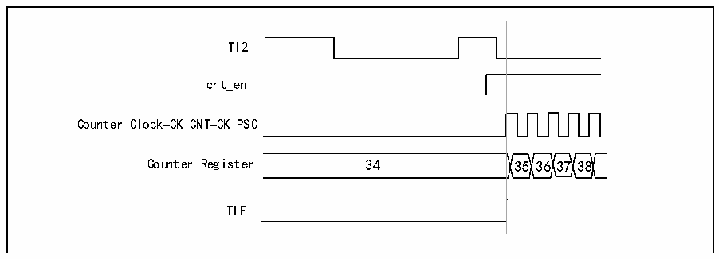

<!-- source-page: 149 -->

[← p.148](0148.md) · [index](../README.md) · [PDF p.149](https://ch32-riscv-ug.github.io/CH32X035/datasheet_zh/CH32X035RM.PDF#page=149) · [p.150 →](0150.md)

<!-- header: CH32X035系列应用手册 https://wch.cn -->
R16_TIMx_SMCFGR寄存器，选择TI2作为输入源。  
当TI2出现上升沿，计数器开始在内部时钟驱动下计数，同时TIF置1。  
TI2上升沿和实际计数器启动之间的延时，是由TI2输入端的重同步电路造成。  

图13-7 触发模式下的控制电路  
 <!-- rendered from the PDF; verify at https://ch32-riscv-ug.github.io/CH32X035/datasheet_zh/CH32X035RM.PDF#page=149 -->

🖼 Text parsed from the figure above

TI2  
cnt_en  
Counter Clock=CK_CNT=CK_PSC  
Counter Register 34 35 36 37 38  
TIF  

### 13.3.10 调试模式

当系统进入调试模式时，根据DBG模块的设置可以控制定时器继续运转或者停止。  

## 13.4 寄存器描述

<!-- p149-table-001 (table-13-1@1) -->
<table><caption>表13-1 TIM3相关寄存器列表</caption><tr><th>名称</th><th>偏移地址</th><th>描述</th><th>复位值</th></tr><tr><td>R16_TIM3_CTLR1</td><td>0x40000400</td><td>TIM3控制寄存器1</td><td>0x0000</td></tr><tr><td>R16_TIM3_SMCFGR</td><td>0x40000408</td><td>TIM3从模式控制寄存器</td><td>0x0000</td></tr><tr><td>R16_TIM3_DMAINTENR</td><td>0x4000040C</td><td>TIM3中断使能寄存器</td><td>0x0000</td></tr><tr><td>R16_TIM3_INTFR</td><td>0x40000410</td><td>TIM3中断状态寄存器</td><td>0x0000</td></tr><tr><td>R16_TIM3_SWEVGR</td><td>0x40000414</td><td>TIM3事件产生寄存器</td><td>0x0000</td></tr><tr><td>R16_TIM3_CHCTLR1</td><td>0x40000418</td><td>TIM3比较/捕获控制寄存器1</td><td>0x0000</td></tr><tr><td>R16_TIM3_CCER</td><td>0x40000420</td><td>TIM3比较/捕获使能寄存器</td><td>0x0000</td></tr><tr><td>R16_TIM3_CNT</td><td>0x40000424</td><td>TIM3计数器</td><td>0x0000</td></tr><tr><td>R16_TIM3_PSC</td><td>0x40000428</td><td>TIM3计数时钟预分频器</td><td>0x0000</td></tr><tr><td>R16_TIM3_ATRLR</td><td>0x4000042C</td><td>TIM3自动重装值寄存器</td><td>0xFFFF</td></tr><tr><td>R32_TIM3_CH1CVR</td><td>0x40000434</td><td>TIM3比较/捕获寄存器1</td><td>0x00000000</td></tr><tr><td>R32_TIM3_CH2CVR</td><td>0x40000438</td><td>TIM3比较/捕获寄存器2</td><td>0x00000000</td></tr><tr><td>R16_TIM3_SPEC</td><td>0x40000450</td><td>SPEC寄存器</td><td>0x0000</td></tr></table>

### 13.4.1 控制寄存器1（TIM3_CTLR1）

偏移地址：0x00  

<!-- p149-table-002 (table-13-1@1) -->
<table class="bitfield"><colgroup><col style="width:6.2500%"><col style="width:6.2500%"><col style="width:6.2500%"><col style="width:6.2500%"><col style="width:6.2500%"><col style="width:6.2500%"><col style="width:6.2500%"><col style="width:6.2500%"><col style="width:6.2500%"><col style="width:6.2500%"><col style="width:6.2500%"><col style="width:6.2500%"><col style="width:6.2500%"><col style="width:6.2500%"><col style="width:6.2500%"><col style="width:6.2500%"></colgroup><tr><th>15</th><th>14</th><th>13</th><th>12</th><th>11</th><th>10</th><th>9</th><th>8</th><th>7</th><th>6</th><th>5</th><th>4</th><th>3</th><th>2</th><th>1</th><th>0</th></tr><tr><td>CAPLVL</td><td>CAPOV</td><td colspan="4">Reserved</td><td colspan="2">CKD[1:0]</td><td>ARPE</td><td colspan="3">Reserved</td><td>OPM</td><td>URS</td><td>UDIS</td><td>CEN</td></tr></table>

<!-- p149-table-003 (table-13-1@1) pages 149-151 -->
<table><tr><th>位</th><th>名称</th><th>访问</th><th>描述</th><th>复位值</th></tr><tr><td>15</td><td>CAPLVL</td><td>RW</td><td style="text-align:left">双沿捕获模式下，捕获电平指示使能： 1：使能指示功能； 0：关闭指示功能。 注：使能后，CHxCVR的bit[16]指示捕获值对应的电平。</td><td>0</td></tr><tr><td>14</td><td>CAPOV</td><td>RW</td><td style="text-align:left">捕获值模式配置： 1：当捕获前产生计数器溢出时，CHxCVR 值为0xFFFF； 0：捕获值为实际计数器的值。</td><td>0</td></tr><tr><td>[13:10]</td><td>Reserved</td><td>RO</td><td>保留。</td><td>0</td></tr><tr><td>[9:8]</td><td>CKD[1:0]</td><td>RW</td><td style="text-align:left">这2位定义在定时器时钟(CK_INT)频率、数字滤波器所用的采样时钟之间的分频比例： 00：Tdts=Tck_int； 01：Tdts= 2xTck_int； 10：Tdts= 4xTck_int； 11：保留。</td><td>0</td></tr><tr><td>7</td><td>ARPE</td><td>RW</td><td style="text-align:left">自动重装预装使能位： 1：使能自动重装值寄存器（ATRLR）； 0：禁止自动重装值寄存器（ATRLR）。</td><td>0</td></tr><tr><td>[6:4]</td><td>Reserved</td><td>RO</td><td>保留。</td><td>0</td></tr><tr><td>3</td><td>OPM</td><td>RW</td><td style="text-align:left">单脉冲模式。 1：在发生下一次更新事件(清除CEN位)时，计数器停止； 0：在发生下一次更新事件时，计数器不停止。</td><td>0</td></tr><tr><td>2</td><td>URS</td><td>RW</td><td style="text-align:left">更新请求源，软件通过该位选择UEV事件的源。 1：如果使能了更新中断请求，则只有计数器溢出/ 下溢才产生更新中断请求； 0：如果使能了更新中断请求，则下述任一事件产生更新中断请求： -计数器溢出/下溢 -设置UG位 -从模式控制器产生的更新</td><td>0</td></tr><tr><td>1</td><td>UDIS</td><td>RW</td><td style="text-align:left">禁止更新，软件通过该位允许/禁止 UEV 事件的产生。 1：禁止UEV。不产生更新事件，各寄存器(ATRLR、 PSC、CHCTLRx)保持它们的值。如果设置了UG位或从模式控制器发出了一个硬件复位，则计数器和预分频器被重新初始化。 0：允许UEV。更新(UEV)事件由下述任一事件产生 -计数器溢出/下溢 -设置UG位 -从模式控制器产生的更新具有缓存的寄存器被装入它们的预装载值。</td><td>0</td></tr><tr><td>0</td><td>CEN</td><td>RW</td><td style="text-align:left">使能计数器 (Counter enable)。 1：使能计数器； 0：禁止计数器。 注：在软件设置了CEN位后，外部时钟、门控模式才能工作。触发模式可以自动地通过硬件设置CEN位。</td><td style="text-align:left">0式N</td></tr></table>

<!-- image: p149-draw-image-00001 bbox=[507.84, 786.12, 527.28, 796.68] -->
<!-- footer: V1.9 149 -->
