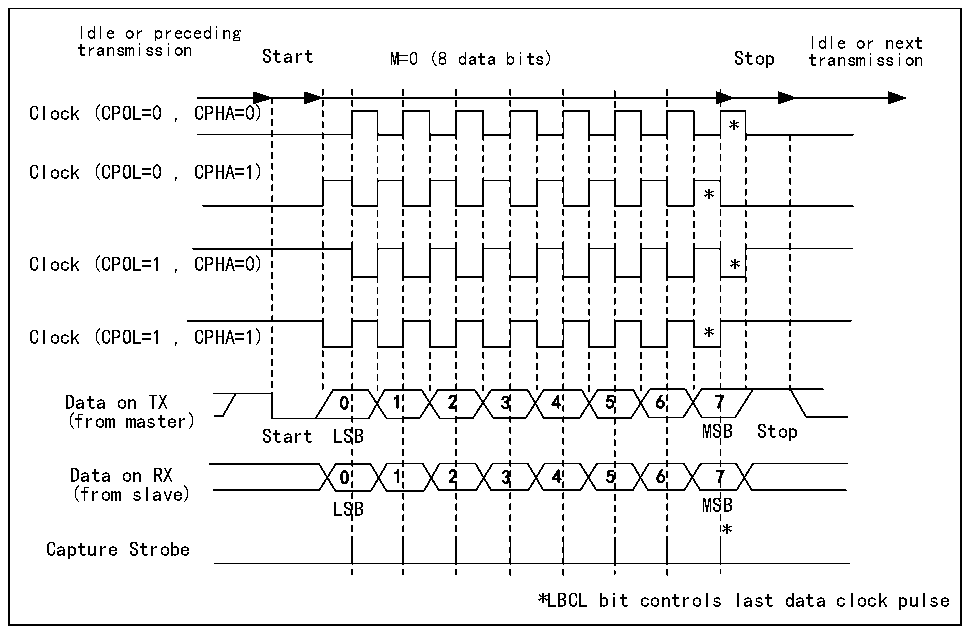
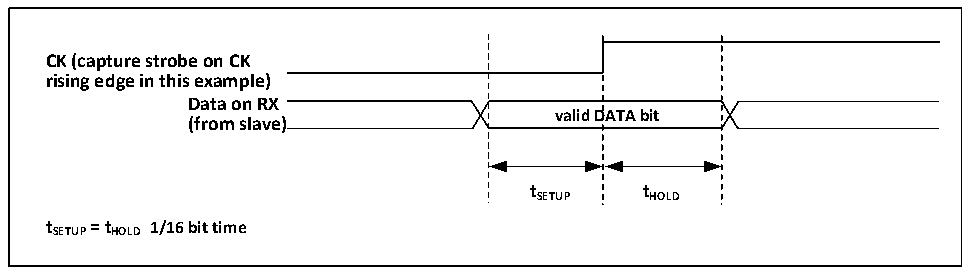

<!-- source-page: 161 -->

[← p.160](0160.md) · [index](../README.md) · [PDF p.161](https://ch32-riscv-ug.github.io/CH32X035/datasheet_zh/CH32X035RM.PDF#page=161) · [p.162 →](0162.md)

<!-- header: CH32X035系列应用手册 https://wch.cn -->

图14-2 USART时钟时序示例(M=0)  
 <!-- rendered from the PDF; verify at https://ch32-riscv-ug.github.io/CH32X035/datasheet_zh/CH32X035RM.PDF#page=161 -->

🖼 Text parsed from the figure above

Idle or preceding  
Idle or next  
transmission Start M=0 (8 data bits) Stop transmission  
1SB1SB  22  3 2 3  4 3 4  55  6 5 6  * * 7MS7MS  
Clock (CPOL=0 , CPHA=0)  
*  **  7  
Clock (CPOL=0 , CPHA=1)  
(from master)  
(from slave)  
LSB MSB  
*  
Capture Strobe  
*LBCL bit controls last data clock pulse  

图14-3 数据采样保持时间  
 <!-- rendered from the PDF; verify at https://ch32-riscv-ug.github.io/CH32X035/datasheet_zh/CH32X035RM.PDF#page=161 -->

🖼 Text parsed from the figure above

valid  DATA bit  
<strong>CK (capture strobe on CK</strong>  
<strong>rising edge in this example)</strong>  
<strong>Data on RX</strong>  
<strong>(from slave)</strong>  
<strong>tSETUP tHOLD</strong>  
<strong>tSETUP= tHOLD 1/16 bit time</strong>  

## 14.5 单线半双工模式

半双工模式支持使用单个引脚（只使用TX引脚）来接收和发送，TX引脚和RX引脚在芯片内部  
连接。  
开启半双工模式的方式是对控制寄存器 3（R16_USARTx_CTLR3）的 HDSEL 位置位，但同时需要  
关闭LIN模式、智能卡模式、红外模式和同步模式，即保证SCEN、CLKEN和IREN位处于复位状态，  
这三位在控制寄存器2和3（R16_USARTx_CTLR2和R16_USARTx_CTLR3）中。  
设置成半双工模式之后，需要把TX的IO口设置成输出模式外加上拉。在TE置位的情况下，只  
要将数据写到数据寄存器上，就会发送出去。特别要注意的是，半双工模式可能会出现多设备使用  
单总线收发时的总线冲突，这需要用户用软件自行避免。  

## 14.6 智能卡

智能卡模式支持ISO7816-3协议访问智能卡控制器。  
开启智能卡模式的方式是对控制寄存器3（R16_USARTx_CTLR3）的SCEN位置位，但同时需要关  
<!-- image: p161-draw-image-00001 bbox=[507.84, 786.12, 527.28, 796.68] -->
<!-- footer: V1.9 161 -->
