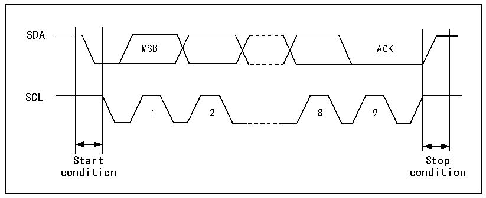

<!-- source-page: 171 -->

[← p.170](0170.md) · [index](../README.md) · [PDF p.171](https://ch32-riscv-ug.github.io/CH32X035/datasheet_zh/CH32X035RM.PDF#page=171) · [p.172 →](0172.md)

<!-- header: CH32X035系列应用手册 https://wch.cn -->

# 第 15 章 两线通信总线（I2C）

内部集成电路总线（I2C或IIC）广泛用在微控制器和传感器及其他片外模块的通讯上，它本身  
支持多主多从模式，仅仅使用两根线（SDA和SCL）就能以100KHz（标准）和400KHz（快速）两种  
速度通讯。  

## 15.1 主要特征

● 支持主机模式(Master）和从机模式(Slave)，支持多主多从。  
● 支持两种速度模式：100KHz和400KHz，兼容I2C两线串行总线规范。  
● 支持7位或10位地址。  
● 从设备支持双7位地址。  
● 支持总线广播。  
● 支持总线仲裁、错误检测、PEC校验、延长时钟。  

## 15.2 概述

I2C是半双工的总线，它同时只能运行在下列四种模式中之一：主设备发送模式、主设备接收  
模式、从设备发送模式和从设备接收模式。I2C模块默认工作在从模式，在产生起始条件后，会自  
动地切换到主模式，当仲裁丢失或产生停止信号后，会切换到从模式。I2C模块支持多主机功能。  
工作在主模式时，I2C模块会主动发出数据和地址。数据和地址都以8位为单位进行传输，高位在  
前，低位在后，在起始事件后的是一个字节（7位地址模式下）或两个字节（10位地址模式下）地  
址，主机每发送8位数据或地址，从机需要回复一个应答ACK，即把SDA总线拉低，如图15-1所  
示。  

图15-1 I2C时序图  
 <!-- rendered from the PDF; verify at https://ch32-riscv-ug.github.io/CH32X035/datasheet_zh/CH32X035RM.PDF#page=171 -->

🖼 Text parsed from the figure above

SDA  
MSB ACK  
SCL  
1 2 8 9  
Start Stop  
condition condition  

## 15.3 主模式

主模式时，I2C模块主导数据传输并输出时钟信号，数据传输以开始事件开始，以结束事件结  
束。使用主模式通讯的步骤为：  
1) 在控制寄存器2（R16_I2C1_CTLR2）和时钟控制寄存器（R16_I2C1_CKCFGR）中设置正确的  
时钟；  
2) 在控制寄存器（R16_I2C1_CTLR1）中置PE位启动外设；  
3) 在控制寄存器（R16_I2C1_CTLR1）中置START位，产生起始事件。  
在置START位后，I2C模块会自动切换到主模式，MSL位会置位，产生起始事件，在产生起始事  
件后，SB位会置位，如果ITEVTEN位（在R16_I2C1_CTLR2）被置位，则会产生中断。此时应该读取  
<!-- image: p171-draw-image-00001 bbox=[507.84, 786.12, 527.28, 796.68] -->
<!-- footer: V1.9 171 -->
