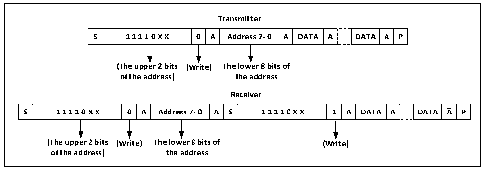

<!-- source-page: 172 -->

[← p.171](0171.md) · [index](../README.md) · [PDF p.172](https://ch32-riscv-ug.github.io/CH32X035/datasheet_zh/CH32X035RM.PDF#page=172) · [p.173 →](0173.md)

<!-- header: CH32X035系列应用手册 https://wch.cn -->
状态寄存器1（R16_I2C1_STAR1），写从地址到数据寄存器后，SB位会自动清除；  
4）如果是使用10位地址模式，那么写数据寄存器发送头序列（头序列为11110xx0b，其中的  
xx位是10位地址的最高两位）。  
在发送完头序列之后，状态寄存器的ADD10位会被置位，如果ITEVTEN位已经置位，则会产生  
中断，此时应读取R16_I2C1_STAR1寄存器后，写第二个地址字节到数据寄存器后，清除ADD10位。  
然后写数据寄存器发送第二个地址字节，在发送完第二个地址字节后，状态寄存器的ADDR位  
会被置位，如果ITEVTEN位已经置位，则会产生中断，此时应读取R16_I2C1_STAR1寄存器后再读一  
次R16_I2C1_STAR2寄存器以清除ADDR位；  
如果使用的是7位地址模式，那么写数据寄存器发送地址字节，在发送完地址字节后，状态寄  
存器的ADDR位会被置位，如果ITEVTEN位已经置位，则会产生中断，此时应读取R16_I2C1_STAR1  
寄存器后再读一次R16_I2C1_STAR2寄存器以清除ADDR位；  
在7位地址模式下，发送的第一个字节为地址字节，头7位代表的是目标从设备地址，第8位  
决定了后续报文的方向，0代表是主设备写入数据到从设备，1代表是主设备向从设备读取信息。  
在10位地址模式下，如图15-3所示，在发送地址阶段，第一个字节为11110xx0，xx为10位  
地址的最高2位，第二个字节为10位地址的低8位。若后续进入主设备发送模式，则继续发送数  
据；若后续准备进入主设备接收模式，则需要重新发送一个起始条件，跟随发送一个字节为  
11110xx1，然后进入主设备接收模式。  

图15-2 10位地址时主机收发数据示意图  
 <!-- rendered from the PDF; verify at https://ch32-riscv-ug.github.io/CH32X035/datasheet_zh/CH32X035RM.PDF#page=172 -->

🖼 Text parsed from the figure above

<strong>Transmitter</strong>  
S  1 1 1 1 0 X X  0  A  Address 7- 0  A  DATA  A  DATA  A  P  
<strong>(The upper 2 bits (Write) The lower 8 bits of</strong>  
<strong>of the address) the address</strong>  
<strong>Receiver</strong>  
S  1 1 1 1 0 X X  0  A  Address 7- 0  A  S  1 1 1 1 0 X X  1  A  DATA  A  DATA  A  P  
<strong>(The upper 2 bits (Write) The lower 8 bits of (Write)</strong>  
<strong>of the address) the address</strong>  

主发送模式：  
主设备内部的移位寄存器将数据从数据寄存器发送到SDA线上，当主设备接收到ACK时，状态  
寄存器1（R16_I2C1_STAR1）的TxE被置位，如果ITEVTEN和ITBUFEN被置位，还会产生中断。向  
数据寄存器写入数据将会清除TxE位。  
如果TxE位被置位且上次发送数据之前没有新的数据被写入数据寄存器，那么BTF位会被置位,  
在其被清除之前，SCL将保持低电平，读R16_I2C1_STAR1后，向数据寄存器写入数据将会清除BTF  
位。  
<!-- image: p172-draw-image-00001 bbox=[507.84, 786.12, 527.28, 796.68] -->
<!-- footer: V1.9 172 -->
