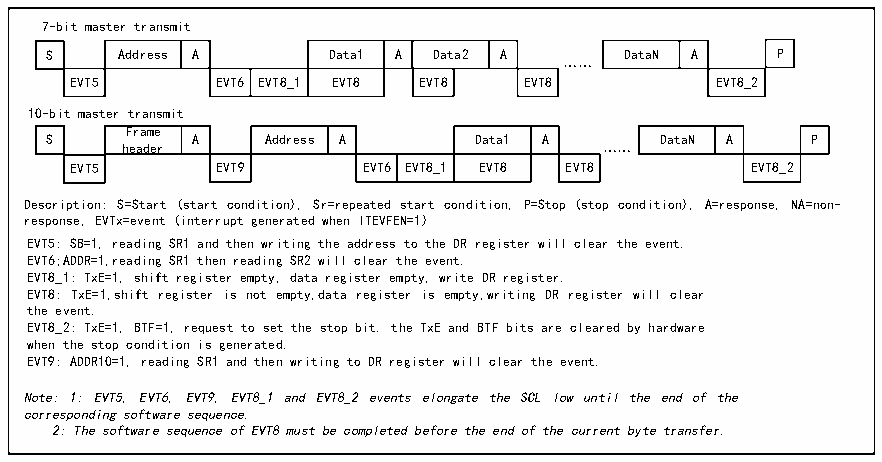
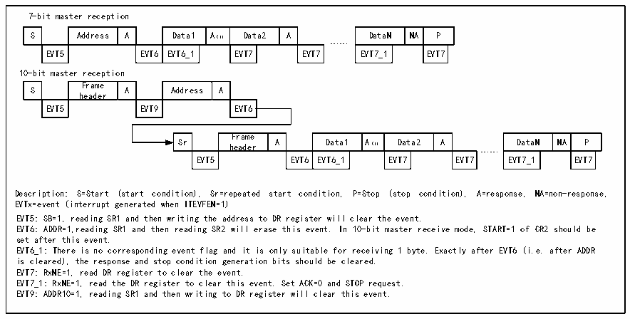

<!-- source-page: 173 -->

[← p.172](0172.md) · [index](../README.md) · [PDF p.173](https://ch32-riscv-ug.github.io/CH32X035/datasheet_zh/CH32X035RM.PDF#page=173) · [p.174 →](0174.md)

<!-- header: CH32X035系列应用手册 https://wch.cn -->

图15-3 主发送器传送序列图  
 <!-- rendered from the PDF; verify at https://ch32-riscv-ug.github.io/CH32X035/datasheet_zh/CH32X035RM.PDF#page=173 -->

🖼 Text parsed from the figure above

7-bit master transmit  
S  Address  A  Data1  A  Data2  A  EVT5  EVT6  EVT8_1  EVT8  EVT8  EVT8  
DataN  A  P  EVT8_2  
……  
10-bit master transmit  
S  Frame header  A  Address  A  Data1  A  EVT5  EVT9  EVT6  EVT8_1  EVT8  … EVT8  
DataN  A  P  EVT8_2  
Description: S=Start (start condition), Sr=repeated start condition, P=Stop (stop condition), A=response, NA=non-  
response, EVTx=event (interrupt generated when ITEVFEN=1)  
EVT5: SB=1, reading SR1 and then writing the address to the DR register will clear the event.  
EVT6;ADDR=1,reading SR1 then reading SR2 will clear the event.  
EVT8_1: TxE=1, shift register empty, data register empty, write DR register.  
EVT8: TxE=1,shift register is not empty,data register is empty,writing DR register will clear  
the event.  
EVT8_2: TxE=1, BTF=1, request to set the stop bit. the TxE and BTF bits are cleared by hardware  
when the stop condition is generated.  
EVT9: ADDR10=1, reading SR1 and then writing to DR register will clear the event.  
Note: 1: EVT5, EVT6, EVT9, EVT8_1 and EVT8_2 events elongate the SCL low until the end of the  
corresponding software sequence.  
2: The software sequence of EVT8 must be completed before the end of the current byte transfer.  

主接收模式  
I2C模块会从SDA线接收数据，通过移位寄存器写进数据寄存器。在每个字节之后，如果ACK  
位被置位，那么I2C模块将会发出一个应答低电平，同时RxNE位会被置位，如果ITEVTEN和  
ITBUFEN被置位，还会产生中断。如果RxNE被置位且在新的数据被接收前，原有的数据没有被读  
出，则BTF位将被置位，在清除BTF之前，SCL将保持低电平，读取R16_I2C1_STAR1后，再读取数  
据寄存器将会清除BTF位。  

图15-4 接收器传送序列图  
 <!-- rendered from the PDF; verify at https://ch32-riscv-ug.github.io/CH32X035/datasheet_zh/CH32X035RM.PDF#page=173 -->

🖼 Text parsed from the figure above

7-bit master reception  
S  Address  A  Data1  A（1）  Data2  A  EVT5  EVT6  EVT6_1  EVT7  EVT7  
DataN  NA  P  EVT7_1  EVT7  
……  
10-bit master reception  
S  Frame header  A  Address  A  EVT5  EVT9  EVT6  
Sr  Frame header  A  Data1  A（1）  Data2  A  EVT5  EVT6  EVT6_1  EVT7  EVT7  
DataN  NA  P  EVT7_1  EVT7  
……  
Description: S=Start (start condition), Sr=repeated start condition, P=Stop (stop condition), A=response, NA=non-response,  
EVTx=event (interrupt generated when ITEVFEN=1)  
EVT5: SB=1, reading SR1 and then writing the address to DR register will clear the event.  
EVT6: ADDR=1,reading SR1 and then reading SR2 will erase this event. In 10-bit master receive mode, START=1 of CR2 should be  
set after this event.  
EVT6_1: There is no corresponding event flag and it is only suitable for receiving 1 byte. Exactly after EVT6 (i.e. after ADDR  
is cleared), the response and stop condition generation bits should be cleared.  
EVT7: RxNE=1, read DR register to clear the event.  
EVT7_1: RxNE=1, read the DR register to clear this event. Set ACK=0 and STOP request.  
EVT9: ADDR10=1, reading SR1 and then writing to DR register will clear this event.  

# 主设备在结束发送数据时，会主动发一个结束事件，即置STOP位。在接收模式时，主设备需

要在最后一个数据位的应答位置NAK。注意，产生NAK后，I2C模块将会切换至从模式。  

## 15.4 从模式

从模式时，I2C模块能识别它自己的地址和广播呼叫地址。软件能控制开启或禁止广播呼叫地  
址的识别。一旦检测到起始事件，I2C模块将SDA的数据通过移位寄存器与自己的地址（位数取决  
于ENDUAL和ADDMODE）或广播地址（ENGC置位时）相比较，如果不匹配将会忽略，直到产生新的起  
<!-- image: p173-draw-image-00001 bbox=[507.84, 786.12, 527.28, 796.68] -->
<!-- footer: V1.9 173 -->
