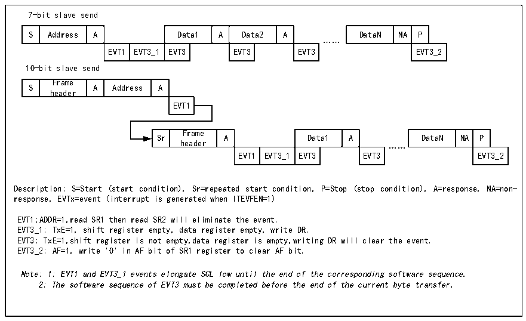

<!-- source-page: 174 -->

[← p.173](0173.md) · [index](../README.md) · [PDF p.174](https://ch32-riscv-ug.github.io/CH32X035/datasheet_zh/CH32X035RM.PDF#page=174) · [p.175 →](0175.md)

<!-- header: CH32X035系列应用手册 https://wch.cn -->
始事件。如果与头序列相匹配，则会产生一个ACK信号并等待第二个字节的地址；如果第二字节的  
地址也匹配或7位地址情况下全段地址匹配，那么：  
首先产生一个ACK应答；  
ADDR位被置位，如果ITEVTEN位已经置位，那么还会产生相应的中断；  
如果使用的是双地址模式（ENDUAL位被置位），还需要读取DUALF位来判断主机唤起的是哪一  
个地址。  
从模式默认是接收模式，在接收的头序列的最后一位为1，或7位地址最后一位为1时（取决  
于第一次接收到头序列还是普通的7位地址），I2C模块将进入到发送器模式，TRA位将指示当前是  
接收器还是发送器模式。  
从发送模式  
在清除ADDR位后，I2C模块将字节从数据寄存器通过移位寄存器发送到SDA线上。在收到一个  
应答ACK后，TxE位将被置位，如果设置了ITEVTEN和ITBUFEN，还会产生一个中断。如果TxE被置  
位但在下一个数据发送结束前没有新的数据被写入数据寄存器时，BTF位将被置位。在清除BTF  
前，SCL将保持低电平，读取状态寄存器1（R16_I2C1_STAR1）后，再向数据寄存器写入数据将会清  
除BTF位。  

图15-5 从发送器的传送序列图  
 <!-- rendered from the PDF; verify at https://ch32-riscv-ug.github.io/CH32X035/datasheet_zh/CH32X035RM.PDF#page=174 -->

🖼 Text parsed from the figure above

7-bit slave send  
S  Address  A  Data1  A  Data2  A  EVT1  EVT3_1  EVT3  EVT3  EVT3  
DataN  NA  P  EVT3_2  
……  
10-bit slave send  
S  Frame header  A  Address  A  EVT1  
Sr  Frame header  A  Data1  A  EVT1  EVT3_1  EVT3  EVT3  
DataN  NA  P  EVT3_2  
……  
Description: S=Start (start condition), Sr=repeated start condition, P=Stop (stop condition), A=response, NA=non-  
response, EVTx=event (interrupt is generated when ITEVFEN=1)  
EVT1;ADDR=1,read SR1 then read SR2 will eliminate the event.  
EVT3_1: TxE=1, shift register empty, data register empty, write DR.  
EVT3: TxE=1,shift register is not empty,data register is empty,writing DR will clear the event.  
EVT3_2: AF=1, write &#x27;0&#x27; in AF bit of SR1 register to clear AF bit.  
Note: 1: EVT1 and EVT3_1 events elongate SCL low until the end of the corresponding software sequence.  
2: The software sequence of EVT3 must be completed before the end of the current byte transfer.  

从接收模式  
在ADDR被清除后，I2C模块将SDA上的数据通过移位寄存器存进数据寄存器，在每接收到一个  
字节后，I2C模块都会置一个ACK位，并置RxNE位，如果设置了ITEVTEN和ITBUFEN，还会产生一  
个中断。如果RxNE被置位，且在接收到新的数据前旧的数据没有被读出，那么BTF会被置位。在清  
除BTF位之前SCL会保持低电平。读取状态寄存器1（R16_I2C1_STAR1）并读取数据寄存器里的数  
据会清除BTF位。  
<!-- image: p174-draw-image-00001 bbox=[507.84, 786.12, 527.28, 796.68] -->
<!-- footer: V1.9 174 -->
