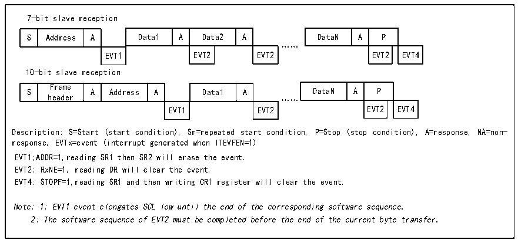

<!-- source-page: 175 -->

[← p.174](0174.md) · [index](../README.md) · [PDF p.175](https://ch32-riscv-ug.github.io/CH32X035/datasheet_zh/CH32X035RM.PDF#page=175) · [p.176 →](0176.md)

<!-- header: CH32X035系列应用手册 https://wch.cn -->

图15-6 从接收器的传送序列图  
 <!-- rendered from the PDF; verify at https://ch32-riscv-ug.github.io/CH32X035/datasheet_zh/CH32X035RM.PDF#page=175 -->

🖼 Text parsed from the figure above

7-bit slave reception  
S  Address  A  Data1  A  Data2  A  EVT1  EVT2  EVT2  
DataN  A  P  EVT2  EVT4  
……  
10-bit slave reception  
S  Frame header  A  Address  A  Data1  A  EVT1  EVT2  
DataN  A  P  EVT2  EVT4  
EVT1 EVT2 EVT2 EVT4  
Description: S=Start (start condition), Sr=repeated start condition, P=Stop (stop condition), A=response, NA=non-  
response, EVTx=event (interrupt generated when ITEVFEN=1)  
EVT1;ADDR=1,reading SR1 then SR2 will erase the event.  
EVT2: RxNE=1, reading DR will clear the event.  
EVT4: STOPF=1,reading SR1 and then writing CR1 register will clear the event.  
Note: 1: EVT1 event elongates SCL low until the end of the corresponding software sequence.  
2: The software sequence of EVT2 must be completed before the end of the current byte transfer.  

主设备在传输完最后一个数据字节后，将产生一个停止条件，当I2C模块检测到停止事件时，  
将置STOPF位，如果设置了ITEVFEN位，还会产生一个中断。用户需要读取状态寄存器  
（R16_I2C1_STAR1）再写控制寄存器（比如复位控制字SWRST）来清除。  

## 15.5 错误

### 15.5.1 总线错误 BERR

在传输地址或数据期间，I2C模块检测到外部的起始或停止事件时，将产生一个总线错误。产  
生总线错误时，BERR位被置位，如果设置了ITERREN还会产生一个中断。在从模式下，数据被丢  
弃，硬件释放总线。如果是起始信号，硬件会认为是重启信号，开始等待地址或停止信号；如果是  
停止信号，则提前按正常的停止条件操作。在主模式下，硬件不会释放总线，同时不影响当前传  
输，由用户代码决定是否中止传输。  

### 15.5.2 应答错误 AF

当I2C模块检测到一个字节后没有应答时，会产生应答错误。产生应答错误时：AF会被置位，  
如果设置了ITERREN还会产生一个中断；遇到AF错误，如果I2C模块工作在从模式，硬件必须释放  
总线，如果处于主模式，软件必须生成一个停止事件。  

### 15.5.3 仲裁丢失 ARLO

当I2C模块检测到仲裁丢失时，产生仲裁丢失错误。产生仲裁丢失错误时：ARLO位被置位，如  
果设置了 ITERREN 还会产生一个中断；I2C 模块切换到从模式，并不再响应针对它的从地址发起的  
传输，除非有主机发起新的起始事件；硬件会释放总线。  

### 15.5.4 过载/欠载错误 OVR

● 过载错误：  
在从机模式下，如果禁止时钟延长，I2C模块正在接收数据，如果已经接受到一个字节的数据，  
但是上一次接收到数据还没有被读出，则会产生过载错误。发生过载错误时，最后收到的字节将被  
丢弃，发送方应当重发最后一次发送的字节。  
● 欠载错误：  
在从模式下，如果禁止时钟延长，I2C模块正在发送数据，如果在下一个字节的时钟到来之前  
<!-- image: p175-draw-image-00001 bbox=[507.84, 786.12, 527.28, 796.68] -->
<!-- footer: V1.9 175 -->
