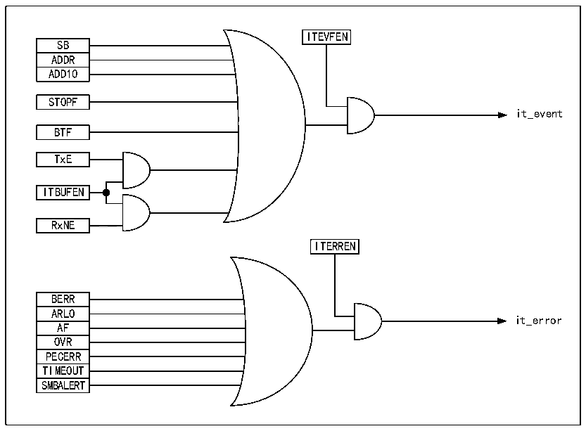

<!-- source-page: 176 -->

[← p.175](0175.md) · [index](../README.md) · [PDF p.176](https://ch32-riscv-ug.github.io/CH32X035/datasheet_zh/CH32X035RM.PDF#page=176) · [p.177 →](0177.md)

<!-- header: CH32X035系列应用手册 https://wch.cn -->
新的数据还没有被写入到数据寄存器，那么将产生欠载错误。在发生欠载错误时，前一次数据寄存  
器里的数据将被发送两次，如果发生欠载错误，那么接收方应该丢弃重复收到的数据。为了不产生  
欠载错误，I2C模块应当在下一个字节的第一个上升沿之前将数据写入数据寄存器。  

## 15.6 时钟延长

如果禁止时钟延长，那么就存在发生过载/欠载错误的可能。但如果使能了时钟延长：  
● 在发送模式下，如果TxE置位且BTF置位，SCL将一直为低，一直等待用户读取状态寄存器，  
并向数据寄存器写入待发送的数据；  
● 在接收模式下，如果RxNE置位且BTF置位，那么SCL在接收到数据后将保持低，直到用户读取  
状态寄存器，并读取数据寄存器；  
由此可见，使能时钟延长可以避免出现过载/欠载错误。  

## 15.7 中断

每个I2C模块都有两种中断向量，分别是事件中断和错误中断。两种中断支持图15-4的中断源。  

图15-7 I2C中断请求  
 <!-- rendered from the PDF; verify at https://ch32-riscv-ug.github.io/CH32X035/datasheet_zh/CH32X035RM.PDF#page=176 -->

🖼 Text parsed from the figure above

ITEVFEN  
SB  ADDR  ADD10  
STOPF  
it_event  
BTF  
TxE  
ITBUFEN  
RxNE  
<!-- image: p176-draw-image-00002 inside the figure -->
ITERREN  
BERR  ARLO  AF  OVR  PECERR  TIMEOUT  SMBALERT  
it_error  

## 15.8 包校验错误

包错误校验(PEC)是为了提供传输的可靠性而增加一项CRC8校验的步骤，使用以下多项式对每  
一位串行数据进行计算：  
C=X8+X2+X+1  
PEC计算是由控制寄存器的ENPEC位激活，对所有信息字节进行计算，包括地址和读写位在内。  
在发送时，启用PEC会在最后一字节数据之后加上一个字节的CRC8计算结果；而在接收模式，在最  
后一字节被认为是CRC8校验结果，如果和内部的计算结果不符合，就会回复一个NAK，如果是主接  
收器，无论校验结果正确与否，都会回复一个NAK。  
<!-- image: p176-draw-image-00001 bbox=[507.84, 786.12, 527.28, 796.68] -->
<!-- footer: V1.9 176 -->
