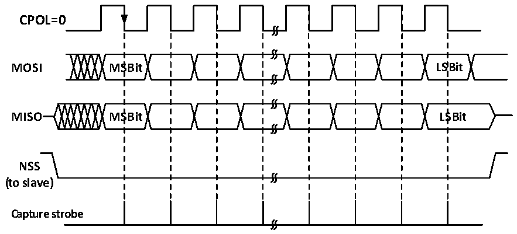
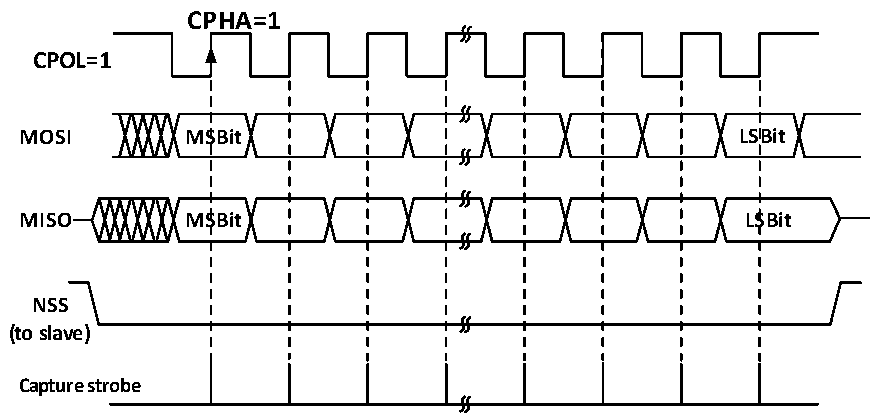

<!-- source-page: 187 -->

[← p.186](0186.md) · [index](../README.md) · [PDF p.187](https://ch32-riscv-ug.github.io/CH32X035/datasheet_zh/CH32X035RM.PDF#page=187) · [p.188 →](0188.md)

<!-- header: CH32X035系列应用手册 https://wch.cn -->

图16-4 SPI主模式读写模式2  
 <!-- rendered from the PDF; verify at https://ch32-riscv-ug.github.io/CH32X035/datasheet_zh/CH32X035RM.PDF#page=187 -->

# MODE 2

# CPHA=1

🖼 Text parsed from the figure above

<strong>CPOL=0</strong>  
<strong>MOSI MSBit LSBit</strong>  
<strong>MISO MSBit LSBit</strong>  
<strong>NSS</strong>  
<strong>(to slave)</strong>  
<strong>Capture strobe</strong>  

图16-5 SPI主模式读写模式3  
 <!-- rendered from the PDF; verify at https://ch32-riscv-ug.github.io/CH32X035/datasheet_zh/CH32X035RM.PDF#page=187 -->

# MODE 3

🖼 Text parsed from the figure above

CPHA=1  
<strong>CPOL=1</strong>  
<strong>MOSI MSBit LSBit</strong>  
<strong>MISO MSBit LSBit</strong>  
<strong>NSS</strong>  
<strong>(to slave)</strong>  
<strong>Capture strobe</strong>  

### 16.2.3 从模式

当 SPI 模块工作在从模式时，SCK 用于接收主机发来的时钟，自身的波特率设置无效。配置成  
从模式的步骤如下：  
配置DEF位设置数据位长度；  
配置CPHA匹配主机工作模式；  
根据收发的配置和CPOL来决定SPI的工作模式；  
若需要在从模式进行发送，则需要将CPOL置位，配置为模式2或模式3，主机根据需要更改配  
置；  
若只需要在从模式进行接收，则只需要匹配主机CPOL模式即可；  
配置LSBFIRST匹配主机数据帧格式；  
硬件管理模式下，NSS管脚需要保持为低电平，如果设置NSS为软件管理（SSM置位），那么请  
保持SSI不被置位；  
<!-- image: p187-draw-image-00001 bbox=[507.84, 786.12, 527.28, 796.68] -->
<!-- footer: V1.9 187 -->
