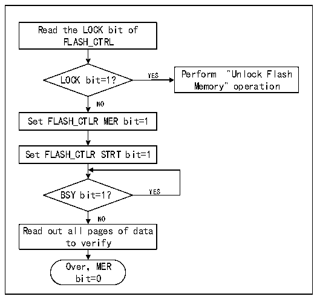

<!-- source-page: 232 -->

[← p.231](0231.md) · [index](../README.md) · [PDF p.232](https://ch32-riscv-ug.github.io/CH32X035/datasheet_zh/CH32X035RM.PDF#page=232) · [p.233 →](0233.md)

<!-- header: CH32X035系列应用手册 https://wch.cn -->

图20-2 FLASH整片擦除  
 <!-- rendered from the PDF; verify at https://ch32-riscv-ug.github.io/CH32X035/datasheet_zh/CH32X035RM.PDF#page=232 -->

🖼 Text parsed from the figure above

Read the LOCK bit of  
FLASH_CTRL  
LOCK bit=1? YES Perform &quot;Unlock Flash  
Memory&quot; operation  
NO  
Set FLASH_CTLR MER bit=1  
Set FLASH_CTLR STRT bit=1  
BSY bit=1？ YES  
NO  
Read out all pages of data  
to verify  
Over，MER  
bit=0  

1）检查FLASH_CTLR寄存器LOCK位，如果为1，需要执行“解除闪存锁”操作。  
2）设置FLASH_CTLR寄存器的MER位为‘1’，开启整片擦除模式。  
3）设置FLASH_CTLR寄存器的STRT位为‘1’，启动擦除动作。  
4）等待BSY位变为‘0’或FLASH_STATR寄存器的EOP位为‘1’表示擦除结束，将EOP位清0。  
5）读擦除页的数据进行校验。  
6）将MER位清0。  

### 20.4.4 快速编程模式解锁

通过写入序列到FLASH_MODEKEYR寄存器可解锁快速编程模式操作。解锁后，FLASH_CTLR寄存器  
的FLOCK位将清0，表示可以进行快速擦除和编程操作。通过将FLASH_CTLR寄存器的“FLOCK”位软  
件置1来再次锁定。  
解锁序列：  
1）向FLASH_MODEKEYR寄存器写入KEY1 = 0x45670123；  
2）向FLASH_MODEKEYR寄存器写入KEY2 = 0xCDEF89AB。  
上述操作必须按序并连续执行，否则属于错误操作会锁定，直到下次系统复位才能重新解锁。  
注：快速编程操作需要解除“LOCK”和“FLOCK”两层锁定。  

### 20.4.5 主存储器快速编程

快速编程按页（256字节）进行编程。  
1）检查FLASH_CTLR寄存器LOCK位，如果为‘1’，需要执行“解除闪存锁”操作。  
2）检查FLASH_CTLR寄存器FLOCK位，如果为‘1’，需要执行“快速编程模式解锁”操作。  
3）检查FLASH_STATR寄存器的BSY位，以确认没有其他正在进行的编程操作。  
4）设置FLASH_CTLR寄存器的FTPG位为‘1’，使能快速页编程模式。  
5）设置FLASH_CTLR寄存器的BUFRST位，执行清除内部256字节缓存区操作。  
6）等待BSY位变为‘0’或FLASH_STATR寄存器的EOP位为‘1’表示清除结束，将EOP位清0。  
7）使用32位方式向FLASH地址写入数据，例如  
- *（uint32_t*）0x8000000 = 0x12345678；
8）然后设置FLASH_CTLR 寄存器的BUFLOAD位，执行加载到缓存区。  
9）等待FLASH_STATR寄存器的BSY为‘0’，写入下个数据。  
10）重复步骤7-9共64次，将256字节数据都加载到缓存区（主要64轮操作地址要连续）。  
<!-- image: p232-draw-image-00001 bbox=[507.84, 786.12, 527.28, 796.68] -->
<!-- footer: V1.9 232 -->
