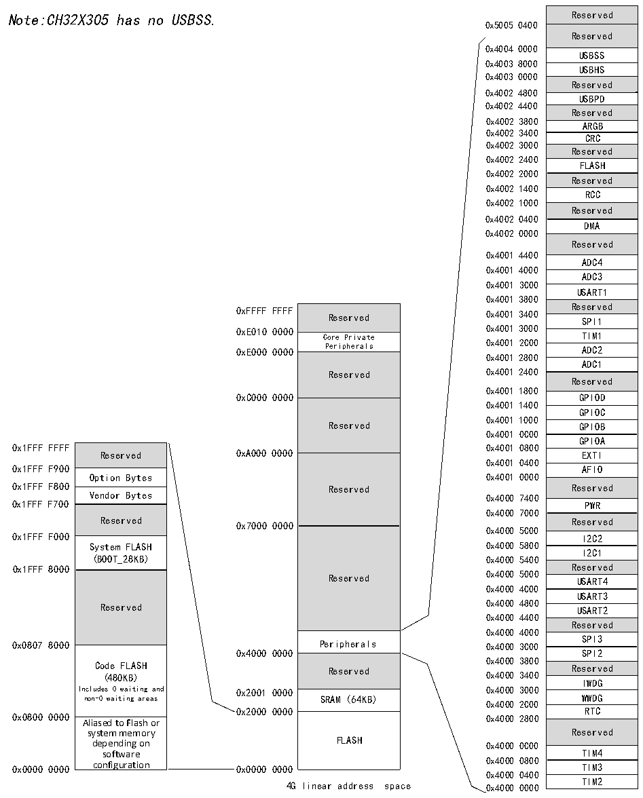

<!-- source-page: 7 -->

[← p.6](0006.md) · [index](../README.md) · [PDF p.7](https://ch32-riscv-ug.github.io/CH32X315/datasheet_en/CH32X315DS0.PDF#page=7) · [p.8 →](0008.md)

<!-- header: CH32V407/V467 Datasheet https://wch-ic.com -->

## 1.2 Memory Map

Figure 1-2 Memory address map  
 <!-- rendered from the PDF; verify at https://ch32-riscv-ug.github.io/CH32X315/datasheet_en/CH32X315DS0.PDF#page=7 -->

🖼 Text parsed from the figure above

Reserved  Reserved  USBSS  USBHS  Reserved  USBPD  Reserved  ARGB  CRC  Reserved  FLASH  Reserved  RCC  Reserved  DMA  Reserved  ADC4ADC3  USART1Reserved  Reserved  SPI1  TIM1  ADC2  ADC1  Reserved  GPIOD  GPIOC  GPIOB  GPIOAEXTI  EXTI  AFIO  Reserved  PWR  Reserved  I2C2  I2C1  Reserved  USART4  USART3  USART2  Reserved  SPI3  SPI2  Reserved  IWDG  WWDG  RTC  Reserved  TIM4  TIM3  TIM2  
Note:CH32X305 has no USBSS.0x50050400 Reserved  
0x4004 0000  
0x4003 8000  
0x4003 0000  
0x4002 4800  
0x4002 4400  
0x4002 3800  
0x4002 3400  
0x4002 3000  
0x4002 2400  
0x4002 2000  
0x4002 1400  
0x4002 1000  
0x4002 0400  
0x4002 0000  
0x4001 4400  
0x4001 4000  
0x4001 3C00  
0x4001 3800  
0xFFFF FFFF Reserved 0x4001 3400 Re S s P e I r 1 ved  
Reserved  Core Private Peripherals  Reserved  Reserved  Reserved  Reserved  Peripherals  Reserved  SRAM (64KB)  FLASH  
Core Private TIM1  
0xE000 0000 Peripherals 0x4001 2C00 ADC2  
0x4001 2800  
Reserved 0x4001 2400  
0x4001 1800  
0xC000 0000 GPIOD  
0x4001 1400  
0x4001 1000  
Reserved GPIOB  
0x4001 0C00  
0x1FFF FFFF 0x4001 0800  
Reserved  Option Bytes  Vendor Bytes  Reserved  System FLASH (BOOT_28KB)  Reserved  Code FLASH (480KB) Includes 0 waiting and non-0 waiting areas Aliased to Flash or  Aliased to Flash or system memory depending on software configuration  
0x4001 0400  
0x4000 7000  
0x4000 5C00  
Reserved 0x4000 5000 USART4  
0x4000 4C00  
0x4000 4400  
0x4000 4000  
0x0807 8000 Peripherals 0x4000 3C00  
0x4000 0000 SPI2  
0x4000 2C00  
0x2000 0000 RTC  
0x0800 0000 0x4000 2800  
0x4000 0800  
0x4000 0400  
4G linear address space 0x4000 0000 TIM2  

<!-- image: p7-draw-image-00001 bbox=[509.28, 782.04, 531.0, 793.8] -->
<!-- footer: V1.1 4 -->
