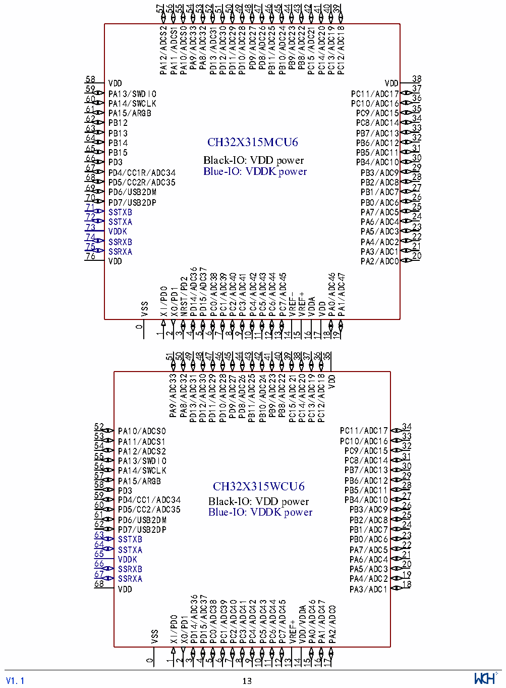

<!-- source-page: 16 -->

[← p.15](0015.md) · [index](../README.md) · [PDF p.16](https://ch32-riscv-ug.github.io/CH32X315/datasheet_en/CH32X315DS0.PDF#page=16) · [p.17 →](0017.md)

<!-- header: CH32V407/V467 Datasheet https://wch-ic.com -->

# Chapter 2 Pinouts and Pin Definition

## 2.1 Pinout

### 2.1.1 CH32X315 Pinouts

 <!-- p16-cluster-01 uncaptioned graphics, rendered from the PDF; verify at https://ch32-riscv-ug.github.io/CH32X315/datasheet_en/CH32X315DS0.PDF#page=16 -->

🖼 Text parsed from the figure above

57 56 55 54 53 42 41 40 39  
52 51 50 49 48 47  
46 45  
44 43  
PA12/ADCS2 PA11/ADCS1 PA10/ADCS0 PA9/ADC33 PA8/ADC32 PD13/ADC31 PD12/ADC30 PD11/ADC29 PD10/ADC28 PD9/ADC27 PD8/ADC26 PB11/ADC25 PB10/ADC24 PB9/ADC23 PB8/ADC22 PC15/ADC21 PC14/ADC20 PC13/ADC19 PC12/ADC18  
38  
58  
VDD  
VDD  
37  
59  
PA13/SWDIO  
PC11/ADC17  
36  
60  
PA14/SWCLK  
PC10/ADC16  
35  
61  
PA15/ARGB  
PC9/ADC15  
34  
62  
PB12  
PC8/ADC14  
33  
63  
PB13  
PB7/ADC13  
32  
64  
PB14 CH32X315MCU6  
PB6/ADC12  
31  
65  
PB15  
PB5/ADC11  
30  
66 PD3 Black-IO: VDD power  
PB4/ADC10  
29  
67  
PD4/CC1R/ADC34 Blue-IO: VDDK power  
PB3/ADC9  
28  
68  
PD5/CC2R/ADC35  
PB2/ADC8  
27  
69  
PD6/USB2DM  
PB1/ADC7  
26  
70  
PD7/USB2DP  
PB0/ADC6  
25  
71  
SSTXB  
PA7/ADC5  
24  
72  
SSTXA  
PA6/ADC4  
23  
73  
VDDK  
PA5/ADC3  
22  
74  
SSRXB  
PA4/ADC2  
21  
75  
SSRXA  
PA3/ADC1  
20  
76  
VDD  
PA2/ADC0  
PD14/ADC36  
PD15/ADC37  
PC0/ADC38  
PC1/ADC39  
PC2/ADC40  
PC3/ADC41  
PC4/ADC42  
PC5/ADC43  
PC6/ADC44  
PC7/ADC45  
PA0/ADC46  
PA1/ADC47  
NRST/PD2  
XI/PD0  
XO/PD1  
VREF-  
VREF+  
VDDA  
VSS  
VDD  
0  
1  
2  
3  
4  
5  
6  
7  
8  
9  
10  
11  
12  
13  
14  
15  
16  
17  
18  
19  
51 50 43 42 39 38 37 36 35  
49  
48  
47  
46  
45  
44  
41 40  
PA9/ADC33  
PA8/ADC32  
PD13/ADC31  
PD12/ADC30  
PD11/ADC29  
PD10/ADC28  
PB11/ADC25  
PB9/ADC23  
PB8/ADC22  
PC15/ADC21  
PC14/ADC20  
PC13/ADC19  
PC12/ADC18  
PD9/ADC27  
PD8/ADC26  
PB10/ADC24  
VDD  
52  
34  
PA10/ADCS0 PC11/ADC17  
53  
33  
PA11/ADCS1 PC10/ADC16  
54  
32  
PA12/ADCS2 PC9/ADC15  
55  
31  
PA13/SWDIO PC8/ADC14  
56  
30  
PA14/SWCLK PB7/ADC13  
57  
29  
PA15/ARGB PB6/ADC12  
58  
28  
CH32X315WCU6  
PD3 PB5/ADC11  
59  
27  
PD4/CC1/ADC34 PB4/ADC10  
Black-IO: VDD power  
60  
26  
PD5/CC2/ADC35 PB3/ADC9 61  
Blue-IO: VDDK power 25  
PD6/USB2DM PB2/ADC8  
62  
24  
PD7/USB2DP PB1/ADC7  
63  
23  
SSTXB PB0/ADC6  
64  
22  
SSTXA PA7/ADC5  
65  
21  
VDDK PA6/ADC4  
66  
20  
SSRXB PA5/ADC3  
67  
19  
SSRXA PA4/ADC2  
68  
18  
VDD PA3/ADC1  
PD14/ADC36  
PD15/ADC37  
PC0/ADC38  
PC1/ADC39  
PC2/ADC40  
PC3/ADC41 PC4/ADC42 PC5/ADC43 PC6/ADC44 PC7/ADC45  
PA0/ADC46 PA1/ADC47  
VDD/VDDA  
PA2/ADC0  
XI/PD0 XO/PD1  
VREF+  
VSS  
0 1  
2  
3  
4  
5  
6  
7  
8  
9  
10  
11  
12  
13  
14  
15  
16  
17  
<!-- image: p16-draw-image-00001 inside the figure -->
<!-- footer: V1.1 13 -->

