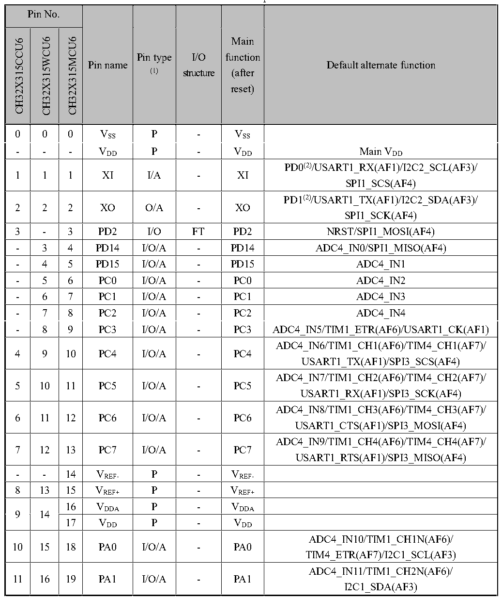

<!-- source-page: 19 -->

[← p.18](0018.md) · [index](../README.md) · [PDF p.19](https://ch32-riscv-ug.github.io/CH32X315/datasheet_en/CH32X315DS0.PDF#page=19) · [p.20 →](0020.md)

<!-- header: CH32V407/V467 Datasheet https://wch-ic.com -->

## 2.2 Pin Definitions

<em>Note: The pin function in the table below refer to all functions and do not involve specific model(s). There are</em>  
<em>differences in peripheral resources between different models. Please confirm whether this function is</em>  
<em>available according to the particular model&#x27;s resource table before viewing this table.</em>  

 <!-- p19-cluster-01 uncaptioned graphics, rendered from the PDF; verify at https://ch32-riscv-ug.github.io/CH32X315/datasheet_en/CH32X315DS0.PDF#page=19 -->

🖼 Text parsed from the figure above

<!-- p19-table-001 (table-2-1@1) -->
<table><caption>Table 2-1 CH32X315 pin definitions</caption><tr><th colspan="3">Pin No.</th><th rowspan="2">Pin name</th><th rowspan="2" style="text-align:left">Pin type (1)</th><th rowspan="2" style="text-align:left">I/O structure</th><th rowspan="2" style="text-align:left">Main function (after reset)</th><th rowspan="2">Default alternate function</th></tr><tr><td>CH32X315CCU6</td><td>CH32X315WCU6</td><td>CH32X315MCU6</td></tr><tr><td>0</td><td>0</td><td>0</td><td style="text-align:left">VSS</td><td>P</td><td>-</td><td style="text-align:left">VSS</td><td></td></tr><tr><td>-</td><td>-</td><td>-</td><td style="text-align:left">VDD</td><td>P</td><td>-</td><td style="text-align:left">VDD</td><td style="text-align:left">Main VDD</td></tr><tr><td>1</td><td>1</td><td>1</td><td>XI</td><td>I/A</td><td>-</td><td>XI</td><td style="text-align:left">PD0(2)/USART1_RX(AF1)/I2C2_SCL(AF3)/ SPI1_SCS(AF4)</td></tr><tr><td>2</td><td>2</td><td>2</td><td>XO</td><td>O/A</td><td>-</td><td>XO</td><td style="text-align:left">PD1(2)/USART1_TX(AF1)/I2C2_SDA(AF3)/ SPI1_SCK(AF4)</td></tr><tr><td>3</td><td>-</td><td>3</td><td>PD2</td><td>I/O</td><td>FT</td><td>PD2</td><td>NRST/SPI1_MOSI(AF4)</td></tr><tr><td>-</td><td>3</td><td>4</td><td>PD14</td><td>I/O/A</td><td>-</td><td>PD14</td><td>ADC4_IN0/SPI1_MISO(AF4)</td></tr><tr><td>-</td><td>4</td><td>5</td><td>PD15</td><td>I/O/A</td><td>-</td><td>PD15</td><td>ADC4_IN1</td></tr><tr><td>-</td><td>5</td><td>6</td><td>PC0</td><td>I/O/A</td><td>-</td><td>PC0</td><td>ADC4_IN2</td></tr><tr><td>-</td><td>6</td><td>7</td><td>PC1</td><td>I/O/A</td><td>-</td><td>PC1</td><td>ADC4_IN3</td></tr><tr><td>-</td><td>7</td><td>8</td><td>PC2</td><td>I/O/A</td><td>-</td><td>PC2</td><td>ADC4_IN4</td></tr><tr><td>-</td><td>8</td><td>9</td><td>PC3</td><td>I/O/A</td><td>-</td><td>PC3</td><td>ADC4_IN5/TIM1_ETR(AF6)/USART1_CK(AF1)</td></tr><tr><td>4</td><td>9</td><td>10</td><td>PC4</td><td>I/O/A</td><td>-</td><td>PC4</td><td style="text-align:left">ADC4_IN6/TIM1_CH1(AF6)/TIM4_CH1(AF7)/ USART1_TX(AF1)/SPI3_SCS(AF4)</td></tr><tr><td>5</td><td>10</td><td>11</td><td>PC5</td><td>I/O/A</td><td>-</td><td>PC5</td><td style="text-align:left">ADC4_IN7/TIM1_CH2(AF6)/TIM4_CH2(AF7)/ USART1_RX(AF1)/SPI3_SCK(AF4)</td></tr><tr><td>6</td><td>11</td><td>12</td><td>PC6</td><td>I/O/A</td><td>-</td><td>PC6</td><td style="text-align:left">ADC4_IN8/TIM1_CH3(AF6)/TIM4_CH3(AF7)/ USART1_CTS(AF1)/SPI3_MOSI(AF4)</td></tr><tr><td>7</td><td>12</td><td>13</td><td>PC7</td><td>I/O/A</td><td>-</td><td>PC7</td><td style="text-align:left">ADC4_IN9/TIM1_CH4(AF6)/TIM4_CH4(AF7)/ USART1_RTS(AF1)/SPI3_MISO(AF4)</td></tr><tr><td>-</td><td>-</td><td>14</td><td style="text-align:left">VREF-</td><td>P</td><td>-</td><td style="text-align:left">VREF-</td><td></td></tr><tr><td>8</td><td>13</td><td>15</td><td style="text-align:left">VREF+</td><td>P</td><td>-</td><td style="text-align:left">VREF+</td><td></td></tr><tr><td rowspan="2">9</td><td rowspan="2">14</td><td>16</td><td style="text-align:left">VDDA</td><td>P</td><td>-</td><td style="text-align:left">VDDA</td><td></td></tr><tr><td>17</td><td style="text-align:left">VDD</td><td>P</td><td>-</td><td style="text-align:left">VDD</td><td></td></tr><tr><td>10</td><td>15</td><td>18</td><td>PA0</td><td>I/O/A</td><td>-</td><td>PA0</td><td style="text-align:left">ADC4_IN10/TIM1_CH1N(AF6)/ TIM4_ETR(AF7)/I2C1_SCL(AF3)</td></tr><tr><td>11</td><td>16</td><td>19</td><td>PA1</td><td>I/O/A</td><td>-</td><td>PA1</td><td style="text-align:left">ADC4_IN11/TIM1_CH2N(AF6)/ I2C1_SDA(AF3)</td></tr></table>

0 0 0 VSS P - VSS  

<!-- image: p19-draw-image-00001 bbox=[513.84, 782.04, 535.56, 793.8] -->
<!-- footer: V1.1 16 -->
