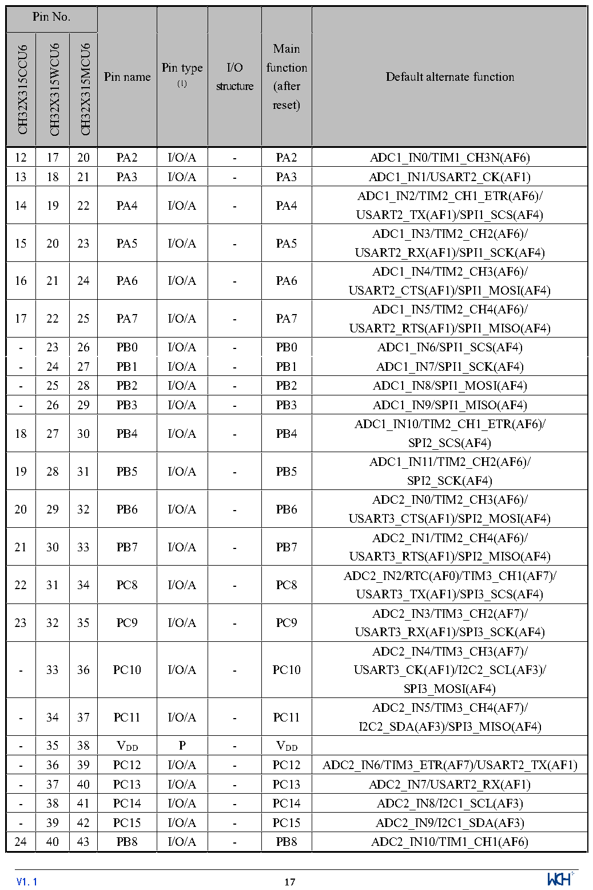

<!-- source-page: 20 -->

[← p.19](0019.md) · [index](../README.md) · [PDF p.20](https://ch32-riscv-ug.github.io/CH32X315/datasheet_en/CH32X315DS0.PDF#page=20) · [p.21 →](0021.md)

<!-- header: CH32V407/V467 Datasheet https://wch-ic.com -->

 <!-- p20-cluster-01 uncaptioned graphics, rendered from the PDF; verify at https://ch32-riscv-ug.github.io/CH32X315/datasheet_en/CH32X315DS0.PDF#page=20 -->

🖼 Text parsed from the figure above

<!-- p20-table-001 (table-2-1@1) -->
<table><tr><th colspan="3">Pin No.</th><th rowspan="2">Pin name</th><th rowspan="2" style="text-align:left">Pin type (1)</th><th rowspan="2" style="text-align:left">I/O structure</th><th rowspan="2" style="text-align:left">Main function (after reset)</th><th rowspan="2">Default alternate function</th></tr><tr><td>CH32X315CCU6</td><td>CH32X315WCU6</td><td>CH32X315MCU6</td></tr><tr><td>12</td><td>17</td><td>20</td><td>PA2</td><td>I/O/A</td><td>-</td><td>PA2</td><td>ADC1_IN0/TIM1_CH3N(AF6)</td></tr><tr><td>13</td><td>18</td><td>21</td><td>PA3</td><td>I/O/A</td><td>-</td><td>PA3</td><td>ADC1_IN1/USART2_CK(AF1)</td></tr><tr><td>14</td><td>19</td><td>22</td><td>PA4</td><td>I/O/A</td><td>-</td><td>PA4</td><td style="text-align:left">ADC1_IN2/TIM2_CH1_ETR(AF6)/ USART2_TX(AF1)/SPI1_SCS(AF4)</td></tr><tr><td>15</td><td>20</td><td>23</td><td>PA5</td><td>I/O/A</td><td>-</td><td>PA5</td><td style="text-align:left">ADC1_IN3/TIM2_CH2(AF6)/ USART2_RX(AF1)/SPI1_SCK(AF4)</td></tr><tr><td>16</td><td>21</td><td>24</td><td>PA6</td><td>I/O/A</td><td>-</td><td>PA6</td><td style="text-align:left">ADC1_IN4/TIM2_CH3(AF6)/ USART2_CTS(AF1)/SPI1_MOSI(AF4)</td></tr><tr><td>17</td><td>22</td><td>25</td><td>PA7</td><td>I/O/A</td><td>-</td><td>PA7</td><td style="text-align:left">ADC1_IN5/TIM2_CH4(AF6)/ USART2_RTS(AF1)/SPI1_MISO(AF4)</td></tr><tr><td>-</td><td>23</td><td>26</td><td>PB0</td><td>I/O/A</td><td>-</td><td>PB0</td><td>ADC1_IN6/SPI1_SCS(AF4)</td></tr><tr><td>-</td><td>24</td><td>27</td><td>PB1</td><td>I/O/A</td><td>-</td><td>PB1</td><td>ADC1_IN7/SPI1_SCK(AF4)</td></tr><tr><td>-</td><td>25</td><td>28</td><td>PB2</td><td>I/O/A</td><td>-</td><td>PB2</td><td>ADC1_IN8/SPI1_MOSI(AF4)</td></tr><tr><td>-</td><td>26</td><td>29</td><td>PB3</td><td>I/O/A</td><td>-</td><td>PB3</td><td>ADC1_IN9/SPI1_MISO(AF4)</td></tr><tr><td>18</td><td>27</td><td>30</td><td>PB4</td><td>I/O/A</td><td>-</td><td>PB4</td><td style="text-align:left">ADC1_IN10/TIM2_CH1_ETR(AF6)/ SPI2_SCS(AF4)</td></tr><tr><td>19</td><td>28</td><td>31</td><td>PB5</td><td>I/O/A</td><td>-</td><td>PB5</td><td style="text-align:left">ADC1_IN11/TIM2_CH2(AF6)/ SPI2_SCK(AF4)</td></tr><tr><td>20</td><td>29</td><td>32</td><td>PB6</td><td>I/O/A</td><td>-</td><td>PB6</td><td style="text-align:left">ADC2_IN0/TIM2_CH3(AF6)/ USART3_CTS(AF1)/SPI2_MOSI(AF4)</td></tr><tr><td>21</td><td>30</td><td>33</td><td>PB7</td><td>I/O/A</td><td>-</td><td>PB7</td><td style="text-align:left">ADC2_IN1/TIM2_CH4(AF6)/ USART3_RTS(AF1)/SPI2_MISO(AF4)</td></tr><tr><td>22</td><td>31</td><td>34</td><td>PC8</td><td>I/O/A</td><td>-</td><td>PC8</td><td style="text-align:left">ADC2_IN2/RTC(AF0)/TIM3_CH1(AF7)/ USART3_TX(AF1)/SPI3_SCS(AF4)</td></tr><tr><td>23</td><td>32</td><td>35</td><td>PC9</td><td>I/O/A</td><td>-</td><td>PC9</td><td style="text-align:left">ADC2_IN3/TIM3_CH2(AF7)/ USART3_RX(AF1)/SPI3_SCK(AF4)</td></tr><tr><td>-</td><td>33</td><td>36</td><td>PC10</td><td>I/O/A</td><td>-</td><td>PC10</td><td style="text-align:left">ADC2_IN4/TIM3_CH3(AF7)/ USART3_CK(AF1)/I2C2_SCL(AF3)/ SPI3_MOSI(AF4)</td></tr><tr><td>-</td><td>34</td><td>37</td><td>PC11</td><td>I/O/A</td><td>-</td><td>PC11</td><td style="text-align:left">ADC2_IN5/TIM3_CH4(AF7)/ I2C2_SDA(AF3)/SPI3_MISO(AF4)</td></tr><tr><td>-</td><td>35</td><td>38</td><td style="text-align:left">VDD</td><td>P</td><td>-</td><td style="text-align:left">VDD</td><td></td></tr><tr><td>-</td><td>36</td><td>39</td><td>PC12</td><td>I/O/A</td><td>-</td><td>PC12</td><td>ADC2_IN6/TIM3_ETR(AF7)/USART2_TX(AF1)</td></tr><tr><td>-</td><td>37</td><td>40</td><td>PC13</td><td>I/O/A</td><td>-</td><td>PC13</td><td>ADC2_IN7/USART2_RX(AF1)</td></tr><tr><td>-</td><td>38</td><td>41</td><td>PC14</td><td>I/O/A</td><td>-</td><td>PC14</td><td>ADC2_IN8/I2C1_SCL(AF3)</td></tr><tr><td>-</td><td>39</td><td>42</td><td>PC15</td><td>I/O/A</td><td>-</td><td>PC15</td><td>ADC2_IN9/I2C1_SDA(AF3)</td></tr><tr><td>24</td><td>40</td><td>43</td><td>PB8</td><td>I/O/A</td><td>-</td><td>PB8</td><td>ADC2_IN10/TIM1_CH1(AF6)</td></tr></table>

<!-- image: p20-draw-image-00001 inside the figure -->
<!-- footer: V1.1 17 -->

