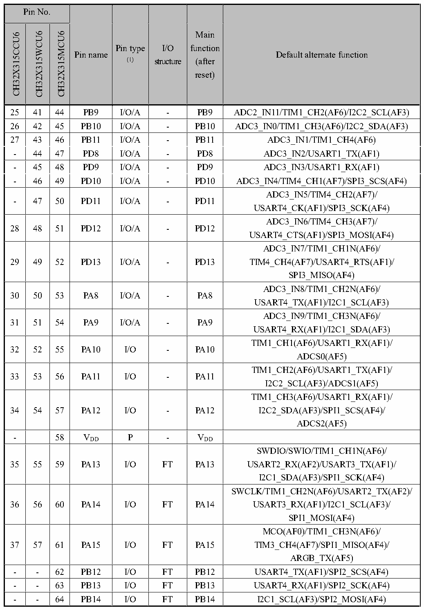

<!-- source-page: 21 -->

[← p.20](0020.md) · [index](../README.md) · [PDF p.21](https://ch32-riscv-ug.github.io/CH32X315/datasheet_en/CH32X315DS0.PDF#page=21) · [p.22 →](0022.md)

<!-- header: CH32V407/V467 Datasheet https://wch-ic.com -->

 <!-- p21-cluster-01 uncaptioned graphics, rendered from the PDF; verify at https://ch32-riscv-ug.github.io/CH32X315/datasheet_en/CH32X315DS0.PDF#page=21 -->

🖼 Text parsed from the figure above

<!-- p21-table-001 (table-2-1@1) -->
<table><tr><th colspan="3">Pin No.</th><th rowspan="2">Pin name</th><th rowspan="2" style="text-align:left">Pin type (1)</th><th rowspan="2" style="text-align:left">I/O structure</th><th rowspan="2" style="text-align:left">Main function (after reset)</th><th rowspan="2">Default alternate function</th></tr><tr><td>CH32X315CCU6</td><td>CH32X315WCU6</td><td>CH32X315MCU6</td></tr><tr><td>25</td><td>41</td><td>44</td><td>PB9</td><td>I/O/A</td><td>-</td><td>PB9</td><td>ADC2_IN11/TIM1_CH2(AF6)/I2C2_SCL(AF3)</td></tr><tr><td>26</td><td>42</td><td>45</td><td>PB10</td><td>I/O/A</td><td>-</td><td>PB10</td><td>ADC3_IN0/TIM1_CH3(AF6)/I2C2_SDA(AF3)</td></tr><tr><td>27</td><td>43</td><td>46</td><td>PB11</td><td>I/O/A</td><td>-</td><td>PB11</td><td>ADC3_IN1/TIM1_CH4(AF6)</td></tr><tr><td>-</td><td>44</td><td>47</td><td>PD8</td><td>I/O/A</td><td>-</td><td>PD8</td><td>ADC3_IN2/USART1_TX(AF1)</td></tr><tr><td>-</td><td>45</td><td>48</td><td>PD9</td><td>I/O/A</td><td>-</td><td>PD9</td><td>ADC3_IN3/USART1_RX(AF1)</td></tr><tr><td>-</td><td>46</td><td>49</td><td>PD10</td><td>I/O/A</td><td>-</td><td>PD10</td><td>ADC3_IN4/TIM4_CH1(AF7)/SPI3_SCS(AF4)</td></tr><tr><td>-</td><td>47</td><td>50</td><td>PD11</td><td>I/O/A</td><td>-</td><td>PD11</td><td style="text-align:left">ADC3_IN5/TIM4_CH2(AF7)/ USART4_CK(AF1)/SPI3_SCK(AF4)</td></tr><tr><td>28</td><td>48</td><td>51</td><td>PD12</td><td>I/O/A</td><td>-</td><td>PD12</td><td style="text-align:left">ADC3_IN6/TIM4_CH3(AF7)/ USART4_CTS(AF1)/SPI3_MOSI(AF4)</td></tr><tr><td>29</td><td>49</td><td>52</td><td>PD13</td><td>I/O/A</td><td>-</td><td>PD13</td><td style="text-align:left">ADC3_IN7/TIM1_CH1N(AF6)/ TIM4_CH4(AF7)/USART4_RTS(AF1)/ SPI3_MISO(AF4)</td></tr><tr><td>30</td><td>50</td><td>53</td><td>PA8</td><td>I/O/A</td><td>-</td><td>PA8</td><td style="text-align:left">ADC3_IN8/TIM1_CH2N(AF6)/ USART4_TX(AF1)/I2C1_SCL(AF3)</td></tr><tr><td>31</td><td>51</td><td>54</td><td>PA9</td><td>I/O/A</td><td>-</td><td>PA9</td><td style="text-align:left">ADC3_IN9/TIM1_CH3N(AF6)/ USART4_RX(AF1)/I2C1_SDA(AF3)</td></tr><tr><td>32</td><td>52</td><td>55</td><td>PA10</td><td>I/O</td><td>-</td><td>PA10</td><td style="text-align:left">TIM1_CH1(AF6)/USART1_RX(AF1)/ ADCS0(AF5)</td></tr><tr><td>33</td><td>53</td><td>56</td><td>PA11</td><td>I/O</td><td>-</td><td>PA11</td><td style="text-align:left">TIM1_CH2(AF6)/USART1_TX(AF1)/ I2C2_SCL(AF3)/ADCS1(AF5)</td></tr><tr><td>34</td><td>54</td><td>57</td><td>PA12</td><td>I/O</td><td>-</td><td>PA12</td><td style="text-align:left">TIM1_CH3(AF6)/USART1_RX(AF1)/ I2C2_SDA(AF3)/SPI1_SCS(AF4)/ ADCS2(AF5)</td></tr><tr><td>-</td><td></td><td>58</td><td style="text-align:left">VDD</td><td>P</td><td>-</td><td style="text-align:left">VDD</td><td></td></tr><tr><td>35</td><td>55</td><td>59</td><td>PA13</td><td>I/O</td><td>FT</td><td>PA13</td><td style="text-align:left">SWDIO/SWIO/TIM1_CH1N(AF6)/ USART2_RX(AF2)/USART3_TX(AF1)/ I2C1_SDA(AF3)/SPI1_SCK(AF4)</td></tr><tr><td>36</td><td>56</td><td>60</td><td>PA14</td><td>I/O</td><td>FT</td><td>PA14</td><td style="text-align:left">SWCLK/TIM1_CH2N(AF6)/USART2_TX(AF2)/ USART3_RX(AF1)/I2C1_SCL(AF3)/ SPI1_MOSI(AF4)</td></tr><tr><td>37</td><td>57</td><td>61</td><td>PA15</td><td>I/O</td><td>FT</td><td>PA15</td><td style="text-align:left">MCO(AF0)/TIM1_CH3N(AF6)/ TIM3_CH4(AF7)/SPI1_MISO(AF4)/ ARGB_TX(AF5)</td></tr><tr><td>-</td><td>-</td><td>62</td><td>PB12</td><td>I/O</td><td>FT</td><td>PB12</td><td>USART4_TX(AF1)/SPI2_SCS(AF4)</td></tr><tr><td>-</td><td>-</td><td>63</td><td>PB13</td><td>I/O</td><td>FT</td><td>PB13</td><td>USART4_RX(AF1)/SPI2_SCK(AF4)</td></tr><tr><td>-</td><td>-</td><td>64</td><td>PB14</td><td>I/O</td><td>FT</td><td>PB14</td><td>I2C1_SCL(AF3)/SPI2_MOSI(AF4)</td></tr></table>

<!-- image: p21-draw-image-00001 bbox=[513.84, 782.04, 535.56, 793.8] -->
<!-- footer: V1.1 18 -->
