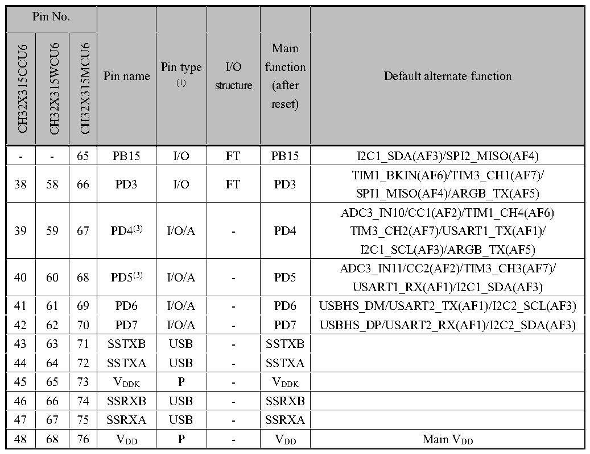

<!-- source-page: 22 -->

[← p.21](0021.md) · [index](../README.md) · [PDF p.22](https://ch32-riscv-ug.github.io/CH32X315/datasheet_en/CH32X315DS0.PDF#page=22) · [p.23 →](0023.md)

<!-- header: CH32V407/V467 Datasheet https://wch-ic.com -->

 <!-- p22-cluster-01 uncaptioned graphics, rendered from the PDF; verify at https://ch32-riscv-ug.github.io/CH32X315/datasheet_en/CH32X315DS0.PDF#page=22 -->

🖼 Text parsed from the figure above

<!-- p22-table-001 (table-2-1@1) -->
<table><tr><th colspan="3">Pin No.</th><th rowspan="2">Pin name</th><th rowspan="2" style="text-align:left">Pin type (1)</th><th rowspan="2" style="text-align:left">I/O structure</th><th rowspan="2" style="text-align:left">Main function (after reset)</th><th rowspan="2">Default alternate function</th></tr><tr><td>CH32X315CCU6</td><td>CH32X315WCU6</td><td>CH32X315MCU6</td></tr><tr><td>-</td><td>-</td><td>65</td><td>PB15</td><td>I/O</td><td>FT</td><td>PB15</td><td>I2C1_SDA(AF3)/SPI2_MISO(AF4)</td></tr><tr><td>38</td><td>58</td><td>66</td><td>PD3</td><td>I/O</td><td>FT</td><td>PD3</td><td style="text-align:left">TIM1_BKIN(AF6)/TIM3_CH1(AF7)/ SPI1_MISO(AF4)/ARGB_TX(AF5)</td></tr><tr><td>39</td><td>59</td><td>67</td><td>PD4(3)</td><td>I/O/A</td><td>-</td><td>PD4</td><td style="text-align:left">ADC3_IN10/CC1(AF2)/TIM1_CH4(AF6) TIM3_CH2(AF7)/USART1_TX(AF1)/ I2C1_SCL(AF3)/ARGB_TX(AF5)</td></tr><tr><td>40</td><td>60</td><td>68</td><td>PD5(3)</td><td>I/O/A</td><td>-</td><td>PD5</td><td style="text-align:left">ADC3_IN11/CC2(AF2)/TIM3_CH3(AF7)/ USART1_RX(AF1)/I2C1_SDA(AF3)</td></tr><tr><td>41</td><td>61</td><td>69</td><td>PD6</td><td>I/O/A</td><td>-</td><td>PD6</td><td>USBHS_DM/USART2_TX(AF1)/I2C2_SCL(AF3)</td></tr><tr><td>42</td><td>62</td><td>70</td><td>PD7</td><td>I/O/A</td><td>-</td><td>PD7</td><td>USBHS_DP/USART2_RX(AF1)/I2C2_SDA(AF3)</td></tr><tr><td>43</td><td>63</td><td>71</td><td>SSTXB</td><td>USB</td><td>-</td><td>SSTXB</td><td></td></tr><tr><td>44</td><td>64</td><td>72</td><td>SSTXA</td><td>USB</td><td>-</td><td>SSTXA</td><td></td></tr><tr><td>45</td><td>65</td><td>73</td><td style="text-align:left">VDDK</td><td>P</td><td>-</td><td style="text-align:left">VDDK</td><td></td></tr><tr><td>46</td><td>66</td><td>74</td><td>SSRXB</td><td>USB</td><td>-</td><td>SSRXB</td><td></td></tr><tr><td>47</td><td>67</td><td>75</td><td>SSRXA</td><td>USB</td><td>-</td><td>SSRXA</td><td></td></tr><tr><td>48</td><td>68</td><td>76</td><td style="text-align:left">VDD</td><td>P</td><td>-</td><td style="text-align:left">VDD</td><td style="text-align:left">Main VDD</td></tr></table>

<em>Note 1: Abbreviations in the table</em>  
<em>I = TTL/CMOS Schmitt input; O = CMOS tri-state output; A = Analog signal input or output;</em>  
<em>P = Power; USB = USB signal pin; FT = 5V tolerance.</em>  
<em>Note 2: For the CH32X315 chip, pins 1 and 2 are configured as XI and XO function pins by default after the</em>  
<em>chip is reset. The software can reset these 2 pins to PD0 and PD1 functions.</em>  
<em>Note 3: In order to reduce the quiescent current of PD4 and PD5, PD4 and PD5 can be configured as GPIO</em>  
<em>pull-up, and the bits CC1_PD and CC2_PD are configured as 1; PD4 and PD5 can also be configured as</em>  
<em>GPIO pull-down, and the bits CC1_PD and CC2_PD are configured as 0. For the CH32X315MCU6 chip,</em>  
<em>only PD4 and PD5 can be configured as GPIO pull-downs, and bits CC1_PD and CC2_PD can be</em>  
<em>configured as 0.</em>  

> ⚠ Table extraction recorded 1 issue(s) (overlapping merged cells); verify against [the PDF, pp.22-24](https://ch32-riscv-ug.github.io/CH32X315/datasheet_en/CH32X315DS0.PDF#page=22).

<!-- p22-table-003 (table-2-2@1) pages 22-24 -->
<table><caption>Table 2-2 CH32X305 pin definitions</caption><tr><th></th><th rowspan="2" colspan="2" style="text-align:left">Pin No.</th><th rowspan="2">Pin name</th><th rowspan="2" style="text-align:left">Pin type (1)</th><th rowspan="2" style="text-align:left">I/O structure</th><th rowspan="2" style="text-align:left">Main function</th><th rowspan="2">Default alternate function</th></tr><tr></tr><tr><td colspan="3">CH32X305RCT6</td><td></td><td></td><td></td><td style="text-align:left">(after reset)</td><td></td></tr><tr><td colspan="3">1</td><td>XI</td><td>I/A</td><td>-</td><td>XI</td><td style="text-align:left">PD0(2)/USART1_RX(AF1)/I2C2_SCL(AF3)/ SPI1_SCS(AF4)</td></tr><tr><td colspan="3">2</td><td>XO</td><td>O/A</td><td>-</td><td>XO</td><td style="text-align:left">PD1(2)/USART1_TX(AF1)/I2C2_SDA(AF3)/ SPI1_SCK(AF4)</td></tr><tr><td colspan="3">3</td><td>PD2</td><td>I/O</td><td>FT</td><td>PD2</td><td>NRST/SPI1_MOSI(AF4)</td></tr><tr><td colspan="3">4</td><td>PC0</td><td>I/O/A</td><td>-</td><td>PC0</td><td>ADC4_IN2</td></tr><tr><td colspan="3">5</td><td>PC1</td><td>I/O/A</td><td>-</td><td>PC1</td><td>ADC4_IN3</td></tr><tr><td colspan="3">6</td><td>PC2</td><td>I/O/A</td><td>-</td><td>PC2</td><td>ADC4_IN4</td></tr><tr><td colspan="3">7</td><td>PC3</td><td>I/O/A</td><td>-</td><td>PC3</td><td>ADC4_IN5/TIM1_ETR(AF6)/USART1_CK(AF1)</td></tr><tr><td colspan="3">8</td><td>PC4</td><td>I/O/A</td><td>-</td><td>PC4</td><td style="text-align:left">ADC4_IN6/TIM1_CH1(AF6)/TIM4_CH1(AF7)/ USART1_TX(AF1)/SPI3_SCS(AF4)</td></tr><tr><td colspan="3">9</td><td>PC5</td><td>I/O/A</td><td>-</td><td>PC5</td><td style="text-align:left">ADC4_IN7/TIM1_CH2(AF6)/TIM4_CH2(AF7)/ USART1_RX(AF1)/SPI3_SCK(AF4)</td></tr><tr><td colspan="3">10</td><td>PC6</td><td>I/O/A</td><td>-</td><td>PC6</td><td style="text-align:left">ADC4_IN8/TIM1_CH3(AF6)/TIM4_CH3(AF7)/ USART1_CTS(AF1)/SPI3_MOSI(AF4)</td></tr><tr><td colspan="3">11</td><td>PC7</td><td>I/O/A</td><td>-</td><td>PC7</td><td style="text-align:left">ADC4_IN9/TIM1_CH4(AF6)/TIM4_CH4(AF7)/ USART1_RTS(AF1)/SPI3_MISO(AF4)</td></tr><tr><td rowspan="2" colspan="3">12</td><td style="text-align:left">VREF-</td><td>P</td><td>-</td><td style="text-align:left">VREF-</td><td></td></tr><tr><td style="text-align:left">VSSA</td><td>P</td><td>-</td><td style="text-align:left">VSSA</td><td></td></tr><tr><td colspan="3">13</td><td style="text-align:left">VREF+</td><td>P</td><td>-</td><td style="text-align:left">VREF+</td><td></td></tr><tr><td colspan="3">14</td><td style="text-align:left">VDDA</td><td>P</td><td>-</td><td style="text-align:left">VDDA</td><td></td></tr><tr><td colspan="3">15</td><td style="text-align:left">VSS</td><td>P</td><td>-</td><td style="text-align:left">VSS</td><td></td></tr><tr><td colspan="3">16</td><td style="text-align:left">VDD</td><td>P</td><td>-</td><td style="text-align:left">VDD</td><td></td></tr><tr><td colspan="3">17</td><td>PA0</td><td>I/O/A</td><td>-</td><td>PA0</td><td style="text-align:left">ADC4_IN10/TIM1_CH1N(AF6)/ TIM4_ETR(AF7)/I2C1_SCL(AF3)</td></tr><tr><td colspan="3">18</td><td>PA1</td><td>I/O/A</td><td>-</td><td>PA1</td><td style="text-align:left">ADC4_IN11/TIM1_CH2N(AF6)/ I2C1_SDA(AF3)</td></tr><tr><td colspan="3">19</td><td>PA2</td><td>I/O/A</td><td>-</td><td>PA2</td><td>ADC1_IN0/TIM1_CH3N(AF6)</td></tr><tr><td colspan="3">20</td><td>PA3</td><td>I/O/A</td><td>-</td><td>PA3</td><td>ADC1_IN1/USART2_CK(AF1)</td></tr><tr><td colspan="3">21</td><td>PA4</td><td>I/O/A</td><td>-</td><td>PA4</td><td style="text-align:left">ADC1_IN2/TIM2_CH1_ETR(AF6)/ USART2_TX(AF1)/SPI1_SCS(AF4)</td></tr><tr><td colspan="3">22</td><td>PA5</td><td>I/O/A</td><td>-</td><td>PA5</td><td style="text-align:left">ADC1_IN3/TIM2_CH2(AF6)/ USART2_RX(AF1)/SPI1_SCK(AF4)</td></tr><tr><td colspan="3">23</td><td>PA6</td><td>I/O/A</td><td>-</td><td>PA6</td><td style="text-align:left">ADC1_IN4/TIM2_CH3(AF6)/ USART2_CTS(AF1)/SPI1_MOSI(AF4)</td></tr><tr><td colspan="3">24</td><td>PA7</td><td>I/O/A</td><td>-</td><td>PA7</td><td style="text-align:left">ADC1_IN5/TIM2_CH4(AF6)/ USART2_RTS(AF1)/SPI1_MISO(AF4)</td></tr><tr><td colspan="3">25</td><td>PB0</td><td>I/O/A</td><td>-</td><td>PB0</td><td>ADC1_IN6/SPI1_SCS(AF4)</td></tr><tr><td colspan="3" style="text-align:left">Pin No.</td><td rowspan="2">Pin name</td><td rowspan="2" style="text-align:left">Pin type (1)</td><td rowspan="2" style="text-align:left">I/O structure</td><td rowspan="2" style="text-align:left">Main function (after reset)</td><td rowspan="2">Default alternate function</td></tr><tr><td colspan="3">CH32X305RCT6</td></tr><tr><td colspan="3">26</td><td>PB4</td><td>I/O/A</td><td>-</td><td>PB4</td><td style="text-align:left">ADC1_IN10/TIM2_CH1_ETR(AF6)/ SPI2_SCS(AF4)</td></tr><tr><td colspan="3">27</td><td>PB5</td><td>I/O/A</td><td>-</td><td>PB5</td><td>ADC1_IN11/TIM2_CH2(AF6)/SPI2_SCK(AF4)</td></tr><tr><td colspan="3">28</td><td>PB6</td><td>I/O/A</td><td>-</td><td>PB6</td><td style="text-align:left">ADC2_IN0/TIM2_CH3(AF6)/ USART3_CTS(AF1)/SPI2_MOSI(AF4)</td></tr><tr><td colspan="3">29</td><td>PB7</td><td>I/O/A</td><td>-</td><td>PB7</td><td style="text-align:left">ADC2_IN1/TIM2_CH4(AF6)/ USART3_RTS(AF1)/SPI2_MISO(AF4)</td></tr><tr><td colspan="3">30</td><td>PC8</td><td>I/O/A</td><td>-</td><td>PC8</td><td style="text-align:left">ADC2_IN2/RTC(AF0)/TIM3_CH1(AF7)/ USART3_TX(AF1)/SPI3_SCS(AF4)</td></tr><tr><td colspan="3">31</td><td>PC9</td><td>I/O/A</td><td>-</td><td>PC9</td><td style="text-align:left">ADC2_IN3/TIM3_CH2(AF7)/ USART3_RX(AF1)/SPI3_SCK(AF4)</td></tr><tr><td colspan="3">32</td><td>PC10</td><td>I/O/A</td><td>-</td><td>PC10</td><td style="text-align:left">ADC2_IN4/TIM3_CH3(AF7)/ USART3_CK(AF1)/I2C2_SCL(AF3)/ SPI3_MOSI(AF4)</td></tr><tr><td colspan="3">33</td><td>PC11</td><td>I/O/A</td><td>-</td><td>PC11</td><td style="text-align:left">ADC2_IN5/TIM3_CH4(AF7)/ I2C2_SDA(AF3)/SPI3_MISO(AF4)</td></tr><tr><td colspan="3">34</td><td style="text-align:left">VDD</td><td>P</td><td>-</td><td style="text-align:left">VDD</td><td></td></tr><tr><td colspan="3">35</td><td>PC12</td><td>I/O/A</td><td>-</td><td>PC12</td><td style="text-align:left">ADC2_IN6/TIM3_ETR(AF7)/ USART2_TX(AF1)</td></tr><tr><td colspan="3">36</td><td>PC13</td><td>I/O/A</td><td>-</td><td>PC13</td><td>ADC2_IN7/USART2_RX(AF1)</td></tr><tr><td colspan="3">37</td><td>PB8</td><td>I/O/A</td><td>-</td><td>PB8</td><td>ADC2_IN10/TIM1_CH1(AF6)</td></tr><tr><td colspan="3">38</td><td>PB9</td><td>I/O/A</td><td>-</td><td>PB9</td><td>ADC2_IN11/TIM1_CH2(AF6)/I2C2_SCL(AF3)</td></tr><tr><td colspan="3">39</td><td>PB10</td><td>I/O/A</td><td>-</td><td>PB10</td><td>ADC3_IN0/TIM1_CH3(AF6)/I2C2_SDA(AF3)</td></tr><tr><td colspan="3">40</td><td>PB11</td><td>I/O/A</td><td>-</td><td>PB11</td><td>ADC3_IN1/TIM1_CH4(AF6)</td></tr><tr><td colspan="3">41</td><td>PD10</td><td>I/O/A</td><td>-</td><td>PD10</td><td>ADC3_IN4/TIM4_CH1(AF7)/SPI3_SCS(AF4)</td></tr><tr><td colspan="3">42</td><td>PD11</td><td>I/O/A</td><td>-</td><td>PD11</td><td style="text-align:left">ADC3_IN5/TIM4_CH2(AF7)/ USART4_CK(AF1)/SPI3_SCK(AF4)</td></tr><tr><td colspan="3">43</td><td>PD12</td><td>I/O/A</td><td>-</td><td>PD12</td><td style="text-align:left">ADC3_IN6/TIM4_CH3(AF7)/ USART4_CTS(AF1)/SPI3_MOSI(AF4)</td></tr><tr><td colspan="3">44</td><td>PD13</td><td>I/O/A</td><td>-</td><td>PD13</td><td style="text-align:left">ADC3_IN7/TIM1_CH1N(AF6)/ TIM4_CH4(AF7)/USART4_RTS(AF1)/ SPI3_MISO(AF4)</td></tr><tr><td colspan="3">45</td><td>PA8</td><td>I/O/A</td><td>-</td><td>PA8</td><td style="text-align:left">ADC3_IN8/TIM1_CH2N(AF6)/ USART4_TX(AF1)/I2C1_SCL(AF3)</td></tr><tr><td colspan="3">46</td><td>PA9</td><td>I/O/A</td><td>-</td><td>PA9</td><td style="text-align:left">ADC3_IN9/TIM1_CH3N(AF6)/ USART4_RX(AF1)/I2C1_SDA(AF3)</td></tr><tr><td colspan="3">47</td><td>PA10</td><td>I/O</td><td>-</td><td>PA10</td><td>TIM1_CH1(AF6)/USART1_RX(AF1)/</td></tr></table>

<!-- image: p22-draw-image-00001 bbox=[513.84, 782.04, 535.56, 793.8] -->
<!-- footer: V1.1 19 -->
