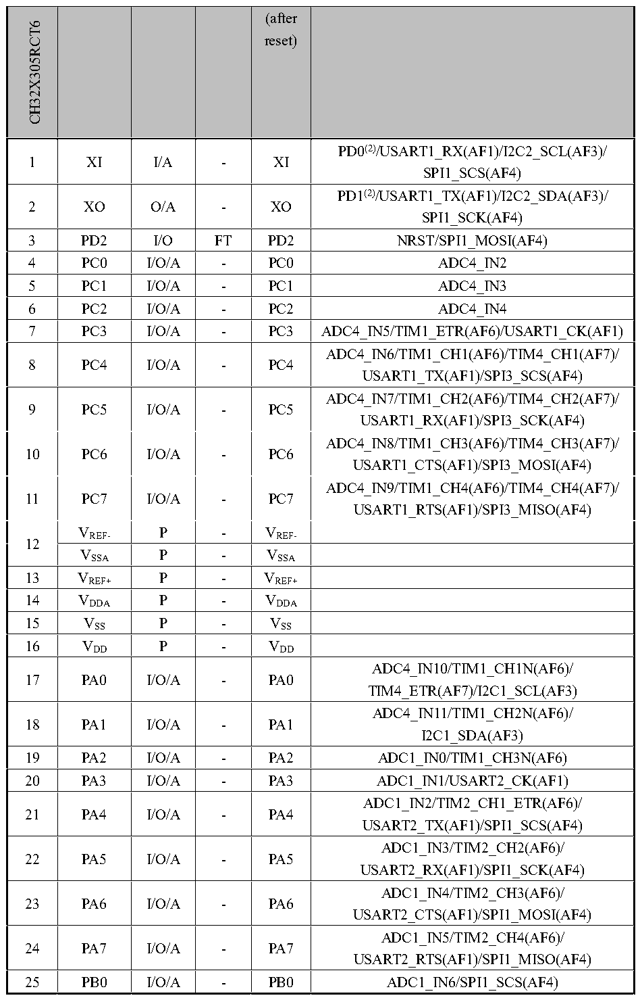

<!-- source-page: 23 -->

[← p.22](0022.md) · [index](../README.md) · [PDF p.23](https://ch32-riscv-ug.github.io/CH32X315/datasheet_en/CH32X315DS0.PDF#page=23) · [p.24 →](0024.md)

<!-- header: CH32V407/V467 Datasheet https://wch-ic.com -->

 <!-- p23-cluster-01 uncaptioned graphics, rendered from the PDF; verify at https://ch32-riscv-ug.github.io/CH32X315/datasheet_en/CH32X315DS0.PDF#page=23 -->

🖼 Text parsed from the figure above

> ⬆ **Table continued** — rendered in full at [page 22](0022.md). <!-- p23-table-001 -->

VREF- P - VREF-  
VSSA P - VSSA  

<!-- image: p23-draw-image-00001 bbox=[513.84, 782.04, 535.56, 793.8] -->
<!-- footer: V1.1 20 -->
