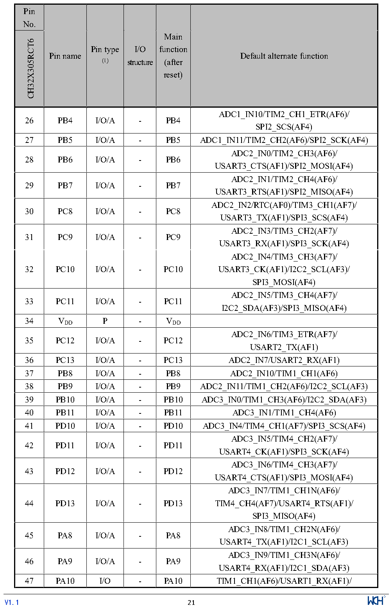

<!-- source-page: 24 -->

[← p.23](0023.md) · [index](../README.md) · [PDF p.24](https://ch32-riscv-ug.github.io/CH32X315/datasheet_en/CH32X315DS0.PDF#page=24) · [p.25 →](0025.md)

<!-- header: CH32V407/V467 Datasheet https://wch-ic.com -->

 <!-- p24-cluster-01 uncaptioned graphics, rendered from the PDF; verify at https://ch32-riscv-ug.github.io/CH32X315/datasheet_en/CH32X315DS0.PDF#page=24 -->

🖼 Text parsed from the figure above

> ⬆ **Table continued** — rendered in full at [page 22](0022.md). <!-- p24-table-001 -->

<!-- image: p24-draw-image-00001 inside the figure -->
<!-- footer: V1.1 21 -->

