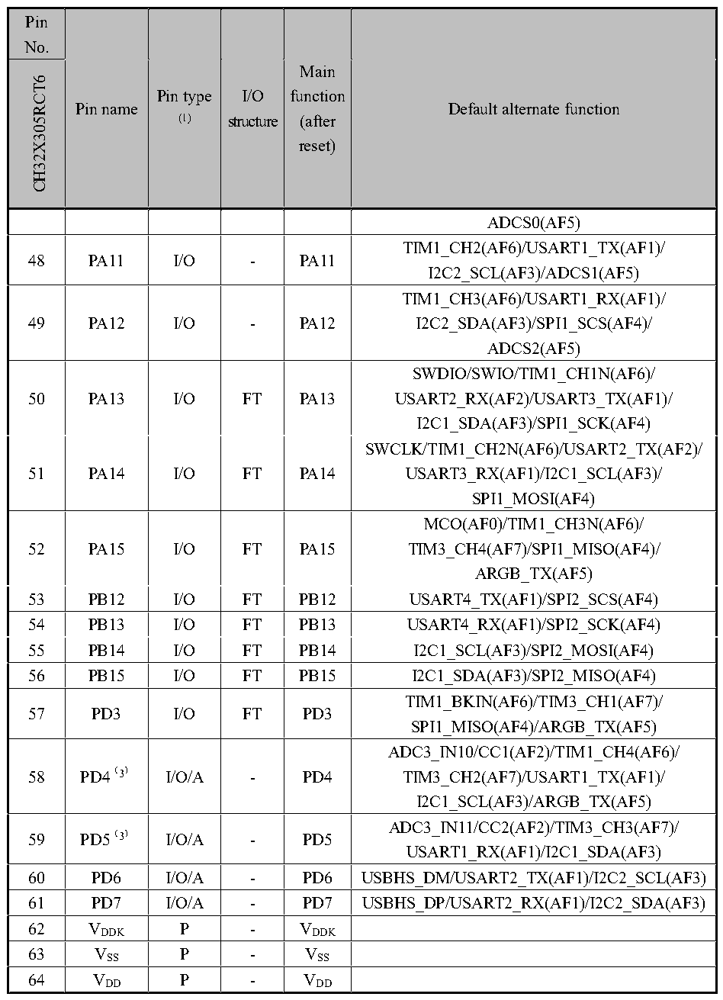

<!-- source-page: 25 -->

[← p.24](0024.md) · [index](../README.md) · [PDF p.25](https://ch32-riscv-ug.github.io/CH32X315/datasheet_en/CH32X315DS0.PDF#page=25) · [p.26 →](0026.md)

<!-- header: CH32V407/V467 Datasheet https://wch-ic.com -->

 <!-- p25-cluster-01 uncaptioned graphics, rendered from the PDF; verify at https://ch32-riscv-ug.github.io/CH32X315/datasheet_en/CH32X315DS0.PDF#page=25 -->

🖼 Text parsed from the figure above

<!-- p25-table-001 (table-2-2@1) -->
<table><tr><th style="text-align:left">Pin No.</th><th rowspan="2">Pin name</th><th rowspan="2" style="text-align:left">Pin type (1)</th><th rowspan="2" style="text-align:left">I/O structure</th><th rowspan="2" style="text-align:left">Main function (after reset)</th><th rowspan="2">Default alternate function</th></tr><tr><td>CH32X305RCT6</td></tr><tr><td></td><td></td><td></td><td></td><td></td><td>ADCS0(AF5)</td></tr><tr><td>48</td><td>PA11</td><td>I/O</td><td>-</td><td>PA11</td><td style="text-align:left">TIM1_CH2(AF6)/USART1_TX(AF1)/ I2C2_SCL(AF3)/ADCS1(AF5)</td></tr><tr><td>49</td><td>PA12</td><td>I/O</td><td>-</td><td>PA12</td><td style="text-align:left">TIM1_CH3(AF6)/USART1_RX(AF1)/ I2C2_SDA(AF3)/SPI1_SCS(AF4)/ ADCS2(AF5)</td></tr><tr><td>50</td><td>PA13</td><td>I/O</td><td>FT</td><td>PA13</td><td style="text-align:left">SWDIO/SWIO/TIM1_CH1N(AF6)/ USART2_RX(AF2)/USART3_TX(AF1)/ I2C1_SDA(AF3)/SPI1_SCK(AF4)</td></tr><tr><td>51</td><td>PA14</td><td>I/O</td><td>FT</td><td>PA14</td><td style="text-align:left">SWCLK/TIM1_CH2N(AF6)/USART2_TX(AF2)/ USART3_RX(AF1)/I2C1_SCL(AF3)/ SPI1_MOSI(AF4)</td></tr><tr><td>52</td><td>PA15</td><td>I/O</td><td>FT</td><td>PA15</td><td style="text-align:left">MCO(AF0)/TIM1_CH3N(AF6)/ TIM3_CH4(AF7)/SPI1_MISO(AF4)/ ARGB_TX(AF5)</td></tr><tr><td>53</td><td>PB12</td><td>I/O</td><td>FT</td><td>PB12</td><td>USART4_TX(AF1)/SPI2_SCS(AF4)</td></tr><tr><td>54</td><td>PB13</td><td>I/O</td><td>FT</td><td>PB13</td><td>USART4_RX(AF1)/SPI2_SCK(AF4)</td></tr><tr><td>55</td><td>PB14</td><td>I/O</td><td>FT</td><td>PB14</td><td>I2C1_SCL(AF3)/SPI2_MOSI(AF4)</td></tr><tr><td>56</td><td>PB15</td><td>I/O</td><td>FT</td><td>PB15</td><td>I2C1_SDA(AF3)/SPI2_MISO(AF4)</td></tr><tr><td>57</td><td>PD3</td><td>I/O</td><td>FT</td><td>PD3</td><td style="text-align:left">TIM1_BKIN(AF6)/TIM3_CH1(AF7)/ SPI1_MISO(AF4)/ARGB_TX(AF5)</td></tr><tr><td>58</td><td>PD4（3）</td><td>I/O/A</td><td>-</td><td>PD4</td><td style="text-align:left">ADC3_IN10/CC1(AF2)/TIM1_CH4(AF6)/ TIM3_CH2(AF7)/USART1_TX(AF1)/ I2C1_SCL(AF3)/ARGB_TX(AF5)</td></tr><tr><td>59</td><td>PD5（3）</td><td>I/O/A</td><td>-</td><td>PD5</td><td style="text-align:left">ADC3_IN11/CC2(AF2)/TIM3_CH3(AF7)/ USART1_RX(AF1)/I2C1_SDA(AF3)</td></tr><tr><td>60</td><td>PD6</td><td>I/O/A</td><td>-</td><td>PD6</td><td>USBHS_DM/USART2_TX(AF1)/I2C2_SCL(AF3)</td></tr><tr><td>61</td><td>PD7</td><td>I/O/A</td><td>-</td><td>PD7</td><td>USBHS_DP/USART2_RX(AF1)/I2C2_SDA(AF3)</td></tr><tr><td>62</td><td style="text-align:left">VDDK</td><td>P</td><td>-</td><td style="text-align:left">VDDK</td><td></td></tr><tr><td>63</td><td style="text-align:left">VSS</td><td>P</td><td>-</td><td style="text-align:left">VSS</td><td></td></tr><tr><td>64</td><td style="text-align:left">VDD</td><td>P</td><td>-</td><td style="text-align:left">VDD</td><td></td></tr></table>

<em>Note 1: Abbreviations in the table</em>  
<em>I = TTL/CMOS Schmitt input; O = CMOS tri-state output; A = Analog signal input or output;</em>  
<em>P = Power; FT = 5V tolerance.</em>  
<em>Note 2: For the CH32X305 chip, pins 1 and 2 are configured as XI and XO function pins by default after the</em>  
<em>chip is reset. The software can reset these two pins to PD0 and PD1 functions.</em>  
<!-- image: p25-draw-image-00001 bbox=[513.84, 782.04, 535.56, 793.8] -->
<!-- footer: V1.1 22 -->
