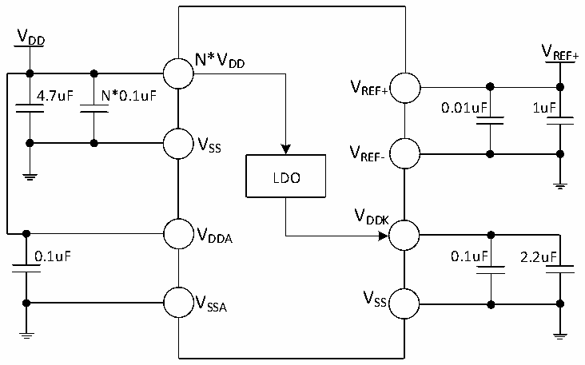

<!-- source-page: 32 -->

[← p.31](0031.md) · [index](../README.md) · [PDF p.32](https://ch32-riscv-ug.github.io/CH32X315/datasheet_en/CH32X315DS0.PDF#page=32) · [p.33 →](0033.md)

<!-- header: CH32X315/X305 Datasheet http://wch-ic.com -->

# Chapter 3 Electrical Characteristics

## 3.1 Test Conditions

Unless otherwise specified and marked, all voltages are referenced to VSS.  
All minimum and maximum values are guaranteed in the worst conditions of ambient temperature, supply voltage  
and clock frequency.  
Typical values for CH32X315 and CH32X305 are based on one of the following two environments for design  
guidance:  
1. At room temperature of 25℃, power supply VDD= 3.3V, VDDA= 3.3V, VREF+= 3.3V, generate VDDK= 1.2V.  
2. At room temperature of 25°C, the external DCDC chip (CH2003K) provides rated 5V, which generates rated  
3.3V and 1.2V for supply to CH32X315. Power supply VDD= VDDA= VREF+= 3.3V, VDDK= 1.2V.  
The data based on comprehensive evaluation, design simulation or technology characteristics are not tested in  
production. On the basis of comprehensive evaluation, the minimum and maximum values refer to sample tests.  
Unless otherwise specified that is tested, the characteristic parameters are guaranteed by comprehensive evaluation  
or design.  
Power supply scheme:  

Figure 3-1-1 Standard power supply typical circuit  
 <!-- rendered from the PDF; verify at https://ch32-riscv-ug.github.io/CH32X315/datasheet_en/CH32X315DS0.PDF#page=32 -->

🖼 Text parsed from the figure above

VDD  
V  
N*V REF+  
DD  
V  
4.7uF N*0.1uF REF+  
0.01uF 1uF  
V  
SS V  
REF-  
LDO  
VDDK  
VDDA  
0.1uF 0.1uF 2.2uF  
V  
V SSA SS  

<!-- image: p32-draw-image-00001 bbox=[518.4, 783.36, 537.84, 793.92] -->
<!-- footer: V1.1 29 -->
