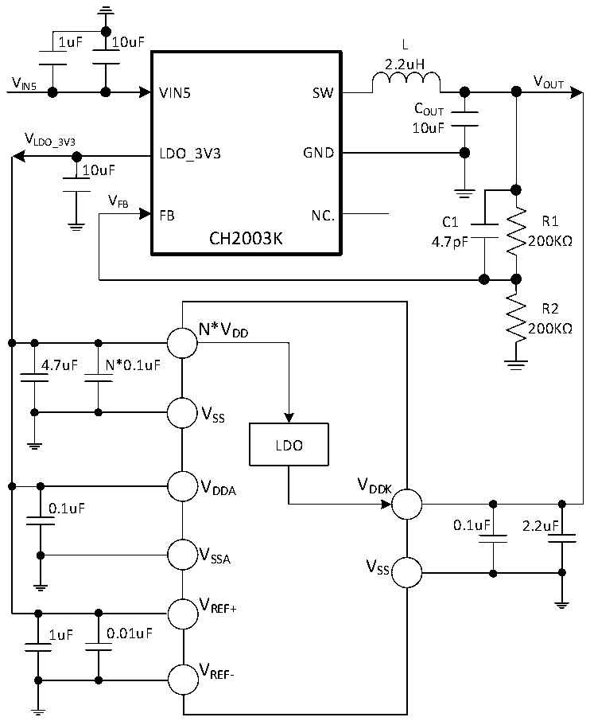

<!-- source-page: 33 -->

[← p.32](0032.md) · [index](../README.md) · [PDF p.33](https://ch32-riscv-ug.github.io/CH32X315/datasheet_en/CH32X315DS0.PDF#page=33) · [p.34 →](0034.md)

<!-- header: CH32X315/X305 Datasheet http://wch-ic.com -->

Figure 3-1-2 Typical circuit of conventional single 5V power supply  
 <!-- rendered from the PDF; verify at https://ch32-riscv-ug.github.io/CH32X315/datasheet_en/CH32X315DS0.PDF#page=33 -->

🖼 Text parsed from the figure above

1uF 10uF L  
2.2uH  
V IN5 VIN5 SW V OUT  
COUT  
10uF  
VLDO_3V3  
LDO_3V3 GND  
10uF  
VFB  
FB NC.  
C1 R1  
CH2003K  
4.7pF 200KΩ  
R2  
N*V 200KΩ  
DD  
4.7uF N*0.1uF  
VSS  
LDO  
VDDA VDDK  
0.1uF  
0.1uF 2.2uF  
V  
SSA V  
SS  
VREF+  
1uF 0.01uF  
VREF-  

<em>Note: 1. For CH32X315 and CH32X305 chips, VDD has multiple pins in the chip package, and the power</em>  
<em>supply pins with the same name must be short-circuited.</em>  
<em>2. The main VDD pin (adjacent or close to the VDDK pin) is connected to an external decoupling</em>  
<em>capacitor of 0.1uF in parallel with a capacity of at least 4.7uF. The remaining VDD pins only need to be</em>  
<em>connected to an external decoupling capacitor of 0.1uF.</em>  
<em>3. For the circuit shown in Figure 3-1-2 above, the bits LDO_VDDK/LDO_VDD12A need to be</em>  
<em>adjusted down to 010 to give way to the external 1.2V power supply.</em>  

## 3.2 Absolute Maximum Ratings

Stresses at or above the absolute maximum ratings listed in the table below may cause permanent damage to  
the device.  

<!-- p33-table-001 (table-3-1@1) pages 33-34 -->
<table><caption>Table 3-1 Absolute maximum ratings</caption><tr><th>Symbol</th><th colspan="2">Description</th><th>Min.</th><th>Max.</th><th>Unit</th></tr><tr><td style="text-align:left">TA</td><td colspan="2">Ambient temperature during operation</td><td>-40</td><td>85</td><td>℃</td></tr><tr><td style="text-align:left">TS</td><td colspan="2">Ambient temperature during storage</td><td>-40</td><td>125</td><td>℃</td></tr><tr><td style="text-align:left">VDD</td><td colspan="2">External main supply voltage</td><td>-0.3</td><td>4.0</td><td>V</td></tr><tr><td style="text-align:left">VDDA</td><td colspan="2">Analog part supply voltage</td><td>-0.3</td><td>4.0</td><td>V</td></tr><tr><td style="text-align:left">VDDK</td><td colspan="2" style="text-align:left">Core operating voltage, USB3.0 module operating voltage</td><td>-0.2</td><td>1.4</td><td>V</td></tr><tr><td style="text-align:left">VREF+</td><td colspan="2" style="text-align:left">Positive reference voltage for ADC module</td><td>-0.3</td><td style="text-align:left">V +0.3DDA</td><td>V</td></tr><tr><td style="text-align:left">VREF-</td><td colspan="2" style="text-align:left">Negative reference voltage for ADC module</td><td>-0.3</td><td>1.3</td><td>V</td></tr><tr><td rowspan="4" style="text-align:left">VIN</td><td colspan="2">Input voltage on FT (5V tolerant) pin</td><td>-0.3</td><td>5.5</td><td>V</td></tr><tr><td colspan="2">Input voltage on USB2.0 pin</td><td>-0.3</td><td style="text-align:left">V +0.3DD</td><td>V</td></tr><tr><td>Input voltage on USB3.0 pin</td><td>CH32X315</td><td>-0.3</td><td style="text-align:left">V +0.3DDK</td><td>V</td></tr><tr><td colspan="2" style="text-align:left">Input voltage on other I/O pins (V supply) DD</td><td>-0.3</td><td style="text-align:left">V +0.3DD</td><td>V</td></tr><tr><td style="text-align:left">| V | DD_x</td><td colspan="2" style="text-align:left">Voltage difference between V of main power supply pin DD</td><td></td><td>20</td><td>mV</td></tr><tr><td style="text-align:left">| V | SS_x</td><td colspan="2" style="text-align:left">Voltage difference between V of common ground pin SS</td><td></td><td>20</td><td>mV</td></tr><tr><td rowspan="2" style="text-align:left">△ VESDIO(HB △ M)</td><td colspan="2" style="text-align:left">SD electrostatic discharge voltage (HBM) of I/O pin</td><td colspan="2">4K</td><td>V</td></tr><tr><td colspan="2">USB 2.0 and USB 3.0 pin</td><td colspan="2">3K</td><td>V</td></tr><tr><td style="text-align:left">IVDD</td><td colspan="2" style="text-align:left">Total current of all V main supply pins DD</td><td></td><td>250</td><td>mA</td></tr><tr><td style="text-align:left">IVSS</td><td colspan="2" style="text-align:left">Total current of all V common ground pins SS</td><td></td><td>250</td><td>mA</td></tr><tr><td rowspan="2" style="text-align:left">IIO</td><td colspan="2">Sink current on any I/O and control pin</td><td></td><td>25</td><td rowspan="2">mA</td></tr><tr><td colspan="2" style="text-align:left">Source current on any I/O and control pin</td><td></td><td>-25</td></tr></table>

<!-- image: p33-draw-image-00001 bbox=[518.4, 783.36, 537.84, 793.92] -->
<!-- footer: V1.1 30 -->
