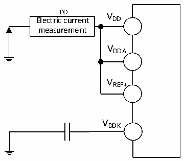

<!-- source-page: 36 -->

[← p.35](0035.md) · [index](../README.md) · [PDF p.36](https://ch32-riscv-ug.github.io/CH32X315/datasheet_en/CH32X315DS0.PDF#page=36) · [p.37 →](0037.md)

<!-- header: CH32X315/X305 Datasheet http://wch-ic.com -->

### 3.3.4 Supply Current Characteristics

Current consumption is a comprehensive index of a variety of parameters and factors. These parameters and  
factors include operating voltage, ambient temperature, I/O pin load, the software configuration of the  
product, the operating frequency, flip rate of the I/O pin, the location of the program in memory and the  
executed code, etc. The current consumption measurement method is as follows:  

Figure 3-2 Current consumption measurement  
 <!-- rendered from the PDF; verify at https://ch32-riscv-ug.github.io/CH32X315/datasheet_en/CH32X315DS0.PDF#page=36 -->

🖼 Text parsed from the figure above

I  
DD V  
Electric current DD  
measurement  
VDDA  
VREF+  
VDDK  

CH32X305 and CH32X315 are in the following conditions:  
1. Under room temperature conditions (VDD= VDDA= 3.3V, VDDK= 1.2V),  
2. At room temperature, the external DCDC chip (CH2003K) provides a rated 5V, which generates a rated  
3.3V and 1.2V for the CH32X315 chip.  
When testing at the same time: all I/O ports are configured with pull-down inputs, only one HSE or HSI is  
turned on, HSE=20M, HSI=20M (calibrated). Enables or disables the power consumption of all peripheral  
clocks.  

<!-- p36-table-001 (table-3-6@1) -->
<table><caption>Table 3-6 Typical current consumption in Run mode, data processing code runs from internal flash memory</caption><tr><th rowspan="4">Symbol</th><th rowspan="4">Parameter</th><th colspan="3">Condition</th><th colspan="2">Typ.</th><th rowspan="4">Unit</th></tr><tr><td rowspan="3">Clock</td><td rowspan="3" style="text-align:left">FCORE</td><td rowspan="3" style="text-align:left">FHCLK</td><td rowspan="3" style="text-align:left">All peripherals enabled</td><td>All</td></tr><tr><td>peripherals</td></tr><tr><td>disabled</td></tr><tr><td rowspan="11" style="text-align:left">I (1) DD</td><td rowspan="11" style="text-align:left">Supply current in Run mode</td><td rowspan="6" style="text-align:left">External clock</td><td style="text-align:left">F = CORE480MHz(2)</td><td style="text-align:left">F = HCLK480MHz(2)</td><td>74.8</td><td>41.1</td><td rowspan="11">mA</td></tr><tr><td style="text-align:left">F = 480MHz CORE</td><td style="text-align:left">F = 240MHz HCLK</td><td>51.1</td><td>34.8</td></tr><tr><td style="text-align:left">F = 240MHz CORE</td><td style="text-align:left">F = 240MHz HCLK</td><td>38.9</td><td>22.5</td></tr><tr><td style="text-align:left">F = 120MHz CORE</td><td style="text-align:left">F = 120MHz HCLK</td><td>22.6</td><td>14.4</td></tr><tr><td style="text-align:left">F = 60MHz CORE</td><td style="text-align:left">F = 60MHz HCLK</td><td>14.4</td><td>10.4</td></tr><tr><td style="text-align:left">F = 20MHz CORE</td><td style="text-align:left">F = 20MHz HCLK</td><td>5.7</td><td>4.3</td></tr><tr><td rowspan="5" style="text-align:left">Run in high-speed internal RC oscillator (HSI), HB prescaler is</td><td style="text-align:left">F = 480MHz CORE</td><td style="text-align:left">F = 240MHz HCLK</td><td>49.9</td><td>33.7</td></tr><tr><td style="text-align:left">F = 240MHz CORE</td><td style="text-align:left">F = 240MHz HCLK</td><td>38.2</td><td>21.8</td></tr><tr><td style="text-align:left">F = 120MHz CORE</td><td style="text-align:left">F = 120MHz HCLK</td><td>22.1</td><td>13.8</td></tr><tr><td style="text-align:left">F = 60MHz CORE</td><td style="text-align:left">F = 60MHz HCLK</td><td>13.8</td><td>9.7</td></tr><tr><td style="text-align:left">F = 20MHz CORE</td><td style="text-align:left">F = 20MHz HCLK</td><td>4.9</td><td>3.6</td></tr></table>

<!-- image: p36-draw-image-00001 bbox=[518.4, 783.36, 537.84, 793.92] -->
<!-- footer: V1.1 33 -->
