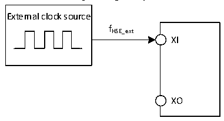

<!-- source-page: 38 -->

[← p.37](0037.md) · [index](../README.md) · [PDF p.38](https://ch32-riscv-ug.github.io/CH32X315/datasheet_en/CH32X315DS0.PDF#page=38) · [p.39 →](0039.md)

<!-- header: CH32X315/X305 Datasheet http://wch-ic.com -->
<em>configured as GPIO pull-down, with bits CC1_PD and CC2_PD set to 0. For the CH32X315MCU6 chip,</em>  
<em>PD4 and PD5 can only be configured as GPIO pull-down, with bits CC1_PD and CC2_PD set to 0.</em>  

### 3.3.5 External Clock Source Characteristics

<!-- p38-table-001 (table-3-9@1) -->
<table><caption>Table 3-9 From external high-speed clock</caption><tr><th>Symbol</th><th>Parameter</th><th>Condition</th><th>Min.</th><th>Typ.</th><th>Max.</th><th>Unit</th></tr><tr><td style="text-align:left">FHSE_ext</td><td>External clock frequency</td><td></td><td>5</td><td>20</td><td>32</td><td>MHz</td></tr><tr><td style="text-align:left">V (1) HSEH</td><td>OSC_IN input pin high level voltage</td><td></td><td style="text-align:left">0.8*VDD</td><td></td><td style="text-align:left">VDD</td><td>V</td></tr><tr><td style="text-align:left">V (1) HSEL</td><td>OSC_IN input pin low-level voltage</td><td></td><td>0</td><td></td><td style="text-align:left">0.2*VDD</td><td>V</td></tr><tr><td style="text-align:left">C in(HSE)</td><td>OSC_IN input capacitance</td><td></td><td></td><td>5</td><td></td><td>pF</td></tr><tr><td style="text-align:left">DuCy (HSE)</td><td>Duty cycle</td><td></td><td></td><td>50</td><td></td><td>%</td></tr><tr><td style="text-align:left">IL</td><td>OSC_IN input leakage current</td><td></td><td></td><td></td><td>±1</td><td>uA</td></tr></table>

<em>Note: 1. Failure to meet this condition may cause level recognition error.</em>  

Figure 3-3 External high-frequency clock source circuit  
 <!-- rendered from the PDF; verify at https://ch32-riscv-ug.github.io/CH32X315/datasheet_en/CH32X315DS0.PDF#page=38 -->

🖼 Text parsed from the figure above

External clock source  
fHSE_ext  
XI  
XO  

<!-- p38-table-002 (table-3-10@1) -->
<table><caption>Table 3-10 High-speed external clock generated from a crystal/ceramic resonator</caption><tr><th>Symbol</th><th>Parameter</th><th>Condition</th><th>Min.</th><th>Typ.</th><th>Max.</th><th>Unit</th></tr><tr><td style="text-align:left">FOSC_IN</td><td>Resonator frequency</td><td></td><td>5</td><td>20</td><td>32</td><td>MHz</td></tr><tr><td style="text-align:left">RF</td><td>Feedback resistance</td><td></td><td></td><td>250</td><td></td><td>kΩ</td></tr><tr><td>C</td><td style="text-align:left">Recommended load capacitance and corresponding crystal series impedance RS</td><td style="text-align:left">R =60Ω(1) S</td><td></td><td>20</td><td></td><td>pF</td></tr><tr><td style="text-align:left">I2</td><td>HSE drive current</td><td></td><td></td><td>0.53</td><td></td><td>mA</td></tr><tr><td style="text-align:left">g m</td><td>Oscillator transconductance</td><td>Startup</td><td></td><td>17</td><td></td><td>mA/V</td></tr><tr><td style="text-align:left">t SU(HSE)</td><td>Startup time</td><td style="text-align:left">V stable, 20M crystal DD</td><td></td><td>1(2)</td><td></td><td>ms</td></tr></table>

<em>Note 1: It is recommended that the crystal&#x27;s ESR does not exceed 80Ω. Prioritize crystals with lower ESR</em>  
<em>values. Refer to the crystal manual for load capacitance requirements.</em>  
<em>2. Start time refers to the time difference from HSEON being activated until HSERDY is set.</em>  
Circuit reference design and requirements:  
The load capacitance of the crystal is subject to the recommendation of the crystal manufacturer, generally  
CL1=CL2.  
<!-- image: p38-draw-image-00001 bbox=[518.4, 783.36, 537.84, 793.92] -->
<!-- footer: V1.1 35 -->
