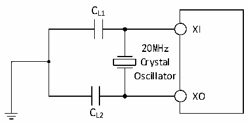

<!-- source-page: 39 -->

[← p.38](0038.md) · [index](../README.md) · [PDF p.39](https://ch32-riscv-ug.github.io/CH32X315/datasheet_en/CH32X315DS0.PDF#page=39) · [p.40 →](0040.md)

<!-- header: CH32X315/X305 Datasheet http://wch-ic.com -->

Figure 3-5 Typical circuit of external 20M crystal  
 <!-- rendered from the PDF; verify at https://ch32-riscv-ug.github.io/CH32X315/datasheet_en/CH32X315DS0.PDF#page=39 -->

🖼 Text parsed from the figure above

CL1  
XI  
20MHz  
Crystal  
Oscillator  
XO  
CL2  

### 3.3.6 Internal Clock Source Characteristics

<!-- p39-table-001 (table-3-11@1) -->
<table><caption>Table 3-11 Internal high-speed (HSI) RC oscillator characteristics</caption><tr><th>Symbol</th><th>Parameter</th><th>Condition</th><th>Min.</th><th>Typ.</th><th>Max.</th><th>Unit</th></tr><tr><td style="text-align:left">FHSI</td><td>Frequency (after calibration)</td><td></td><td></td><td>20</td><td></td><td>MHz</td></tr><tr><td style="text-align:left">DuCy HSI</td><td>Duty cycle</td><td></td><td>45</td><td>50</td><td>55</td><td>%</td></tr><tr><td rowspan="2" style="text-align:left">ACCHSI</td><td rowspan="2" style="text-align:left">Accuracy of HSI oscillator (after calibration)</td><td style="text-align:left">T = 0℃~70℃ A</td><td>-1.5</td><td></td><td>1.8</td><td>%</td></tr><tr><td style="text-align:left">T = -40℃~85℃ A</td><td>-2.2</td><td></td><td>2.2</td><td>%</td></tr><tr><td style="text-align:left">t SU(HSI)</td><td style="text-align:left">HSI oscillator startup stabilization time</td><td></td><td></td><td>2</td><td>12</td><td>us</td></tr><tr><td style="text-align:left">IDD(HSI)</td><td>HSI oscillator power consumption</td><td></td><td>180</td><td>230</td><td>280</td><td>uA</td></tr></table>

<!-- p39-table-002 (table-3-12@1) -->
<table><caption>Table 3-12 Internal low-speed (LSI) RC oscillator characteristics</caption><tr><th>Symbol</th><th>Parameter</th><th>Condition</th><th>Min.</th><th>Typ.</th><th>Max.</th><th>Unit</th></tr><tr><td style="text-align:left">FLSI</td><td>Frequency</td><td></td><td>25</td><td>40</td><td>60</td><td>kHz</td></tr><tr><td style="text-align:left">DuCy LSI</td><td>Duty cycle</td><td></td><td>45</td><td>50</td><td>55</td><td>%</td></tr><tr><td style="text-align:left">t SU(LSI)</td><td style="text-align:left">LSI oscillator startup stabilization time(1)</td><td></td><td></td><td>230</td><td></td><td>us</td></tr><tr><td style="text-align:left">IDD(LSI)</td><td style="text-align:left">LSI oscillator power consumption</td><td></td><td></td><td>1</td><td></td><td>uA</td></tr></table>

<em>Note: 1. Set bit 1 of the RCC_RSTSCKR register to 1 and wait for LSIRDY to be set to 1.</em>  

### 3.3.7 Wakeup Time from Low-power Mode

<!-- p39-table-003 (table-3-13@1) -->
<table><caption>Table 3-13 Wakeup time from low-power mode</caption><tr><th>Symbol</th><th>Parameter</th><th>Condition</th><th>Typ.</th><th>Unit</th></tr><tr><td style="text-align:left">t wusleep</td><td>Wakeup from Sleep mode</td><td>Wake up using HSI RC clock</td><td>0.48</td><td>us</td></tr><tr><td rowspan="2" style="text-align:left">t wustop</td><td style="text-align:left">Wakeup from Stop mode (LDO is in normal mode)</td><td>Wake up using HSI RC clock</td><td>6.6</td><td>us</td></tr><tr><td style="text-align:left">Wakeup from Stop mode (LDO is in low-power mode)</td><td style="text-align:left">LDO wake-up time from low power mode + HIS RC clock wake-up time</td><td>22.05</td><td></td></tr></table>

<!-- image: p39-draw-image-00001 bbox=[518.4, 783.36, 537.84, 793.92] -->
<!-- footer: V1.1 36 -->
