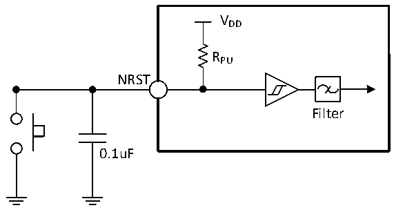

<!-- source-page: 42 -->

[← p.41](0041.md) · [index](../README.md) · [PDF p.42](https://ch32-riscv-ug.github.io/CH32X315/datasheet_en/CH32X315DS0.PDF#page=42) · [p.43 →](0043.md)

<!-- header: CH32X315/X305 Datasheet http://wch-ic.com -->

> ⬆ **Table continued** — rendered in full at [page 41](0041.md). <!-- p42-table-001 -->

<em>Note: 1. The above are guaranteed design parameters.</em>  

### 3.3.10 NRST Pin Characteristics

<!-- p42-table-002 (table-3-19@1) -->
<table><caption>Table 3-19 External reset pin characteristics</caption><tr><th>Symbol</th><th>Parameter</th><th>Condition</th><th>Min.</th><th>Typ.</th><th>Max.</th><th>Unit</th></tr><tr><td style="text-align:left">VIL(NRST)</td><td>NRST input low-level voltage</td><td></td><td>0</td><td></td><td style="text-align:left">0.29*V -0.07DD</td><td>V</td></tr><tr><td style="text-align:left">VIH（NRST）</td><td>NRST input high-level voltage</td><td></td><td style="text-align:left">0.45*V +0.41DD</td><td></td><td style="text-align:left">VDD</td><td>V</td></tr><tr><td style="text-align:left">V hys(NRST)</td><td style="text-align:left">NRST Schmitt Trigger voltage hysteresis</td><td></td><td></td><td>240</td><td></td><td>mV</td></tr><tr><td style="text-align:left">R (1) PU</td><td>Pull-up equivalent resistance</td><td></td><td>30</td><td>40</td><td>55</td><td>kΩ</td></tr><tr><td style="text-align:left">VF(NRST)</td><td>NRST input filtered pulse width</td><td></td><td></td><td></td><td>100</td><td>ns</td></tr><tr><td style="text-align:left">VNF(NRST)</td><td>NRST input not filtered pulse width</td><td></td><td>300</td><td></td><td></td><td>ns</td></tr></table>

<em>Note: The pull-up resistor is a real resistor in series with a switchable PMOS implementation. The resistance</em>  
<em>of this PMOS switch is very small (approximately 10%).</em>  
Circuit reference design and requirements:  

Figure 3-7 Typical circuit of external reset pin  
 <!-- rendered from the PDF; verify at https://ch32-riscv-ug.github.io/CH32X315/datasheet_en/CH32X315DS0.PDF#page=42 -->

🖼 Text parsed from the figure above

VDD  
RPU  
NRST  
Filter  
0.1uF  

<em>Note: The capacitor shown in the diagram is optional and can be used to filter out key bounce.</em>  

### 3.3.11 TIM Timer Characteristics

<!-- p42-table-004 (table-3-20-1@1) pages 42-43 -->
<table><caption>Table 3-20-1 TIM1/2/3 characteristics</caption><tr><th>Symbol</th><th>Parameter</th><th>Condition</th><th>Min.</th><th>Max.</th><th>Unit</th></tr><tr><td rowspan="2" style="text-align:left">t res(TIM)</td><td rowspan="2">Timer reference clock</td><td></td><td>1</td><td></td><td style="text-align:left">t TIMxCLK</td></tr><tr><td style="text-align:left">f = 200MHz TIMxCLK</td><td>5</td><td></td><td>ns</td></tr><tr><td rowspan="2" style="text-align:left">FEXT</td><td rowspan="2" style="text-align:left">Timer external clock frequency on CH1 to CH4</td><td></td><td>0</td><td style="text-align:left">f /2TIMxCLK</td><td>MHz</td></tr><tr><td style="text-align:left">f = 200MHz TIMxCLK</td><td>0</td><td>100</td><td>MHz</td></tr><tr><td style="text-align:left">R esTIM</td><td>Timer resolution</td><td></td><td></td><td>16</td><td>bit</td></tr><tr><td rowspan="2" style="text-align:left">t COUNTER</td><td rowspan="2" style="text-align:left">16-bit counter clock cycle when the internal clock is selected</td><td></td><td>1</td><td>65536</td><td style="text-align:left">t TIMxCLK</td></tr><tr><td style="text-align:left">f = 200MHz TIMxCLK</td><td>0.005</td><td>328</td><td>us</td></tr><tr><td rowspan="2" style="text-align:left">t MAX_COUNT</td><td rowspan="2">Maximum possible count</td><td></td><td></td><td>65536</td><td style="text-align:left">t TIMxCLK</td></tr><tr><td style="text-align:left">f = 200MHz TIMxCLK</td><td></td><td>21.5</td><td>s</td></tr></table>

<!-- image: p42-draw-image-00001 bbox=[518.4, 783.36, 537.84, 793.92] -->
<!-- footer: V1.1 39 -->
