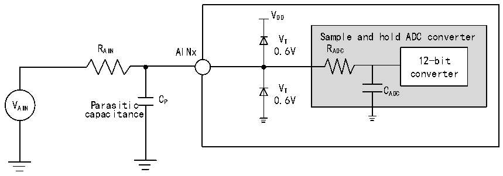

<!-- source-page: 48 -->

[← p.47](0047.md) · [index](../README.md) · [PDF p.48](https://ch32-riscv-ug.github.io/CH32X315/datasheet_en/CH32X315DS0.PDF#page=48) · [p.49 →](0049.md)

<!-- header: CH32X315/X305 Datasheet http://wch-ic.com -->
Formula: Maximum RAIN  
<!-- image: p48-draw-image-00002 bbox=[146.16, 98.64, 153.36, 99.36] -->
<!-- image: p48-draw-image-00003 bbox=[146.16, 99.36, 147.6, 100.08] -->
<!-- image: p48-draw-image-00004 bbox=[148.32, 99.36, 151.2, 100.08] -->
<!-- image: p48-draw-image-00005 bbox=[151.92, 99.36, 153.36, 100.08] -->
<!-- image: p48-draw-image-00006 bbox=[146.16, 100.08, 147.6, 100.8] -->
<!-- image: p48-draw-image-00007 bbox=[148.32, 100.08, 151.2, 100.8] -->
<!-- image: p48-draw-image-00008 bbox=[151.92, 100.08, 153.36, 100.8] -->
<!-- image: p48-draw-image-00009 bbox=[148.32, 100.8, 151.2, 101.52] -->
<!-- image: p48-draw-image-00010 bbox=[152.64, 100.8, 155.52, 101.52] -->
<!-- image: p48-draw-image-00011 bbox=[148.32, 101.52, 151.2, 102.24] -->
<!-- image: p48-draw-image-00012 bbox=[151.92, 101.52, 153.36, 102.24] -->
<!-- image: p48-draw-image-00013 bbox=[154.08, 101.52, 155.52, 102.24] -->
<!-- image: p48-draw-image-00014 bbox=[148.32, 102.24, 151.2, 102.96] -->
<!-- image: p48-draw-image-00015 bbox=[151.92, 102.24, 154.08, 102.96] -->
<!-- image: p48-draw-image-00016 bbox=[148.32, 102.96, 151.2, 103.68] -->
<!-- image: p48-draw-image-00017 bbox=[152.64, 102.96, 155.52, 103.68] -->
<!-- image: p48-draw-image-00018 bbox=[148.32, 103.68, 151.2, 104.4] -->
<!-- image: p48-draw-image-00019 bbox=[154.08, 103.68, 156.24, 104.4] -->
<!-- image: p48-draw-image-00020 bbox=[148.32, 104.4, 151.2, 105.12] -->
<!-- image: p48-draw-image-00021 bbox=[151.92, 104.4, 153.36, 105.12] -->
<!-- image: p48-draw-image-00022 bbox=[154.08, 104.4, 156.24, 105.12] -->
<!-- image: p48-draw-image-00023 bbox=[147.6, 105.12, 155.52, 106.56] -->
<!-- image: p48-draw-image-00024 bbox=[68.4, 107.28, 73.44, 108.0] -->
<!-- image: p48-draw-image-00025 bbox=[213.12, 107.28, 218.16, 108.0] -->
<!-- image: p48-draw-image-00026 bbox=[69.12, 108.0, 74.16, 108.72] -->
<!-- image: p48-draw-image-00027 bbox=[97.92, 108.0, 100.08, 108.72] -->
<!-- image: p48-draw-image-00028 bbox=[213.84, 108.0, 218.88, 108.72] -->
<!-- image: p48-draw-image-00029 bbox=[69.12, 108.72, 71.28, 109.44] -->
<!-- image: p48-draw-image-00030 bbox=[72.0, 108.72, 74.16, 109.44] -->
<!-- image: p48-draw-image-00031 bbox=[95.76, 108.72, 100.08, 109.44] -->
<!-- image: p48-draw-image-00032 bbox=[213.84, 108.72, 216.0, 109.44] -->
<!-- image: p48-draw-image-00033 bbox=[216.72, 108.72, 218.88, 109.44] -->
<!-- image: p48-draw-image-00034 bbox=[69.12, 109.44, 71.28, 110.16] -->
<!-- image: p48-draw-image-00035 bbox=[72.0, 109.44, 74.16, 110.16] -->
<!-- image: p48-draw-image-00036 bbox=[94.32, 109.44, 97.92, 110.16] -->
<!-- image: p48-draw-image-00037 bbox=[213.84, 109.44, 216.0, 110.16] -->
<!-- image: p48-draw-image-00038 bbox=[216.72, 109.44, 218.88, 110.16] -->
<!-- image: p48-draw-image-00039 bbox=[69.12, 110.16, 74.16, 110.88] -->
<!-- image: p48-draw-image-00040 bbox=[92.88, 110.16, 95.76, 110.88] -->
<!-- image: p48-draw-image-00041 bbox=[213.84, 110.16, 218.88, 110.88] -->
<!-- image: p48-draw-image-00042 bbox=[69.12, 110.88, 73.44, 111.6] -->
<!-- image: p48-draw-image-00043 bbox=[92.16, 110.88, 94.32, 111.6] -->
<!-- image: p48-draw-image-00044 bbox=[102.96, 110.88, 200.16, 111.6] -->
<!-- image: p48-draw-image-00045 bbox=[202.32, 110.88, 210.24, 111.6] -->
<!-- image: p48-draw-image-00046 bbox=[213.84, 110.88, 218.16, 111.6] -->
<!-- image: p48-draw-image-00047 bbox=[69.12, 111.6, 73.44, 112.32] -->
<!-- image: p48-draw-image-00048 bbox=[77.04, 111.6, 79.92, 112.32] -->
<!-- image: p48-draw-image-00049 bbox=[81.36, 111.6, 86.4, 112.32] -->
<!-- image: p48-draw-image-00050 bbox=[87.12, 111.6, 90.0, 112.32] -->
<!-- image: p48-draw-image-00051 bbox=[92.88, 111.6, 95.76, 112.32] -->
<!-- image: p48-draw-image-00052 bbox=[213.84, 111.6, 218.16, 112.32] -->
<!-- image: p48-draw-image-00053 bbox=[221.76, 111.6, 224.64, 112.32] -->
<!-- image: p48-draw-image-00054 bbox=[226.08, 111.6, 230.4, 112.32] -->
<!-- image: p48-draw-image-00055 bbox=[231.84, 111.6, 235.44, 112.32] -->
<!-- image: p48-draw-image-00056 bbox=[69.12, 112.32, 71.28, 113.04] -->
<!-- image: p48-draw-image-00057 bbox=[72.0, 112.32, 74.16, 113.04] -->
<!-- image: p48-draw-image-00058 bbox=[77.04, 112.32, 79.92, 113.04] -->
<!-- image: p48-draw-image-00059 bbox=[82.08, 112.32, 83.52, 113.04] -->
<!-- image: p48-draw-image-00060 bbox=[84.96, 112.32, 87.12, 113.04] -->
<!-- image: p48-draw-image-00061 bbox=[87.84, 112.32, 89.28, 113.04] -->
<!-- image: p48-draw-image-00062 bbox=[94.32, 112.32, 97.92, 113.04] -->
<!-- image: p48-draw-image-00063 bbox=[213.84, 112.32, 216.0, 113.04] -->
<!-- image: p48-draw-image-00064 bbox=[216.72, 112.32, 218.88, 113.04] -->
<!-- image: p48-draw-image-00065 bbox=[221.76, 112.32, 224.64, 113.04] -->
<!-- image: p48-draw-image-00066 bbox=[226.8, 112.32, 228.24, 113.04] -->
<!-- image: p48-draw-image-00067 bbox=[228.96, 112.32, 233.28, 113.04] -->
<!-- image: p48-draw-image-00068 bbox=[234.0, 112.32, 235.44, 113.04] -->
<!-- image: p48-draw-image-00069 bbox=[69.12, 113.04, 71.28, 113.76] -->
<!-- image: p48-draw-image-00070 bbox=[72.0, 113.04, 74.16, 113.76] -->
<!-- image: p48-draw-image-00071 bbox=[76.32, 113.04, 80.64, 113.76] -->
<!-- image: p48-draw-image-00072 bbox=[82.08, 113.04, 83.52, 113.76] -->
<!-- image: p48-draw-image-00073 bbox=[84.96, 113.04, 89.28, 113.76] -->
<!-- image: p48-draw-image-00074 bbox=[95.76, 113.04, 100.08, 113.76] -->
<!-- image: p48-draw-image-00075 bbox=[184.32, 113.04, 187.2, 113.76] -->
<!-- image: p48-draw-image-00076 bbox=[187.92, 113.04, 190.8, 113.76] -->
<!-- image: p48-draw-image-00077 bbox=[213.84, 113.04, 216.0, 113.76] -->
<!-- image: p48-draw-image-00078 bbox=[216.72, 113.04, 218.88, 113.76] -->
<!-- image: p48-draw-image-00079 bbox=[221.04, 113.04, 225.36, 113.76] -->
<!-- image: p48-draw-image-00080 bbox=[226.8, 113.04, 228.24, 113.76] -->
<!-- image: p48-draw-image-00081 bbox=[229.68, 113.04, 233.28, 113.76] -->
<!-- image: p48-draw-image-00082 bbox=[68.4, 113.76, 71.28, 114.48] -->
<!-- image: p48-draw-image-00083 bbox=[72.72, 113.76, 74.88, 114.48] -->
<!-- image: p48-draw-image-00084 bbox=[76.32, 113.76, 77.76, 114.48] -->
<!-- image: p48-draw-image-00085 bbox=[79.2, 113.76, 80.64, 114.48] -->
<!-- image: p48-draw-image-00086 bbox=[82.08, 113.76, 83.52, 114.48] -->
<!-- image: p48-draw-image-00087 bbox=[84.96, 113.76, 89.28, 114.48] -->
<!-- image: p48-draw-image-00088 bbox=[97.92, 113.76, 100.08, 114.48] -->
<!-- image: p48-draw-image-00089 bbox=[103.68, 113.76, 107.28, 114.48] -->
<!-- image: p48-draw-image-00090 bbox=[136.08, 113.76, 140.4, 114.48] -->
<!-- image: p48-draw-image-00091 bbox=[167.76, 113.76, 170.64, 114.48] -->
<!-- image: p48-draw-image-00092 bbox=[179.28, 113.76, 183.6, 114.48] -->
<!-- image: p48-draw-image-00093 bbox=[185.04, 113.76, 187.92, 114.48] -->
<!-- image: p48-draw-image-00094 bbox=[188.64, 113.76, 190.08, 114.48] -->
<!-- image: p48-draw-image-00095 bbox=[192.24, 113.76, 194.4, 114.48] -->
<!-- image: p48-draw-image-00096 bbox=[196.56, 113.76, 199.44, 114.48] -->
<!-- image: p48-draw-image-00097 bbox=[213.12, 113.76, 216.0, 114.48] -->
<!-- image: p48-draw-image-00098 bbox=[217.44, 113.76, 219.6, 114.48] -->
<!-- image: p48-draw-image-00099 bbox=[221.04, 113.76, 223.2, 114.48] -->
<!-- image: p48-draw-image-00100 bbox=[223.92, 113.76, 225.36, 114.48] -->
<!-- image: p48-draw-image-00101 bbox=[226.8, 113.76, 228.24, 114.48] -->
<!-- image: p48-draw-image-00102 bbox=[229.68, 113.76, 233.28, 114.48] -->
<!-- image: p48-draw-image-00103 bbox=[76.32, 114.48, 81.36, 115.2] -->
<!-- image: p48-draw-image-00104 bbox=[82.08, 114.48, 83.52, 115.2] -->
<!-- image: p48-draw-image-00105 bbox=[84.96, 114.48, 89.28, 115.2] -->
<!-- image: p48-draw-image-00106 bbox=[103.68, 114.48, 107.28, 115.2] -->
<!-- image: p48-draw-image-00107 bbox=[135.36, 114.48, 137.52, 115.2] -->
<!-- image: p48-draw-image-00108 bbox=[138.24, 114.48, 140.4, 115.2] -->
<!-- image: p48-draw-image-00109 bbox=[169.2, 114.48, 170.64, 115.2] -->
<!-- image: p48-draw-image-00110 bbox=[178.56, 114.48, 180.72, 115.2] -->
<!-- image: p48-draw-image-00111 bbox=[181.44, 114.48, 183.6, 115.2] -->
<!-- image: p48-draw-image-00112 bbox=[185.04, 114.48, 190.08, 115.2] -->
<!-- image: p48-draw-image-00113 bbox=[192.24, 114.48, 194.4, 115.2] -->
<!-- image: p48-draw-image-00114 bbox=[195.84, 114.48, 200.16, 115.2] -->
<!-- image: p48-draw-image-00115 bbox=[221.04, 114.48, 226.08, 115.2] -->
<!-- image: p48-draw-image-00116 bbox=[226.8, 114.48, 228.24, 115.2] -->
<!-- image: p48-draw-image-00117 bbox=[229.68, 114.48, 233.28, 115.2] -->
<!-- image: p48-draw-image-00118 bbox=[75.6, 115.2, 77.76, 115.92] -->
<!-- image: p48-draw-image-00119 bbox=[79.2, 115.2, 81.36, 115.92] -->
<!-- image: p48-draw-image-00120 bbox=[82.08, 115.2, 83.52, 115.92] -->
<!-- image: p48-draw-image-00121 bbox=[84.96, 115.2, 86.4, 115.92] -->
<!-- image: p48-draw-image-00122 bbox=[87.12, 115.2, 89.28, 115.92] -->
<!-- image: p48-draw-image-00123 bbox=[103.68, 115.2, 105.12, 115.92] -->
<!-- image: p48-draw-image-00124 bbox=[125.28, 115.2, 126.72, 115.92] -->
<!-- image: p48-draw-image-00125 bbox=[129.6, 115.2, 131.04, 115.92] -->
<!-- image: p48-draw-image-00126 bbox=[134.64, 115.2, 136.8, 115.92] -->
<!-- image: p48-draw-image-00127 bbox=[138.96, 115.2, 140.4, 115.92] -->
<!-- image: p48-draw-image-00128 bbox=[159.12, 115.2, 160.56, 115.92] -->
<!-- image: p48-draw-image-00129 bbox=[163.44, 115.2, 164.88, 115.92] -->
<!-- image: p48-draw-image-00130 bbox=[169.2, 115.2, 170.64, 115.92] -->
<!-- image: p48-draw-image-00131 bbox=[181.44, 115.2, 183.6, 115.92] -->
<!-- image: p48-draw-image-00132 bbox=[185.04, 115.2, 190.08, 115.92] -->
<!-- image: p48-draw-image-00133 bbox=[192.24, 115.2, 194.4, 115.92] -->
<!-- image: p48-draw-image-00134 bbox=[198.0, 115.2, 199.44, 115.92] -->
<!-- image: p48-draw-image-00135 bbox=[220.32, 115.2, 223.2, 115.92] -->
<!-- image: p48-draw-image-00136 bbox=[223.92, 115.2, 226.08, 115.92] -->
<!-- image: p48-draw-image-00137 bbox=[226.8, 115.2, 228.24, 115.92] -->
<!-- image: p48-draw-image-00138 bbox=[228.96, 115.2, 233.28, 115.92] -->
<!-- image: p48-draw-image-00139 bbox=[234.0, 115.2, 235.44, 115.92] -->
<!-- image: p48-draw-image-00140 bbox=[74.88, 115.92, 77.76, 116.64] -->
<!-- image: p48-draw-image-00141 bbox=[79.2, 115.92, 86.4, 116.64] -->
<!-- image: p48-draw-image-00142 bbox=[87.12, 115.92, 89.28, 116.64] -->
<!-- image: p48-draw-image-00143 bbox=[102.96, 115.92, 106.56, 116.64] -->
<!-- image: p48-draw-image-00144 bbox=[125.28, 115.92, 127.44, 116.64] -->
<!-- image: p48-draw-image-00145 bbox=[128.88, 115.92, 131.04, 116.64] -->
<!-- image: p48-draw-image-00146 bbox=[134.64, 115.92, 136.8, 116.64] -->
<!-- image: p48-draw-image-00147 bbox=[159.12, 115.92, 161.28, 116.64] -->
<!-- image: p48-draw-image-00148 bbox=[162.72, 115.92, 164.88, 116.64] -->
<!-- image: p48-draw-image-00149 bbox=[169.2, 115.92, 170.64, 116.64] -->
<!-- image: p48-draw-image-00150 bbox=[171.36, 115.92, 176.4, 116.64] -->
<!-- image: p48-draw-image-00151 bbox=[181.44, 115.92, 183.6, 116.64] -->
<!-- image: p48-draw-image-00152 bbox=[185.04, 115.92, 190.08, 116.64] -->
<!-- image: p48-draw-image-00153 bbox=[190.8, 115.92, 195.84, 116.64] -->
<!-- image: p48-draw-image-00154 bbox=[197.28, 115.92, 198.72, 116.64] -->
<!-- image: p48-draw-image-00155 bbox=[219.6, 115.92, 223.2, 116.64] -->
<!-- image: p48-draw-image-00156 bbox=[223.92, 115.92, 230.4, 116.64] -->
<!-- image: p48-draw-image-00157 bbox=[231.84, 115.92, 235.44, 116.64] -->
<!-- image: p48-draw-image-00158 bbox=[103.68, 116.64, 105.12, 117.36] -->
<!-- image: p48-draw-image-00159 bbox=[126.0, 116.64, 130.32, 117.36] -->
<!-- image: p48-draw-image-00160 bbox=[134.64, 116.64, 136.8, 117.36] -->
<!-- image: p48-draw-image-00161 bbox=[159.84, 116.64, 164.16, 117.36] -->
<!-- image: p48-draw-image-00162 bbox=[169.2, 116.64, 170.64, 117.36] -->
<!-- image: p48-draw-image-00163 bbox=[172.08, 116.64, 176.4, 117.36] -->
<!-- image: p48-draw-image-00164 bbox=[181.44, 116.64, 183.6, 117.36] -->
<!-- image: p48-draw-image-00165 bbox=[185.04, 116.64, 187.2, 117.36] -->
<!-- image: p48-draw-image-00166 bbox=[187.92, 116.64, 190.08, 117.36] -->
<!-- image: p48-draw-image-00167 bbox=[192.24, 116.64, 194.4, 117.36] -->
<!-- image: p48-draw-image-00168 bbox=[196.56, 116.64, 198.0, 117.36] -->
<!-- image: p48-draw-image-00169 bbox=[198.72, 116.64, 200.16, 117.36] -->
<!-- image: p48-draw-image-00170 bbox=[103.68, 117.36, 105.12, 118.08] -->
<!-- image: p48-draw-image-00171 bbox=[126.72, 117.36, 129.6, 118.08] -->
<!-- image: p48-draw-image-00172 bbox=[134.64, 117.36, 136.8, 118.08] -->
<!-- image: p48-draw-image-00173 bbox=[160.56, 117.36, 163.44, 118.08] -->
<!-- image: p48-draw-image-00174 bbox=[169.2, 117.36, 170.64, 118.08] -->
<!-- image: p48-draw-image-00175 bbox=[172.08, 117.36, 173.52, 118.08] -->
<!-- image: p48-draw-image-00176 bbox=[174.96, 117.36, 176.4, 118.08] -->
<!-- image: p48-draw-image-00177 bbox=[180.72, 117.36, 182.88, 118.08] -->
<!-- image: p48-draw-image-00178 bbox=[184.32, 117.36, 187.2, 118.08] -->
<!-- image: p48-draw-image-00179 bbox=[187.92, 117.36, 190.08, 118.08] -->
<!-- image: p48-draw-image-00180 bbox=[192.24, 117.36, 194.4, 118.08] -->
<!-- image: p48-draw-image-00181 bbox=[195.84, 117.36, 200.16, 118.08] -->
<!-- image: p48-draw-image-00182 bbox=[103.68, 118.08, 105.12, 118.8] -->
<!-- image: p48-draw-image-00183 bbox=[107.28, 118.08, 109.44, 118.8] -->
<!-- image: p48-draw-image-00184 bbox=[110.88, 118.08, 115.92, 118.8] -->
<!-- image: p48-draw-image-00185 bbox=[117.36, 118.08, 120.96, 118.8] -->
<!-- image: p48-draw-image-00186 bbox=[126.72, 118.08, 129.6, 118.8] -->
<!-- image: p48-draw-image-00187 bbox=[134.64, 118.08, 136.8, 118.8] -->
<!-- image: p48-draw-image-00188 bbox=[141.84, 118.08, 144.0, 118.8] -->
<!-- image: p48-draw-image-00189 bbox=[145.44, 118.08, 149.76, 118.8] -->
<!-- image: p48-draw-image-00190 bbox=[151.92, 118.08, 155.52, 118.8] -->
<!-- image: p48-draw-image-00191 bbox=[160.56, 118.08, 163.44, 118.8] -->
<!-- image: p48-draw-image-00192 bbox=[169.2, 118.08, 170.64, 118.8] -->
<!-- image: p48-draw-image-00193 bbox=[172.08, 118.08, 173.52, 118.8] -->
<!-- image: p48-draw-image-00194 bbox=[174.96, 118.08, 176.4, 118.8] -->
<!-- image: p48-draw-image-00195 bbox=[180.0, 118.08, 182.16, 118.8] -->
<!-- image: p48-draw-image-00196 bbox=[192.24, 118.08, 194.4, 118.8] -->
<!-- image: p48-draw-image-00197 bbox=[103.68, 118.8, 105.12, 119.52] -->
<!-- image: p48-draw-image-00198 bbox=[107.28, 118.8, 109.44, 119.52] -->
<!-- image: p48-draw-image-00199 bbox=[111.6, 118.8, 113.04, 119.52] -->
<!-- image: p48-draw-image-00200 bbox=[113.76, 118.8, 118.8, 119.52] -->
<!-- image: p48-draw-image-00201 bbox=[119.52, 118.8, 120.96, 119.52] -->
<!-- image: p48-draw-image-00202 bbox=[126.0, 118.8, 130.32, 119.52] -->
<!-- image: p48-draw-image-00203 bbox=[134.64, 118.8, 136.8, 119.52] -->
<!-- image: p48-draw-image-00204 bbox=[138.96, 118.8, 140.4, 119.52] -->
<!-- image: p48-draw-image-00205 bbox=[141.84, 118.8, 144.0, 119.52] -->
<!-- image: p48-draw-image-00206 bbox=[146.16, 118.8, 147.6, 119.52] -->
<!-- image: p48-draw-image-00207 bbox=[148.32, 118.8, 153.36, 119.52] -->
<!-- image: p48-draw-image-00208 bbox=[154.08, 118.8, 155.52, 119.52] -->
<!-- image: p48-draw-image-00209 bbox=[159.84, 118.8, 164.16, 119.52] -->
<!-- image: p48-draw-image-00210 bbox=[169.2, 118.8, 170.64, 119.52] -->
<!-- image: p48-draw-image-00211 bbox=[172.08, 118.8, 173.52, 119.52] -->
<!-- image: p48-draw-image-00212 bbox=[174.96, 118.8, 176.4, 119.52] -->
<!-- image: p48-draw-image-00213 bbox=[180.0, 118.8, 181.44, 119.52] -->
<!-- image: p48-draw-image-00214 bbox=[103.68, 119.52, 105.12, 120.24] -->
<!-- image: p48-draw-image-00215 bbox=[106.56, 119.52, 110.16, 120.24] -->
<!-- image: p48-draw-image-00216 bbox=[111.6, 119.52, 113.04, 120.24] -->
<!-- image: p48-draw-image-00217 bbox=[115.2, 119.52, 118.8, 120.24] -->
<!-- image: p48-draw-image-00218 bbox=[125.28, 119.52, 127.44, 120.24] -->
<!-- image: p48-draw-image-00219 bbox=[128.88, 119.52, 131.04, 120.24] -->
<!-- image: p48-draw-image-00220 bbox=[135.36, 119.52, 137.52, 120.24] -->
<!-- image: p48-draw-image-00221 bbox=[138.24, 119.52, 140.4, 120.24] -->
<!-- image: p48-draw-image-00222 bbox=[141.12, 119.52, 144.72, 120.24] -->
<!-- image: p48-draw-image-00223 bbox=[146.16, 119.52, 147.6, 120.24] -->
<!-- image: p48-draw-image-00224 bbox=[149.04, 119.52, 153.36, 120.24] -->
<!-- image: p48-draw-image-00225 bbox=[159.12, 119.52, 161.28, 120.24] -->
<!-- image: p48-draw-image-00226 bbox=[162.72, 119.52, 164.88, 120.24] -->
<!-- image: p48-draw-image-00227 bbox=[169.2, 119.52, 170.64, 120.24] -->
<!-- image: p48-draw-image-00228 bbox=[172.08, 119.52, 173.52, 120.24] -->
<!-- image: p48-draw-image-00229 bbox=[174.96, 119.52, 176.4, 120.24] -->
<!-- image: p48-draw-image-00230 bbox=[179.28, 119.52, 180.72, 120.24] -->
<!-- image: p48-draw-image-00231 bbox=[182.16, 119.52, 183.6, 120.24] -->
<!-- image: p48-draw-image-00232 bbox=[102.96, 120.24, 105.84, 120.96] -->
<!-- image: p48-draw-image-00233 bbox=[106.56, 120.24, 108.0, 120.96] -->
<!-- image: p48-draw-image-00234 bbox=[108.72, 120.24, 110.16, 120.96] -->
<!-- image: p48-draw-image-00235 bbox=[111.6, 120.24, 113.04, 120.96] -->
<!-- image: p48-draw-image-00236 bbox=[115.2, 120.24, 118.8, 120.96] -->
<!-- image: p48-draw-image-00237 bbox=[125.28, 120.24, 126.72, 120.96] -->
<!-- image: p48-draw-image-00238 bbox=[129.6, 120.24, 131.04, 120.96] -->
<!-- image: p48-draw-image-00239 bbox=[136.08, 120.24, 140.4, 120.96] -->
<!-- image: p48-draw-image-00240 bbox=[141.12, 120.24, 142.56, 120.96] -->
<!-- image: p48-draw-image-00241 bbox=[143.28, 120.24, 144.72, 120.96] -->
<!-- image: p48-draw-image-00242 bbox=[146.16, 120.24, 147.6, 120.96] -->
<!-- image: p48-draw-image-00243 bbox=[149.04, 120.24, 153.36, 120.96] -->
<!-- image: p48-draw-image-00244 bbox=[159.12, 120.24, 160.56, 120.96] -->
<!-- image: p48-draw-image-00245 bbox=[163.44, 120.24, 164.88, 120.96] -->
<!-- image: p48-draw-image-00246 bbox=[167.76, 120.24, 177.12, 120.96] -->
<!-- image: p48-draw-image-00247 bbox=[178.56, 120.24, 183.6, 120.96] -->
<!-- image: p48-draw-image-00248 bbox=[106.56, 120.96, 110.88, 121.68] -->
<!-- image: p48-draw-image-00249 bbox=[111.6, 120.96, 113.04, 121.68] -->
<!-- image: p48-draw-image-00250 bbox=[115.2, 120.96, 118.8, 121.68] -->
<!-- image: p48-draw-image-00251 bbox=[141.12, 120.96, 145.44, 121.68] -->
<!-- image: p48-draw-image-00252 bbox=[146.16, 120.96, 147.6, 121.68] -->
<!-- image: p48-draw-image-00253 bbox=[149.04, 120.96, 153.36, 121.68] -->
<!-- image: p48-draw-image-00254 bbox=[105.84, 121.68, 108.0, 122.4] -->
<!-- image: p48-draw-image-00255 bbox=[108.72, 121.68, 110.88, 122.4] -->
<!-- image: p48-draw-image-00256 bbox=[111.6, 121.68, 113.04, 122.4] -->
<!-- image: p48-draw-image-00257 bbox=[113.76, 121.68, 118.8, 122.4] -->
<!-- image: p48-draw-image-00258 bbox=[119.52, 121.68, 120.96, 122.4] -->
<!-- image: p48-draw-image-00259 bbox=[140.4, 121.68, 142.56, 122.4] -->
<!-- image: p48-draw-image-00260 bbox=[143.28, 121.68, 145.44, 122.4] -->
<!-- image: p48-draw-image-00261 bbox=[146.16, 121.68, 147.6, 122.4] -->
<!-- image: p48-draw-image-00262 bbox=[148.32, 121.68, 153.36, 122.4] -->
<!-- image: p48-draw-image-00263 bbox=[154.08, 121.68, 155.52, 122.4] -->
<!-- image: p48-draw-image-00264 bbox=[105.12, 122.4, 108.0, 123.12] -->
<!-- image: p48-draw-image-00265 bbox=[108.72, 122.4, 115.92, 123.12] -->
<!-- image: p48-draw-image-00266 bbox=[117.36, 122.4, 120.96, 123.12] -->
<!-- image: p48-draw-image-00267 bbox=[139.68, 122.4, 142.56, 123.12] -->
<!-- image: p48-draw-image-00268 bbox=[143.28, 122.4, 149.76, 123.12] -->
<!-- image: p48-draw-image-00269 bbox=[151.92, 122.4, 155.52, 123.12] -->
<!-- image: p48-draw-image-00270 bbox=[105.12, 123.12, 108.0, 123.84] -->
<!-- image: p48-draw-image-00271 bbox=[108.72, 123.12, 115.92, 123.84] -->
<!-- image: p48-draw-image-00272 bbox=[117.36, 123.12, 120.96, 123.84] -->
<!-- image: p48-draw-image-00273 bbox=[139.68, 123.12, 142.56, 123.84] -->
<!-- image: p48-draw-image-00274 bbox=[143.28, 123.12, 149.76, 123.84] -->
<!-- image: p48-draw-image-00275 bbox=[151.92, 123.12, 155.52, 123.84] -->
The above Formula 1 is used to determine the maximum external impedance so that the error can be less than  
1/4 LSB. Where N=12 (representing 12-bit resolution).  

<!-- p48-table-001 (table-3-26@1) -->
<table><caption>Table 3-26 Maximum RAIN when fADC= 80MHz</caption><tr><th style="text-align:left">T (cycle) S</th><th style="text-align:left">t (ns) S</th><th style="text-align:left">Maximum R (kΩ) AIN</th></tr><tr><td>3.5</td><td>43.75</td><td>0.4</td></tr><tr><td>5.5</td><td>68.75</td><td>1.0</td></tr><tr><td>7.5</td><td>93.75</td><td>1.5</td></tr><tr><td>13.5</td><td>168.75</td><td>3.3</td></tr><tr><td>20.5</td><td>256.25</td><td>5.3</td></tr><tr><td>30.5</td><td>381.25</td><td>8.1</td></tr><tr><td>45.5</td><td>568.75</td><td>12.4</td></tr><tr><td>68.5</td><td>856.25</td><td>19.0</td></tr></table>

<!-- p48-table-002 (table-3-27@1) -->
<table><caption>Table 3-27 ADC error</caption><tr><th>Symbol</th><th>Parameter</th><th>Condition</th><th>Min.</th><th>Typ.</th><th>Max.</th><th>Unit</th></tr><tr><td>ET</td><td>Overall error</td><td rowspan="3" style="text-align:left">R &lt; 1kΩ, AIN V = 3.3VDDA</td><td></td><td>±3.5</td><td></td><td rowspan="3">LSB</td></tr><tr><td>ED</td><td>Differential nonlinearity error</td><td></td><td>±3</td><td></td></tr><tr><td>EL</td><td>Integral nonlinearity error</td><td></td><td>±4</td><td></td></tr></table>

<em>Note: All above are design parameters.</em>  
Cp represents the parasitic capacitance on the PCB and the pad (about 5pF), which may be related to the  
quality of the pad and PCB layout. A larger Cp value will reduce the conversion accuracy, the solution is to  
reduce the fADC value.  

Figure 3-23 ADC typical connection diagram  
 <!-- rendered from the PDF; verify at https://ch32-riscv-ug.github.io/CH32X315/datasheet_en/CH32X315DS0.PDF#page=48 -->

🖼 Text parsed from the figure above

VDD  
VT Sample and hold ADC converter  
R AIN AINx 0.6V R ADC  
12-bit  
converter  
V T C ADC  
VAIN Parasitic C P 0.6V  
capacitance  

<!-- image: p48-draw-image-00001 bbox=[518.4, 783.36, 537.84, 793.92] -->
<!-- footer: V1.1 45 -->
