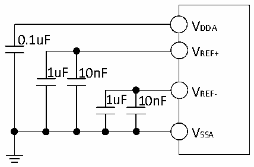

<!-- source-page: 49 -->

[← p.48](0048.md) · [index](../README.md) · [PDF p.49](https://ch32-riscv-ug.github.io/CH32X315/datasheet_en/CH32X315DS0.PDF#page=49) · [p.50 →](0050.md)

<!-- header: CH32X315/X305 Datasheet http://wch-ic.com -->

Figure 3-24 Analog power supply and decoupling circuit reference  
 <!-- rendered from the PDF; verify at https://ch32-riscv-ug.github.io/CH32X315/datasheet_en/CH32X315DS0.PDF#page=49 -->

🖼 Text parsed from the figure above

VDDA  
0.1uF  
VREF+  
1uF 10nF  
V  
1uF 10nF REF-  
VSSA  

<!-- image: p49-draw-image-00001 bbox=[518.4, 783.36, 537.84, 793.92] -->
<!-- footer: V1.1 46 -->
