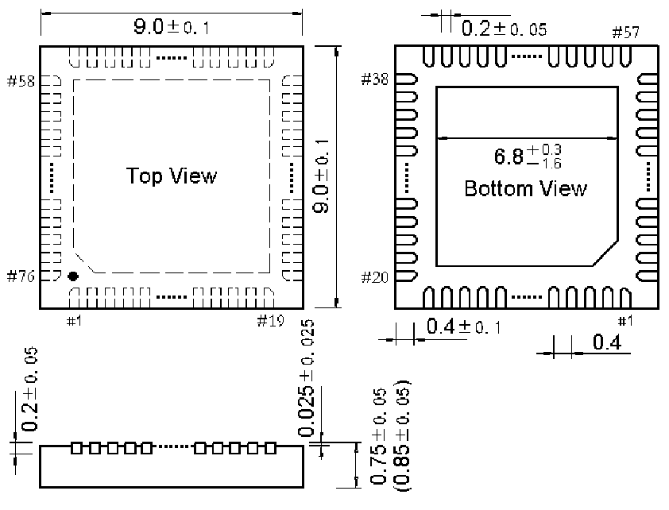

<!-- source-page: 51 -->

[← p.50](0050.md) · [index](../README.md) · [PDF p.51](https://ch32-riscv-ug.github.io/CH32X315/datasheet_en/CH32X315DS0.PDF#page=51) · [p.52 →](0052.md)

<!-- header: CH32X315/X305 Datasheet http://wch-ic.com -->
<em>Note: All dimensions are in millimeters. The pin center spacing values are nominal values, with no error.</em>  
<em>Other than that, the dimensional error is not greater than the greater of ±0.2mm or ±10%.</em>  

## 4.1 QFN76 Package

 <!-- p51-draw-image-00002 rendered from the PDF -->

<!-- image: p51-draw-image-00001 bbox=[518.4, 783.36, 537.84, 793.92] -->
<!-- footer: V1.1 48 -->
