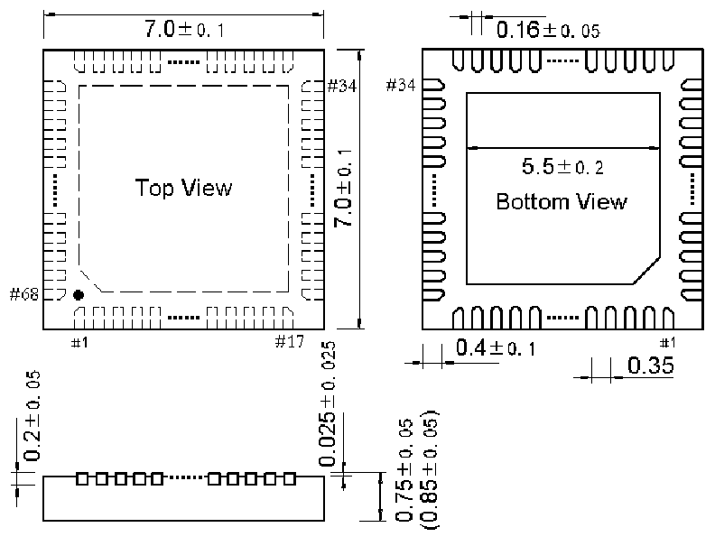

<!-- source-page: 52 -->

[← p.51](0051.md) · [index](../README.md) · [PDF p.52](https://ch32-riscv-ug.github.io/CH32X315/datasheet_en/CH32X315DS0.PDF#page=52) · [p.53 →](0053.md)

<!-- header: CH32X315/X305 Datasheet http://wch-ic.com -->

## 4.2 QFN68X7 Package

 <!-- p52-draw-image-00002 rendered from the PDF -->

## 4.3 QFN48 Package

 <!-- p52-draw-image-00003 rendered from the PDF -->

<!-- image: p52-draw-image-00001 bbox=[518.4, 783.36, 537.84, 793.92] -->
<!-- footer: V1.1 49 -->
