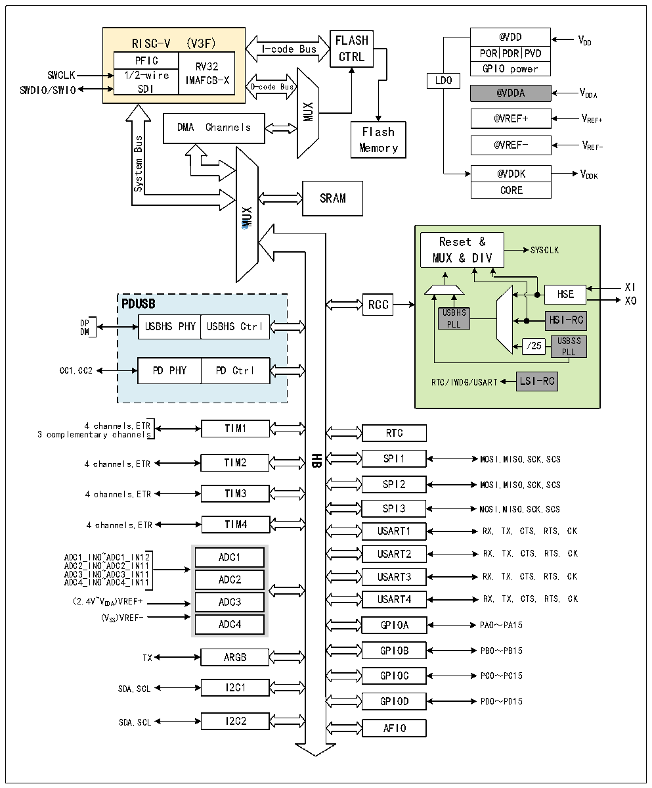

<!-- source-page: 4 -->

[← p.3](0003.md) · [index](../README.md) · [PDF p.4](https://ch32-riscv-ug.github.io/CH32X315/datasheet_zh/CH32X315DS0.PDF#page=4) · [p.5 →](0005.md)

<!-- header: CH32X315、X305数据手册 https://wch.cn -->

图1-1-2 CH32X305系统框图  
 <!-- rendered from the PDF; verify at https://ch32-riscv-ug.github.io/CH32X315/datasheet_zh/CH32X315DS0.PDF#page=4 -->

🖼 Text parsed from the figure above

RISC-V (V3F)  RISC-VPFIC  (V3F) RV32IMAFCB-X  1/2-wire SDI  
@VDD POR PDR PVD  POR  PDR  PVD  GPIO power  
RISC-V (V3F) FLASH  
I-code Bus  
CTRL  
SWCLK  
LDO  
SWDIO/SWIO  
@VDDA VDDA  
MUX  
@VREF+ VREF+  
DMA Channels  
Flash  
Bus  
@VREF- V REF-  
Memory  
System  
@VDDK  CORE  
SRAM  
<!-- image: p4-draw-image-00002 inside the figure -->
MUX  
Reset &amp;  
SYSCLK  
MUX &amp; DIV  
XI  
HSE  
PDUSB XO  
RCC  
USBHS  
DP USBHS PHY USBHS Ctrl PLL HSI-RC  
USBHS PHY  USBHS Ctrl  
DM  
USBSS  
/25  
PLL  
PD PHY  PD Ctrl  
RTC/IWDG/USART LSI-RC  
4 channels,ETR TIM1  
3 complementary channels RTC  
SPI1 4 channels,ETR TIM2  
HB  
MOSI,MISO,SCK,SCS  
SPI2 MOSI,MISO,SCK,SCS  
4 channels,ETR TIM3  
SPI3 MOSI,MISO,SCK,SCS  
4 channels,ETR TIM4  
USART1 RX, TX, CTS, RTS, CK  
ADC1_IN0~ADC1_IN12 ADC1 USART2 RX, TX, CTS, RTS, CK  
ADC2_IN0~ADC2_IN11  
A A D D C C 3 4 _ _ I I N N 0 0 ~ ~ A A D D C C 3 4 _ _ I I N N 1 1 1 1 ADC2 USART3 RX, TX, CTS, RTS, CK  
(2.4V~VDDA)VREF+ ADC3 USART4 RX, TX, CTS, RTS, CK  
(VSS)VREF-  
ADC4  
GPIOA PA0～PA15  
GPIOB  
PB0～PB15  
TX ARGB  
GPIOC PC0～PC15  
SDA,SCL I2C1  
GPIOD PD0～PD15  
SDA,SCL I2C2  
AFIO  

<!-- image: p4-draw-image-00001 bbox=[507.72, 779.28, 527.16, 789.6] -->
<!-- footer: V1.2 2 -->
