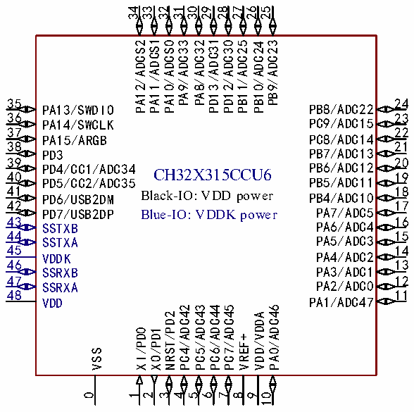
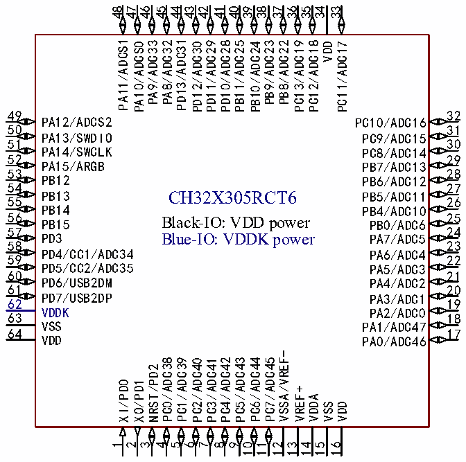

<!-- source-page: 14 -->

[← p.13](0013.md) · [index](../README.md) · [PDF p.14](https://ch32-riscv-ug.github.io/CH32X315/datasheet_zh/CH32X315DS0.PDF#page=14) · [p.15 →](0015.md)

<!-- header: CH32X315、X305数据手册 https://wch.cn -->

 <!-- p14-cluster-01 uncaptioned graphics, rendered from the PDF; verify at https://ch32-riscv-ug.github.io/CH32X315/datasheet_zh/CH32X315DS0.PDF#page=14 -->

🖼 Text parsed from the figure above

34 33 32 31 30  
29 28  
27 26 25  
PA12/ADCS2 PA11/ADCS1 PA10/ADCS0 PA9/ADC33 PA8/ADC32 PD13/ADC31 PD12/ADC30 PB11/ADC25 PB10/ADC24 PB9/ADC23  
35  
24  
PB8/ADC22  
PA13/SWDIO  
36  
23  
PC9/ADC15  
PA14/SWCLK  
37  
22  
PC8/ADC14  
PA15/ARGB  
38  
21  
PB7/ADC13  
PD3  
39  
20  
PB6/ADC12  
PD4/CC1/ADC34  
CH32X315CCU6  
40  
19  
PB5/ADC11  
PD5/CC2/ADC35  
41  
18  
Black-IO: VDD power  
PB4/ADC10  
PD6/USB2DM  
42  
17  
PA7/ADC5  
PD7/USB2DP  
Blue-IO: VDDK power  
43  
16  
PA6/ADC4  
SSTXB  
44  
15  
PA5/ADC3  
SSTXA  
45  
14  
PA4/ADC2  
VDDK  
46  
13  
PA3/ADC1  
SSRXB  
47  
12  
PA2/ADC0  
SSRXA  
48  
11  
PA1/ADC47  
VDD  
PC4/ADC42 PC5/ADC43 PC6/ADC44 PC7/ADC45  
PA0/ADC46  
NRST/PD2  
VDD/VDDA  
XI/PD0 XO/PD1  
VREF+  
VSS  
0 1 2 3 4 5 6 7 8 9 10  

### 2.1.2 CH32X305引脚排列

 <!-- p14-cluster-02 uncaptioned graphics, rendered from the PDF; verify at https://ch32-riscv-ug.github.io/CH32X315/datasheet_zh/CH32X315DS0.PDF#page=14 -->

🖼 Text parsed from the figure above

48 47 34  
46 45 40 39 36 35 33  
44 43 42 41  
38 37  
PA11/ADCS1 PA10/ADCS0 PA9/ADC33 PA8/ADC32 PD13/ADC31 PD12/ADC30 PD11/ADC29 PD10/ADC28 PB11/ADC25 PB10/ADC24 PB9/ADC23 PB8/ADC22 PC13/ADC19 PC12/ADC18 VDD PC11/ADC17  
49  
32  
PA12/ADCS2  
PC10/ADC16  
50  
31  
PA13/SWDIO  
PC9/ADC15  
51  
30  
PA14/SWCLK  
PC8/ADC14  
52  
29  
PA15/ARGB  
PB7/ADC13  
53  
28  
PB12  
PB6/ADC12  
54  
27  
PB13 CH32X305RCT6  
PB5/ADC11  
55  
26  
PB14  
PB4/ADC10  
56 PB15 Black-IO: VDD power  
25  
PB0/ADC6  
57  
24  
PD3 Blue-IO: VDDK power  
PA7/ADC5  
58  
23  
PD4/CC1/ADC34  
PA6/ADC4  
59  
22  
PD5/CC2/ADC35  
PA5/ADC3  
60  
21  
PD6/USB2DM  
PA4/ADC2  
61  
20  
PD7/USB2DP  
PA3/ADC1  
62  
19  
VDDK  
PA2/ADC0  
63  
18  
VSS  
PA1/ADC47  
64  
17  
VDD  
PA0/ADC46  
VSSA/VREF-  
PC0/ADC38  
PC1/ADC39  
PC2/ADC40  
PC3/ADC41  
PC4/ADC42  
PC5/ADC43  
PC6/ADC44  
PC7/ADC45  
NRST/PD2  
XI/PD0  
XO/PD1  
VREF+  
VDDA  
VSS  
VDD  
1  
2  
3  
4  
5  
6  
7  
8  
9  
10  
11  
12  
13  
14  
15  
16  

注：引脚图中复用功能均为缩写。  
示例：ADC1_（ADC0:ADC1_IN0、ADC1:ADC1_IN1、ADC2:ADC1_IN2、ADC3:ADC1_IN3、ADC4:ADC1_IN4、  
<!-- image: p14-draw-image-00001 bbox=[500.88, 779.28, 520.32, 789.6] -->
<!-- footer: V1.2 12 -->
