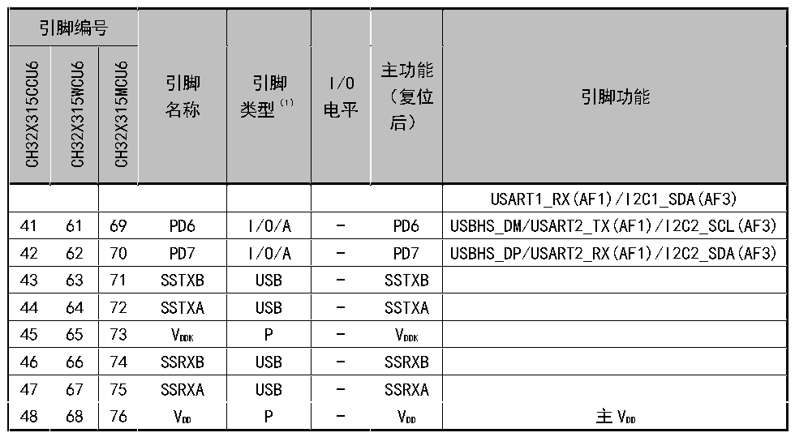
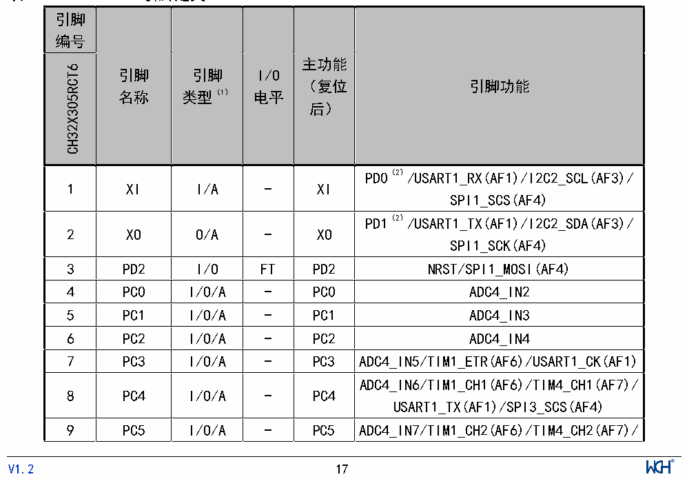

<!-- source-page: 19 -->

[← p.18](0018.md) · [index](../README.md) · [PDF p.19](https://ch32-riscv-ug.github.io/CH32X315/datasheet_zh/CH32X315DS0.PDF#page=19) · [p.20 →](0020.md)

<!-- header: CH32X315、X305数据手册 https://wch.cn -->

 <!-- p19-cluster-01 uncaptioned graphics, rendered from the PDF; verify at https://ch32-riscv-ug.github.io/CH32X315/datasheet_zh/CH32X315DS0.PDF#page=19 -->

🖼 Text parsed from the figure above

<!-- p19-table-001 (table-2-1-1@1) -->
<table><tr><th colspan="3">引脚编号</th><th rowspan="2" style="text-align:left">引脚名称</th><th rowspan="2" style="text-align:left">引脚类型（1）</th><th rowspan="2" style="text-align:left">I/O电平</th><th rowspan="2" style="text-align:left">主功能 （复位后）</th><th rowspan="2">引脚功能</th></tr><tr><td>CH32X315CCU6</td><td>CH32X315WCU6</td><td>CH32X315MCU6</td></tr><tr><td></td><td></td><td></td><td></td><td></td><td></td><td></td><td>USART1_RX(AF1)/I2C1_SDA(AF3)</td></tr><tr><td>41</td><td>61</td><td>69</td><td>PD6</td><td>I/O/A</td><td>-</td><td>PD6</td><td>USBHS_DM/USART2_TX(AF1)/I2C2_SCL(AF3)</td></tr><tr><td>42</td><td>62</td><td>70</td><td>PD7</td><td>I/O/A</td><td>-</td><td>PD7</td><td>USBHS_DP/USART2_RX(AF1)/I2C2_SDA(AF3)</td></tr><tr><td>43</td><td>63</td><td>71</td><td>SSTXB</td><td>USB</td><td>-</td><td>SSTXB</td><td></td></tr><tr><td>44</td><td>64</td><td>72</td><td>SSTXA</td><td>USB</td><td>-</td><td>SSTXA</td><td></td></tr><tr><td>45</td><td>65</td><td>73</td><td style="text-align:left">VDDK</td><td>P</td><td>-</td><td style="text-align:left">VDDK</td><td></td></tr><tr><td>46</td><td>66</td><td>74</td><td>SSRXB</td><td>USB</td><td>-</td><td>SSRXB</td><td></td></tr><tr><td>47</td><td>67</td><td>75</td><td>SSRXA</td><td>USB</td><td>-</td><td>SSRXA</td><td></td></tr><tr><td>48</td><td>68</td><td>76</td><td style="text-align:left">VDD</td><td>P</td><td>-</td><td style="text-align:left">VDD</td><td style="text-align:left">主VDD</td></tr></table>

注1：表格缩写解释：  
I = TTL/CMOS电平斯密特输入； O = CMOS电平三态输出； A = 模拟信号输入或输出；  
P = 电源； USB = USB信号引脚； FT = 耐受5V。  
注2：对于CH32X315芯片，引脚1和引脚2在芯片复位后默认配置为XI和XO功能脚，软件可以重新设置这  
两个引脚为PD0和PD1功能。  
注3：为减小PD4、PD5的静态电流，对于非CH32X315MCU6芯片，可配置PD4、PD5为GPIO上拉，并配置位  
CC1_PD和CC2_PD为1；也可配置PD4、PD5为GPIO下拉，并配置位CC1_PD和CC2_PD为0。对于  
CH32X315MCU6芯片，仅可配置PD4、PD5为GPIO下拉，并配置位CC1_PD和CC2_PD为0。  

 <!-- p19-cluster-02 uncaptioned graphics, rendered from the PDF; verify at https://ch32-riscv-ug.github.io/CH32X315/datasheet_zh/CH32X315DS0.PDF#page=19 -->

🖼 Text parsed from the figure above

> ⚠ Table extraction recorded 1 issue(s) (overlapping merged cells); verify against [the PDF, p.19](https://ch32-riscv-ug.github.io/CH32X315/datasheet_zh/CH32X315DS0.PDF#page=19).

<!-- p19-table-003 (table-2-1-2@1) -->
<table><caption>表2-1-2 CH32X305引脚定义</caption><tr><th rowspan="2" colspan="2" style="text-align:left">引脚编号</th><th rowspan="3" style="text-align:left">引脚名称</th><th rowspan="3" style="text-align:left">引脚类型（1）</th><th rowspan="3" style="text-align:left">I/O电平</th><th rowspan="3" style="text-align:left">主功能 （复位后）</th><th rowspan="3">引脚功能</th></tr><tr></tr><tr><td colspan="2">CH32X305RCT6</td></tr><tr><td colspan="2">1</td><td>XI</td><td>I/A</td><td>-</td><td>XI</td><td style="text-align:left">PD0（2）/USART1_RX(AF1)/I2C2_SCL(AF3)/ SPI1_SCS(AF4)</td></tr><tr><td colspan="2">2</td><td>XO</td><td>O/A</td><td>-</td><td>XO</td><td style="text-align:left">PD1（2）/USART1_TX(AF1)/I2C2_SDA(AF3)/ SPI1_SCK(AF4)</td></tr><tr><td colspan="2">3</td><td>PD2</td><td>I/O</td><td>FT</td><td>PD2</td><td>NRST/SPI1_MOSI(AF4)</td></tr><tr><td colspan="2">4</td><td>PC0</td><td>I/O/A</td><td>-</td><td>PC0</td><td>ADC4_IN2</td></tr><tr><td colspan="2">5</td><td>PC1</td><td>I/O/A</td><td>-</td><td>PC1</td><td>ADC4_IN3</td></tr><tr><td colspan="2">6</td><td>PC2</td><td>I/O/A</td><td>-</td><td>PC2</td><td>ADC4_IN4</td></tr><tr><td colspan="2">7</td><td>PC3</td><td>I/O/A</td><td>-</td><td>PC3</td><td>ADC4_IN5/TIM1_ETR(AF6)/USART1_CK(AF1)</td></tr><tr><td colspan="2">8</td><td>PC4</td><td>I/O/A</td><td>-</td><td>PC4</td><td style="text-align:left">ADC4_IN6/TIM1_CH1(AF6)/TIM4_CH1(AF7)/ USART1_TX(AF1)/SPI3_SCS(AF4)</td></tr><tr><td colspan="2">9</td><td>PC5</td><td>I/O/A</td><td>-</td><td>PC5</td><td>ADC4_IN7/TIM1_CH2(AF6)/TIM4_CH2(AF7)/</td></tr></table>

<!-- image: p19-draw-image-00001 inside the figure -->
<!-- footer: V1.2 17 -->

