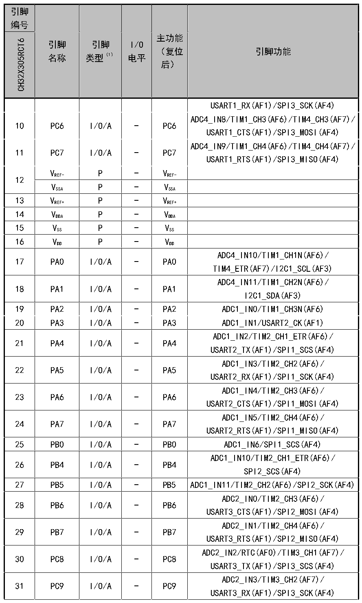

<!-- source-page: 20 -->

[← p.19](0019.md) · [index](../README.md) · [PDF p.20](https://ch32-riscv-ug.github.io/CH32X315/datasheet_zh/CH32X315DS0.PDF#page=20) · [p.21 →](0021.md)

<!-- header: CH32X315、X305数据手册 https://wch.cn -->

 <!-- p20-cluster-01 uncaptioned graphics, rendered from the PDF; verify at https://ch32-riscv-ug.github.io/CH32X315/datasheet_zh/CH32X315DS0.PDF#page=20 -->

🖼 Text parsed from the figure above

<!-- p20-table-001 (table-2-1-2@1) -->
<table><tr><th style="text-align:left">引脚编号</th><th rowspan="2" style="text-align:left">引脚名称</th><th rowspan="2" style="text-align:left">引脚类型（1）</th><th rowspan="2" style="text-align:left">I/O电平</th><th rowspan="2" style="text-align:left">主功能 （复位后）</th><th rowspan="2">引脚功能</th></tr><tr><td>CH32X305RCT6</td></tr><tr><td></td><td></td><td></td><td></td><td></td><td>USART1_RX(AF1)/SPI3_SCK(AF4)</td></tr><tr><td>10</td><td>PC6</td><td>I/O/A</td><td>-</td><td>PC6</td><td style="text-align:left">ADC4_IN8/TIM1_CH3(AF6)/TIM4_CH3(AF7)/ USART1_CTS(AF1)/SPI3_MOSI(AF4)</td></tr><tr><td>11</td><td>PC7</td><td>I/O/A</td><td>-</td><td>PC7</td><td style="text-align:left">ADC4_IN9/TIM1_CH4(AF6)/TIM4_CH4(AF7)/ USART1_RTS(AF1)/SPI3_MISO(AF4)</td></tr><tr><td rowspan="2">12</td><td style="text-align:left">VREF-</td><td>P</td><td>-</td><td style="text-align:left">VREF-</td><td></td></tr><tr><td style="text-align:left">VSSA</td><td>P</td><td>-</td><td style="text-align:left">VSSA</td><td></td></tr><tr><td>13</td><td style="text-align:left">VREF+</td><td>P</td><td>-</td><td style="text-align:left">VREF+</td><td></td></tr><tr><td>14</td><td style="text-align:left">VDDA</td><td>P</td><td>-</td><td style="text-align:left">VDDA</td><td></td></tr><tr><td>15</td><td style="text-align:left">VSS</td><td>P</td><td>-</td><td style="text-align:left">VSS</td><td></td></tr><tr><td>16</td><td style="text-align:left">VDD</td><td>P</td><td>-</td><td style="text-align:left">VDD</td><td></td></tr><tr><td>17</td><td>PA0</td><td>I/O/A</td><td>-</td><td>PA0</td><td style="text-align:left">ADC4_IN10/TIM1_CH1N(AF6)/ TIM4_ETR(AF7)/I2C1_SCL(AF3)</td></tr><tr><td>18</td><td>PA1</td><td>I/O/A</td><td>-</td><td>PA1</td><td style="text-align:left">ADC4_IN11/TIM1_CH2N(AF6)/ I2C1_SDA(AF3)</td></tr><tr><td>19</td><td>PA2</td><td>I/O/A</td><td>-</td><td>PA2</td><td>ADC1_IN0/TIM1_CH3N(AF6)</td></tr><tr><td>20</td><td>PA3</td><td>I/O/A</td><td>-</td><td>PA3</td><td>ADC1_IN1/USART2_CK(AF1)</td></tr><tr><td>21</td><td>PA4</td><td>I/O/A</td><td>-</td><td>PA4</td><td style="text-align:left">ADC1_IN2/TIM2_CH1_ETR(AF6)/ USART2_TX(AF1)/SPI1_SCS(AF4)</td></tr><tr><td>22</td><td>PA5</td><td>I/O/A</td><td>-</td><td>PA5</td><td style="text-align:left">ADC1_IN3/TIM2_CH2(AF6)/ USART2_RX(AF1)/SPI1_SCK(AF4)</td></tr><tr><td>23</td><td>PA6</td><td>I/O/A</td><td>-</td><td>PA6</td><td style="text-align:left">ADC1_IN4/TIM2_CH3(AF6)/ USART2_CTS(AF1)/SPI1_MOSI(AF4)</td></tr><tr><td>24</td><td>PA7</td><td>I/O/A</td><td>-</td><td>PA7</td><td style="text-align:left">ADC1_IN5/TIM2_CH4(AF6)/ USART2_RTS(AF1)/SPI1_MISO(AF4)</td></tr><tr><td>25</td><td>PB0</td><td>I/O/A</td><td>-</td><td>PB0</td><td>ADC1_IN6/SPI1_SCS(AF4)</td></tr><tr><td>26</td><td>PB4</td><td>I/O/A</td><td>-</td><td>PB4</td><td style="text-align:left">ADC1_IN10/TIM2_CH1_ETR(AF6)/ SPI2_SCS(AF4)</td></tr><tr><td>27</td><td>PB5</td><td>I/O/A</td><td>-</td><td>PB5</td><td>ADC1_IN11/TIM2_CH2(AF6)/SPI2_SCK(AF4)</td></tr><tr><td>28</td><td>PB6</td><td>I/O/A</td><td>-</td><td>PB6</td><td style="text-align:left">ADC2_IN0/TIM2_CH3(AF6)/ USART3_CTS(AF1)/SPI2_MOSI(AF4)</td></tr><tr><td>29</td><td>PB7</td><td>I/O/A</td><td>-</td><td>PB7</td><td style="text-align:left">ADC2_IN1/TIM2_CH4(AF6)/ USART3_RTS(AF1)/SPI2_MISO(AF4)</td></tr><tr><td>30</td><td>PC8</td><td>I/O/A</td><td>-</td><td>PC8</td><td style="text-align:left">ADC2_IN2/RTC(AF0)/TIM3_CH1(AF7)/ USART3_TX(AF1)/SPI3_SCS(AF4)</td></tr><tr><td>31</td><td>PC9</td><td>I/O/A</td><td>-</td><td>PC9</td><td style="text-align:left">ADC2_IN3/TIM3_CH2(AF7)/ USART3_RX(AF1)/SPI3_SCK(AF4)</td></tr></table>

VREF- P - VREF-  
VSSA P - VSSA  

<!-- image: p20-draw-image-00001 bbox=[500.88, 779.28, 520.32, 789.6] -->
<!-- footer: V1.2 18 -->
