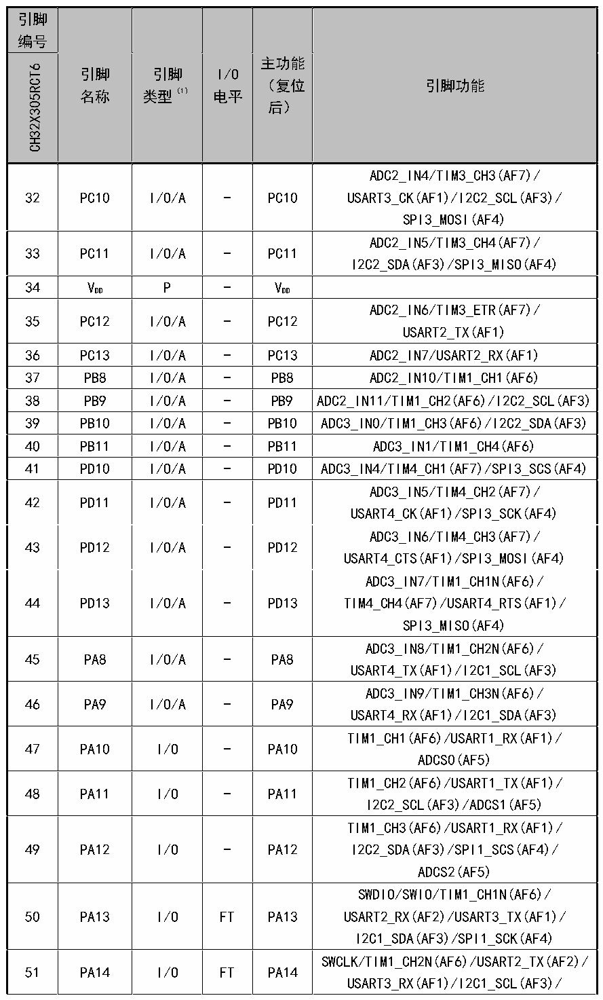

<!-- source-page: 21 -->

[← p.20](0020.md) · [index](../README.md) · [PDF p.21](https://ch32-riscv-ug.github.io/CH32X315/datasheet_zh/CH32X315DS0.PDF#page=21) · [p.22 →](0022.md)

<!-- header: CH32X315、X305数据手册 https://wch.cn -->

 <!-- p21-cluster-01 uncaptioned graphics, rendered from the PDF; verify at https://ch32-riscv-ug.github.io/CH32X315/datasheet_zh/CH32X315DS0.PDF#page=21 -->

🖼 Text parsed from the figure above

<!-- p21-table-001 (table-2-1-2@1) -->
<table><tr><th style="text-align:left">引脚编号</th><th rowspan="2" style="text-align:left">引脚名称</th><th rowspan="2" style="text-align:left">引脚类型（1）</th><th rowspan="2" style="text-align:left">I/O电平</th><th rowspan="2" style="text-align:left">主功能 （复位后）</th><th rowspan="2">引脚功能</th></tr><tr><td>CH32X305RCT6</td></tr><tr><td>32</td><td>PC10</td><td>I/O/A</td><td>-</td><td>PC10</td><td style="text-align:left">ADC2_IN4/TIM3_CH3(AF7)/ USART3_CK(AF1)/I2C2_SCL(AF3)/ SPI3_MOSI(AF4)</td></tr><tr><td>33</td><td>PC11</td><td>I/O/A</td><td>-</td><td>PC11</td><td style="text-align:left">ADC2_IN5/TIM3_CH4(AF7)/ I2C2_SDA(AF3)/SPI3_MISO(AF4)</td></tr><tr><td>34</td><td style="text-align:left">VDD</td><td>P</td><td>-</td><td style="text-align:left">VDD</td><td></td></tr><tr><td>35</td><td>PC12</td><td>I/O/A</td><td>-</td><td>PC12</td><td style="text-align:left">ADC2_IN6/TIM3_ETR(AF7)/ USART2_TX(AF1)</td></tr><tr><td>36</td><td>PC13</td><td>I/O/A</td><td>-</td><td>PC13</td><td>ADC2_IN7/USART2_RX(AF1)</td></tr><tr><td>37</td><td>PB8</td><td>I/O/A</td><td>-</td><td>PB8</td><td>ADC2_IN10/TIM1_CH1(AF6)</td></tr><tr><td>38</td><td>PB9</td><td>I/O/A</td><td>-</td><td>PB9</td><td>ADC2_IN11/TIM1_CH2(AF6)/I2C2_SCL(AF3)</td></tr><tr><td>39</td><td>PB10</td><td>I/O/A</td><td>-</td><td>PB10</td><td>ADC3_IN0/TIM1_CH3(AF6)/I2C2_SDA(AF3)</td></tr><tr><td>40</td><td>PB11</td><td>I/O/A</td><td>-</td><td>PB11</td><td>ADC3_IN1/TIM1_CH4(AF6)</td></tr><tr><td>41</td><td>PD10</td><td>I/O/A</td><td>-</td><td>PD10</td><td>ADC3_IN4/TIM4_CH1(AF7)/SPI3_SCS(AF4)</td></tr><tr><td>42</td><td>PD11</td><td>I/O/A</td><td>-</td><td>PD11</td><td style="text-align:left">ADC3_IN5/TIM4_CH2(AF7)/ USART4_CK(AF1)/SPI3_SCK(AF4)</td></tr><tr><td>43</td><td>PD12</td><td>I/O/A</td><td>-</td><td>PD12</td><td style="text-align:left">ADC3_IN6/TIM4_CH3(AF7)/ USART4_CTS(AF1)/SPI3_MOSI(AF4)</td></tr><tr><td>44</td><td>PD13</td><td>I/O/A</td><td>-</td><td>PD13</td><td style="text-align:left">ADC3_IN7/TIM1_CH1N(AF6)/ TIM4_CH4(AF7)/USART4_RTS(AF1)/ SPI3_MISO(AF4)</td></tr><tr><td>45</td><td>PA8</td><td>I/O/A</td><td>-</td><td>PA8</td><td style="text-align:left">ADC3_IN8/TIM1_CH2N(AF6)/ USART4_TX(AF1)/I2C1_SCL(AF3)</td></tr><tr><td>46</td><td>PA9</td><td>I/O/A</td><td>-</td><td>PA9</td><td style="text-align:left">ADC3_IN9/TIM1_CH3N(AF6)/ USART4_RX(AF1)/I2C1_SDA(AF3)</td></tr><tr><td>47</td><td>PA10</td><td>I/O</td><td>-</td><td>PA10</td><td style="text-align:left">TIM1_CH1(AF6)/USART1_RX(AF1)/ ADCS0(AF5)</td></tr><tr><td>48</td><td>PA11</td><td>I/O</td><td>-</td><td>PA11</td><td style="text-align:left">TIM1_CH2(AF6)/USART1_TX(AF1)/ I2C2_SCL(AF3)/ADCS1(AF5)</td></tr><tr><td>49</td><td>PA12</td><td>I/O</td><td>-</td><td>PA12</td><td style="text-align:left">TIM1_CH3(AF6)/USART1_RX(AF1)/ I2C2_SDA(AF3)/SPI1_SCS(AF4)/ ADCS2(AF5)</td></tr><tr><td>50</td><td>PA13</td><td>I/O</td><td>FT</td><td>PA13</td><td style="text-align:left">SWDIO/SWIO/TIM1_CH1N(AF6)/ USART2_RX(AF2)/USART3_TX(AF1)/ I2C1_SDA(AF3)/SPI1_SCK(AF4)</td></tr><tr><td>51</td><td>PA14</td><td>I/O</td><td>FT</td><td>PA14</td><td style="text-align:left">SWCLK/TIM1_CH2N(AF6)/USART2_TX(AF2)/ USART3_RX(AF1)/I2C1_SCL(AF3)/</td></tr></table>

<!-- image: p21-draw-image-00001 bbox=[500.88, 779.28, 520.32, 789.6] -->
<!-- footer: V1.2 19 -->
