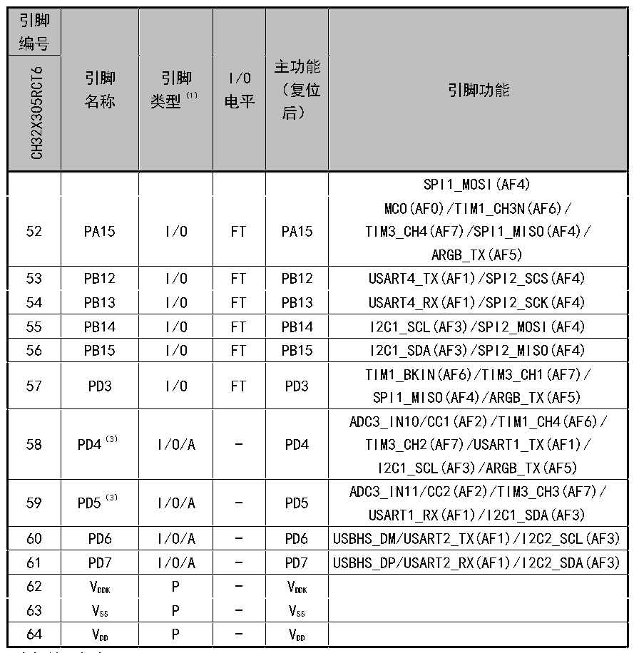

<!-- source-page: 22 -->

[← p.21](0021.md) · [index](../README.md) · [PDF p.22](https://ch32-riscv-ug.github.io/CH32X315/datasheet_zh/CH32X315DS0.PDF#page=22) · [p.23 →](0023.md)

<!-- header: CH32X315、X305数据手册 https://wch.cn -->

 <!-- p22-cluster-01 uncaptioned graphics, rendered from the PDF; verify at https://ch32-riscv-ug.github.io/CH32X315/datasheet_zh/CH32X315DS0.PDF#page=22 -->

🖼 Text parsed from the figure above

<!-- p22-table-001 (table-2-1-2@1) -->
<table><tr><th style="text-align:left">引脚编号</th><th rowspan="2" style="text-align:left">引脚名称</th><th rowspan="2" style="text-align:left">引脚类型（1）</th><th rowspan="2" style="text-align:left">I/O电平</th><th rowspan="2" style="text-align:left">主功能 （复位后）</th><th rowspan="2">引脚功能</th></tr><tr><td>CH32X305RCT6</td></tr><tr><td></td><td></td><td></td><td></td><td></td><td>SPI1_MOSI(AF4)</td></tr><tr><td>52</td><td>PA15</td><td>I/O</td><td>FT</td><td>PA15</td><td style="text-align:left">MCO(AF0)/TIM1_CH3N(AF6)/ TIM3_CH4(AF7)/SPI1_MISO(AF4)/ ARGB_TX(AF5)</td></tr><tr><td>53</td><td>PB12</td><td>I/O</td><td>FT</td><td>PB12</td><td>USART4_TX(AF1)/SPI2_SCS(AF4)</td></tr><tr><td>54</td><td>PB13</td><td>I/O</td><td>FT</td><td>PB13</td><td>USART4_RX(AF1)/SPI2_SCK(AF4)</td></tr><tr><td>55</td><td>PB14</td><td>I/O</td><td>FT</td><td>PB14</td><td>I2C1_SCL(AF3)/SPI2_MOSI(AF4)</td></tr><tr><td>56</td><td>PB15</td><td>I/O</td><td>FT</td><td>PB15</td><td>I2C1_SDA(AF3)/SPI2_MISO(AF4)</td></tr><tr><td>57</td><td>PD3</td><td>I/O</td><td>FT</td><td>PD3</td><td style="text-align:left">TIM1_BKIN(AF6)/TIM3_CH1(AF7)/ SPI1_MISO(AF4)/ARGB_TX(AF5)</td></tr><tr><td>58</td><td>PD4（3）</td><td>I/O/A</td><td>-</td><td>PD4</td><td style="text-align:left">ADC3_IN10/CC1(AF2)/TIM1_CH4(AF6)/ TIM3_CH2(AF7)/USART1_TX(AF1)/ I2C1_SCL(AF3)/ARGB_TX(AF5)</td></tr><tr><td>59</td><td>PD5（3）</td><td>I/O/A</td><td>-</td><td>PD5</td><td style="text-align:left">ADC3_IN11/CC2(AF2)/TIM3_CH3(AF7)/ USART1_RX(AF1)/I2C1_SDA(AF3)</td></tr><tr><td>60</td><td>PD6</td><td>I/O/A</td><td>-</td><td>PD6</td><td>USBHS_DM/USART2_TX(AF1)/I2C2_SCL(AF3)</td></tr><tr><td>61</td><td>PD7</td><td>I/O/A</td><td>-</td><td>PD7</td><td>USBHS_DP/USART2_RX(AF1)/I2C2_SDA(AF3)</td></tr><tr><td>62</td><td style="text-align:left">VDDK</td><td>P</td><td>-</td><td style="text-align:left">VDDK</td><td></td></tr><tr><td>63</td><td style="text-align:left">VSS</td><td>P</td><td>-</td><td style="text-align:left">VSS</td><td></td></tr><tr><td>64</td><td style="text-align:left">VDD</td><td>P</td><td>-</td><td style="text-align:left">VDD</td><td></td></tr></table>

注1：表格缩写解释：  
I = TTL/CMOS电平斯密特输入； O = CMOS电平三态输出； A = 模拟信号输入或输出；  
P = 电源； FT = 耐受5V。  
注2：对于CH32X305芯片，引脚1和引脚2在芯片复位后默认配置为XI和XO功能脚，软件可以重新设置这  
两个引脚为PD0和PD1功能。  
注3：为减小PD4、PD5的静态电流，可配置PD4、PD5为GPIO上拉，并配置位CC1_PD和CC2_PD为1；也可配  
置PD4、PD5为GPIO下拉，并配置位CC1_PD和CC2_PD为0。  
<!-- image: p22-draw-image-00001 bbox=[500.88, 779.28, 520.32, 789.6] -->
<!-- footer: V1.2 20 -->
