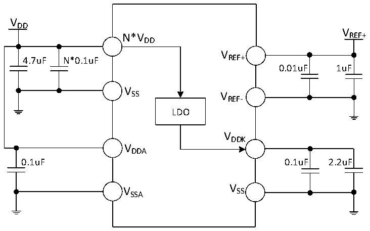

<!-- source-page: 28 -->

[← p.27](0027.md) · [index](../README.md) · [PDF p.28](https://ch32-riscv-ug.github.io/CH32X315/datasheet_zh/CH32X315DS0.PDF#page=28) · [p.29 →](0029.md)

<!-- header: CH32X315、X305数据手册 https://wch.cn -->

# 第 3 章 电气特性

## 3.1 测试条件

除非特殊说明和标注，所有电压都以VSS 为基准。  
所有最小值和最大值将在最坏的环境温度、供电电压和时钟频率条件下得到保证。  
CH32X315和CH32X305的典型数值是基于以下两种环境之一用于设计指导：  
1、常温25℃，供电VDD= 3.3V、VDDA= 3.3V、VREF+= 3.3V，产生VDDK= 1.2V。  
2、常温25℃，外部为DCDC芯片（CH2003K）提供额定5V，产生额定3.3V和1.2V供给CH32X315。  
供电VDD= VDDA= VREF+= 3.3V、VDDK= 1.2V。  
对于通过综合评估、设计模拟或工艺特性得到的数据，不会在生产线进行测试。在综合评估的基  
础上，最小和最大值是通过样本测试后统计得到。除非特殊说明为实测值，否则特性参数以综合评估  
或设计保证。  
供电方案：  

图3-1-1 常规供电典型电路  
 <!-- rendered from the PDF; verify at https://ch32-riscv-ug.github.io/CH32X315/datasheet_zh/CH32X315DS0.PDF#page=28 -->

🖼 Text parsed from the figure above

VDD  
V  
N*V REF+  
DD  
V  
4.7uF N*0.1uF REF+  
0.01uF 1uF  
V  
SS V  
REF-  
LDO  
VDDK  
VDDA  
0.1uF 0.1uF 2.2uF  
V  
V SS  
SSA  

<!-- image: p28-draw-image-00001 bbox=[502.8, 786.36, 522.24, 796.68] -->
<!-- footer: V1.2 26 -->
