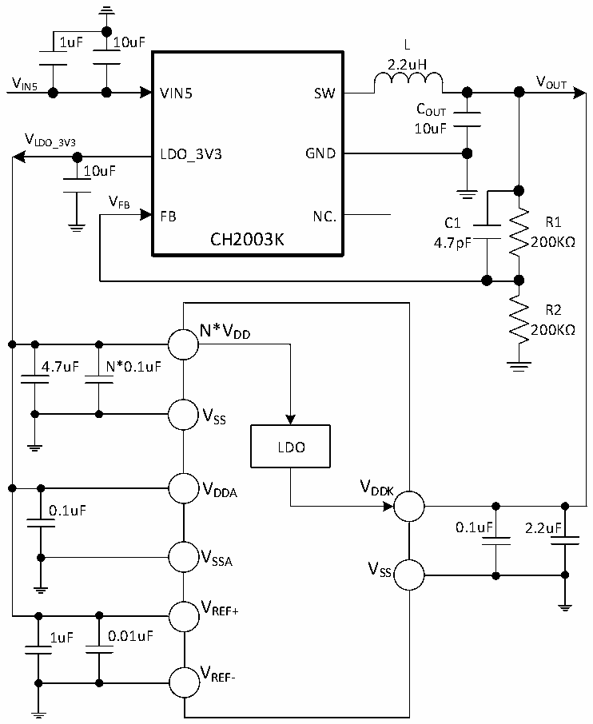

<!-- source-page: 29 -->

[← p.28](0028.md) · [index](../README.md) · [PDF p.29](https://ch32-riscv-ug.github.io/CH32X315/datasheet_zh/CH32X315DS0.PDF#page=29) · [p.30 →](0030.md)

<!-- header: CH32X315、X305数据手册 https://wch.cn -->

图3-1-2常规单一5V供电典型电路  
 <!-- rendered from the PDF; verify at https://ch32-riscv-ug.github.io/CH32X315/datasheet_zh/CH32X315DS0.PDF#page=29 -->

🖼 Text parsed from the figure above

1uF 10uF L  
2.2uH  
V IN5 VIN5 SW V OUT  
COUT  
10uF  
VLDO_3V3  
LDO_3V3 GND  
10uF  
VFB  
FB NC.  
C1 R1  
CH2003K  
4.7pF 200KΩ  
R2  
N*V 200KΩ  
DD  
4.7uF N*0.1uF  
VSS  
LDO  
VDDA VDDK  
0.1uF  
0.1uF 2.2uF  
V  
SSA V  
SS  
VREF+  
1uF 0.01uF  
VREF-  

注：1.对于CH32X315和CH32X305芯片，VDD 在芯片封装中有多个引脚，同名电源引脚必须短接。  
2.主VDD 引脚（与VDDK 引脚相邻或较近）外接0.1uF并联至少4.7uF容量的退耦电容，剩余VDD 引脚  
只需外接0.1uF容量的退耦电容即可。  
3.对于上图3-1-2所示电路，位LDO_VDDK/LDO_VDD12A需调低至010，以便让位于外供的1.2V电  
源。  

## 3.2 绝对最大值

临界或者超过绝对最大值将可能导致芯片工作不正常甚至损坏。  

<!-- p29-table-001 (table-3-1@1) pages 29-30 -->
<table><caption>表3-1 绝对最大值参数表</caption><tr><th>符号</th><th colspan="2">描述</th><th>最小值</th><th>最大值</th><th>单位</th></tr><tr><td style="text-align:left">TA</td><td colspan="2">工作时的环境温度</td><td>-40</td><td>85</td><td>℃</td></tr><tr><td style="text-align:left">TS</td><td colspan="2">存储时的环境温度</td><td>-40</td><td>125</td><td>℃</td></tr><tr><td style="text-align:left">VDD</td><td colspan="2">外部主供电电压</td><td>-0.3</td><td>4.0</td><td>V</td></tr><tr><td style="text-align:left">VDDA</td><td colspan="2">模拟部分供电电压</td><td>-0.3</td><td>4.0</td><td>V</td></tr><tr><td style="text-align:left">VDDK</td><td colspan="2">内核工作电压、USB 3.0模块工作电压</td><td>-0.2</td><td>1.4</td><td>V</td></tr><tr><td style="text-align:left">VREF+</td><td colspan="2">ADC模块的正参考电压</td><td>-0.3</td><td style="text-align:left">V +0.3DDA</td><td>V</td></tr><tr><td style="text-align:left">VREF-</td><td colspan="2">ADC模块的负参考电压</td><td>-0.3</td><td>1.3</td><td>V</td></tr><tr><td rowspan="4" style="text-align:left">VIN</td><td colspan="2">FT（耐受5V）引脚上的输入电压</td><td>-0.3</td><td>5.5</td><td>V</td></tr><tr><td colspan="2">USB 2.0引脚上的输入电压</td><td>-0.3</td><td style="text-align:left">V +0.3DD</td><td>V</td></tr><tr><td>USB 3.0引脚上的输入电压</td><td>CH32X315</td><td>-0.3</td><td style="text-align:left">V +0.3DDK</td><td>V</td></tr><tr><td colspan="2" style="text-align:left">其他I/O引脚上的输入电压（V 供电） DD</td><td>-0.3</td><td style="text-align:left">V +0.3DD</td><td>V</td></tr><tr><td style="text-align:left">|△V | DD_x</td><td colspan="2" style="text-align:left">主供电引脚各V 之间的电压差DD</td><td></td><td>20</td><td>mV</td></tr><tr><td style="text-align:left">|△V | SS_x</td><td colspan="2" style="text-align:left">公共地引脚各V 之间的电压差SS</td><td></td><td>20</td><td>mV</td></tr><tr><td rowspan="2" style="text-align:left">VESDIO(HBM)</td><td colspan="2">I/O引脚的ESD静电放电电压（HBM）</td><td colspan="2">4K</td><td>V</td></tr><tr><td colspan="2">USB 2.0和USB 3.0引脚</td><td colspan="2">4K</td><td>V</td></tr><tr><td style="text-align:left">IVDD</td><td colspan="2" style="text-align:left">所有V 主供电引脚的合计总电流DD</td><td></td><td>250</td><td>mA</td></tr><tr><td style="text-align:left">IVSS</td><td colspan="2" style="text-align:left">所有V 公共地引脚的合计总电流SS</td><td></td><td>250</td><td>mA</td></tr><tr><td rowspan="2" style="text-align:left">IIO</td><td colspan="2">任意I/O和控制引脚上的灌电流</td><td></td><td>25</td><td rowspan="2">mA</td></tr><tr><td colspan="2">任意I/O和控制引脚上的源电流</td><td></td><td>-25</td></tr></table>

<!-- image: p29-draw-image-00001 bbox=[502.8, 786.36, 522.24, 796.68] -->
<!-- footer: V1.2 27 -->
