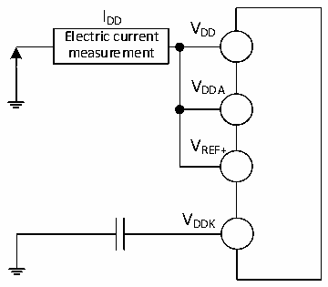

<!-- source-page: 31 -->

[← p.30](0030.md) · [index](../README.md) · [PDF p.31](https://ch32-riscv-ug.github.io/CH32X315/datasheet_zh/CH32X315DS0.PDF#page=31) · [p.32 →](0032.md)

<!-- header: CH32X315、X305数据手册 https://wch.cn -->

### 3.3.2 内置复位和电源控制模块特性

<!-- p31-table-001 (table-3-4@1) -->
<table><caption>表3-4 复位及电压监测</caption><tr><th>符号</th><th>参数</th><th>条件</th><th>最小值</th><th>典型值</th><th>最大值</th><th>单位</th></tr><tr><td rowspan="8" style="text-align:left">V （1） PVD</td><td rowspan="8" style="text-align:left">可编程电压检测器的电平选择</td><td>PLS[1:0] = 00（上升沿）</td><td></td><td>2.79</td><td></td><td>V</td></tr><tr><td>PLS[1:0] = 00（下降沿）</td><td></td><td>2.77</td><td></td><td>V</td></tr><tr><td>PLS[1:0] = 01（上升沿）</td><td></td><td>2.91</td><td></td><td>V</td></tr><tr><td>PLS[1:0] = 01（下降沿）</td><td></td><td>2.88</td><td></td><td>V</td></tr><tr><td>PLS[1:0] = 10（上升沿）</td><td></td><td>3.01</td><td></td><td>V</td></tr><tr><td>PLS[1:0] = 10（下降沿）</td><td></td><td>2.99</td><td></td><td>V</td></tr><tr><td>PLS[1:0] = 11（上升沿）</td><td></td><td>3.09</td><td></td><td>V</td></tr><tr><td>PLS[1:0] = 11（下降沿）</td><td></td><td>3.07</td><td></td><td>V</td></tr><tr><td style="text-align:left">VPVDhyst</td><td>PVD迟滞</td><td></td><td></td><td>0.02</td><td></td><td>V</td></tr><tr><td rowspan="2" style="text-align:left">VPOR/PDR</td><td rowspan="2">上电/掉电复位阈值</td><td>上升沿</td><td></td><td>2.65</td><td></td><td>V</td></tr><tr><td>下降沿</td><td></td><td>2.64</td><td></td><td>V</td></tr><tr><td style="text-align:left">VPDRhyst</td><td>PDR迟滞</td><td></td><td></td><td>10</td><td></td><td>mV</td></tr><tr><td rowspan="2" style="text-align:left">t RSTTEMPO</td><td>上电复位</td><td></td><td>16</td><td>28</td><td>30</td><td>ms</td></tr><tr><td>其他复位</td><td></td><td>2</td><td>20</td><td>30</td><td>ms</td></tr></table>

注：1.常温测试值。  

### 3.3.3 内置的参考电压

<!-- p31-table-002 (table-3-5@1) -->
<table><caption>表3-5 内置参考电压</caption><tr><th>符号</th><th>参数</th><th>条件</th><th>最小值</th><th>典型值</th><th>最大值</th><th>单位</th></tr><tr><td style="text-align:left">VREFINT</td><td>内置参考电压</td><td style="text-align:left">T = -40℃～85℃ A</td><td>1.17</td><td>1.2</td><td>1.23</td><td>V</td></tr><tr><td style="text-align:left">TS_vrefint</td><td style="text-align:left">当读出内部参考电压时， ADC的采样时间</td><td></td><td>3.6</td><td></td><td></td><td>us</td></tr></table>

### 3.3.4 供电电流特性

电流消耗是多种参数和因素的综合指标，这些参数和因素包括工作电压、环境温度、I/O 引脚的  
负载、产品的软件配置、工作频率、I/O 脚的翻转速率、程序在存储器中的位置以及执行的代码等。  
电流消耗测量方法如下图：  

图3-2 电流消耗测量  
 <!-- rendered from the PDF; verify at https://ch32-riscv-ug.github.io/CH32X315/datasheet_zh/CH32X315DS0.PDF#page=31 -->

🖼 Text parsed from the figure above

I  
DD V  
Electric current DD  
measurement  
VDDA  
VREF+  
VDDK  

CH32X305和CH32X315处于下列条件之一：  
1、常温VDD= VDDA= 3.3V、VDDK= 1.2V情况下，  
<!-- image: p31-draw-image-00001 bbox=[502.8, 786.36, 522.24, 796.68] -->
<!-- footer: V1.2 29 -->
