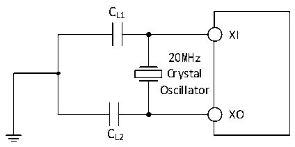

<!-- source-page: 34 -->

[← p.33](0033.md) · [index](../README.md) · [PDF p.34](https://ch32-riscv-ug.github.io/CH32X315/datasheet_zh/CH32X315DS0.PDF#page=34) · [p.35 →](0035.md)

<!-- header: CH32X315、X305数据手册 https://wch.cn -->
电路参考设计及要求：  
晶体的负载电容以晶体厂商建议为准，通常情况CL1= CL2。  

图3-5 外接20M晶体典型电路  
 <!-- rendered from the PDF; verify at https://ch32-riscv-ug.github.io/CH32X315/datasheet_zh/CH32X315DS0.PDF#page=34 -->

🖼 Text parsed from the figure above

CL1  
XI  
20MHz  
Crystal  
Oscillator  
XO  
CL2  

### 3.3.6 内部时钟源特性

<!-- p34-table-001 (table-3-11@1) -->
<table><caption>表3-11 内部高速（HSI）RC振荡器特性</caption><tr><th>符号</th><th>参数</th><th>条件</th><th>最小值</th><th>典型值</th><th>最大值</th><th>单位</th></tr><tr><td style="text-align:left">FHSI</td><td>频率（校准后）</td><td></td><td></td><td>20</td><td></td><td>MHz</td></tr><tr><td style="text-align:left">DuCy HSI</td><td>占空比（Duty cycle）</td><td></td><td>45</td><td>50</td><td>55</td><td>%</td></tr><tr><td rowspan="2" style="text-align:left">ACCHSI</td><td rowspan="2">HSI振荡器的精度（校准后）</td><td style="text-align:left">T = 0℃～70℃ A</td><td>-1.5</td><td></td><td>1.8</td><td>%</td></tr><tr><td style="text-align:left">T = -40℃～85℃ A</td><td>-2.2</td><td></td><td>2.2</td><td>%</td></tr><tr><td style="text-align:left">t SU（HSI）</td><td>HSI振荡器启动稳定时间</td><td></td><td></td><td>2</td><td>12</td><td>us</td></tr><tr><td style="text-align:left">IDD（HSI）</td><td>HSI振荡器功耗</td><td></td><td>180</td><td>230</td><td>280</td><td>uA</td></tr></table>

<!-- p34-table-002 (table-3-12@1) -->
<table><caption>表3-12 内部低速（LSI）RC振荡器特性</caption><tr><th>符号</th><th>参数</th><th>条件</th><th>最小值</th><th>典型值</th><th>最大值</th><th>单位</th></tr><tr><td style="text-align:left">FLSI</td><td>频率</td><td></td><td>25</td><td>40</td><td>60</td><td>kHz</td></tr><tr><td style="text-align:left">DuCy LSI</td><td>占空比（Duty cycle）</td><td></td><td>45</td><td>50</td><td>55</td><td>%</td></tr><tr><td style="text-align:left">t SU（LSI）</td><td>LSI振荡器启动稳定时间（1）</td><td></td><td></td><td>230</td><td></td><td>us</td></tr><tr><td style="text-align:left">IDD（LSI）</td><td>LSI振荡器功耗</td><td></td><td></td><td>1</td><td></td><td>uA</td></tr></table>

注：1.寄存器RCC_RSTSCKR LSION位置1，等待LSIRDY置1。  

### 3.3.7 从低功耗模式唤醒的时间

<!-- p34-table-003 (table-3-13@1) -->
<table><caption>表3-13 低功耗模式唤醒的时间</caption><tr><th>符号</th><th>参数</th><th>条件</th><th>典型值</th><th>单位</th></tr><tr><td style="text-align:left">t wusleep</td><td>从睡眠模式唤醒</td><td>使用HSI RC时钟唤醒</td><td>0.48</td><td>us</td></tr><tr><td rowspan="2" style="text-align:left">t wustop</td><td>从停止模式唤醒（LDO处于正常模式）</td><td>HSI RC时钟唤醒</td><td>6.6</td><td>us</td></tr><tr><td>从停止模式唤醒（LDO为低功耗模式）</td><td style="text-align:left">LDO从低功耗模式唤醒时间 + HSI RC时钟唤醒</td><td>22.05</td><td>us</td></tr></table>

### 3.3.8 存储器特性

<!-- p34-table-004 (table-3-14@1) pages 34-35 -->
<table><caption>表3-14 闪存存储器特性</caption><tr><th>符号</th><th>参数</th><th>条件</th><th>最小值</th><th>典型值</th><th>最大值</th><th>单位</th></tr><tr><td style="text-align:left">t prog_page</td><td>页（256字节）编程时间</td><td style="text-align:left">T = -40℃～85℃ A</td><td></td><td>1.5</td><td></td><td>ms</td></tr><tr><td style="text-align:left">t erase_sec</td><td>扇区擦除时间</td><td style="text-align:left">T = -40℃～85℃ A</td><td></td><td>3</td><td></td><td>ms</td></tr><tr><td style="text-align:left">t erase_32k</td><td>块擦除时间</td><td style="text-align:left">T = -40℃～85℃ A</td><td></td><td>3</td><td></td><td>ms</td></tr></table>

<!-- image: p34-draw-image-00001 bbox=[502.8, 786.36, 522.24, 796.68] -->
<!-- footer: V1.2 32 -->
