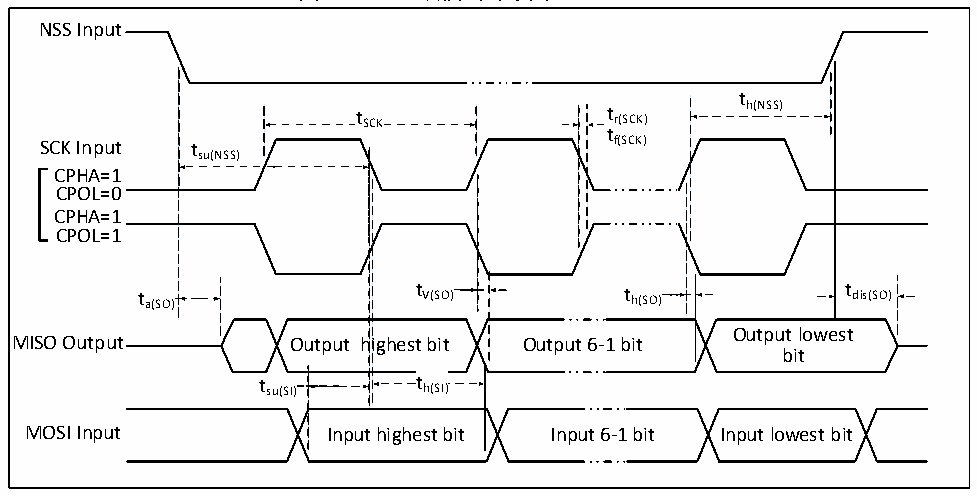

<!-- source-page: 40 -->

[← p.39](0039.md) · [index](../README.md) · [PDF p.40](https://ch32-riscv-ug.github.io/CH32X315/datasheet_zh/CH32X315DS0.PDF#page=40) · [p.41 →](0041.md)

<!-- header: CH32X315、X305数据手册 https://wch.cn -->

图3-11 SPI从模式时序图（CPHA=1）  
 <!-- rendered from the PDF; verify at https://ch32-riscv-ug.github.io/CH32X315/datasheet_zh/CH32X315DS0.PDF#page=40 -->

🖼 Text parsed from the figure above

NSS Input  
t  
t SCK t r(SCK) h(NSS)  
t  
SCK Input tsu(NSS) f(SCK)  
CPHA=1  
CPOL=0  
CPHA=1  
CPOL=1  
t a(SO) t V(SO) t h(SO) t dis(SO)  
Output lowest  
MISO Output Output highest bit Output 6-1 bit  
bit  
t su(SI)  
t h(SI)  th(SI)  
MOSI Input Input highest bit Input 6-1 bit Input lowest bit  

<!-- p40-table-003 (table-3-22@1) -->
<table><caption>表3-22 SPI接口特性</caption><tr><th>符号</th><th>参数</th><th colspan="2">条件</th><th>最小值</th><th>最大值</th><th>单位</th></tr><tr><td rowspan="2" style="text-align:left">f /t SCK SCK</td><td rowspan="2">SPI时钟频率</td><td colspan="2">主模式</td><td></td><td>100</td><td>MHz</td></tr><tr><td colspan="2">从模式</td><td></td><td>100</td><td>MHz</td></tr><tr><td style="text-align:left">t /t r（SCK） f（SCK）</td><td>SPI时钟上升和下降时间</td><td colspan="2">负载电容：C = 30pF</td><td></td><td>8</td><td>ns</td></tr><tr><td style="text-align:left">t SU（NSS）</td><td>NSS建立时间</td><td colspan="2">从模式</td><td style="text-align:left">2*t PCLK</td><td></td><td>ns</td></tr><tr><td style="text-align:left">t h（NSS）</td><td>NSS保持时间</td><td colspan="2">从模式</td><td style="text-align:left">2*t PCLK</td><td></td><td>ns</td></tr><tr><td style="text-align:left">t /t w（SCKH） w（SCKL）</td><td>SCK高电平和低电平时间</td><td colspan="2" style="text-align:left">主模式，f = 24MHz， PCLK预分频系数=4</td><td>70</td><td>97</td><td>ns</td></tr><tr><td rowspan="2" style="text-align:left">t SU（MI）</td><td rowspan="3">数据输入建立时间</td><td rowspan="2">主模式</td><td>HSRXEN = 0</td><td>9</td><td></td><td>ns</td></tr><tr><td>HSRXEN = 1</td><td style="text-align:left">9-0.5*t SCK</td><td></td><td>ns</td></tr><tr><td style="text-align:left">t SU（SI）</td><td colspan="2">从模式</td><td>4</td><td></td><td>ns</td></tr><tr><td rowspan="2" style="text-align:left">t h（MI）</td><td rowspan="3">数据输入保持时间</td><td rowspan="2">主模式</td><td>HSRXEN = 0</td><td>-4</td><td></td><td>ns</td></tr><tr><td>HSRXEN = 1</td><td style="text-align:left">0.5*t -4SCK</td><td></td><td>ns</td></tr><tr><td style="text-align:left">t h（SI）</td><td colspan="2">从模式</td><td>4</td><td></td><td>ns</td></tr><tr><td style="text-align:left">t a（SO）</td><td>数据输出访问时间</td><td colspan="2" style="text-align:left">从模式，f = 20MHz PCLK</td><td>0</td><td style="text-align:left">1*t PCLK</td><td>ns</td></tr><tr><td style="text-align:left">t dis（SO）</td><td>数据输出禁止时间</td><td colspan="2">从模式</td><td>0</td><td>9</td><td>ns</td></tr><tr><td style="text-align:left">t V（SO）</td><td rowspan="2">数据输出有效时间</td><td colspan="2">从模式（使能边沿之后）</td><td></td><td>9</td><td>ns</td></tr><tr><td style="text-align:left">t V（MO）</td><td colspan="2">主模式（使能边沿之后）</td><td></td><td>5</td><td>ns</td></tr><tr><td style="text-align:left">t h（SO）</td><td rowspan="2">数据输出保持时间</td><td colspan="2">从模式（使能边沿之后）</td><td>8</td><td></td><td>ns</td></tr><tr><td style="text-align:left">t h（MO）</td><td colspan="2">主模式（使能边沿之后）</td><td>0</td><td></td><td>ns</td></tr></table>

### 3.3.14 USB PD接口特性

<!-- p40-table-004 (table-3-23-1@1) pages 40-41 -->
<table><caption>表3-23-1 PD接口I/O特性</caption><tr><th>符号</th><th>参数</th><th>条件</th><th>最小值</th><th>典型值</th><th>最大值</th><th>单位</th></tr><tr><td style="text-align:left">t Rise</td><td>上升时间</td><td style="text-align:left">幅度10%到90%之间的时间， 最小值为无负载条件下的时间</td><td>300</td><td>400</td><td></td><td>ns</td></tr><tr><td style="text-align:left">t Fall</td><td>下降时间</td><td style="text-align:left">幅度10%到90%之间的时间， 最小值为无负载条件下的时间</td><td>300</td><td>400</td><td></td><td>ns</td></tr><tr><td style="text-align:left">VSwing</td><td style="text-align:left">输出电压摆幅 （峰-峰值）</td><td></td><td>1.04</td><td>1.12</td><td>1.20</td><td>V</td></tr></table>

<!-- image: p40-draw-image-00001 bbox=[502.8, 786.36, 522.24, 796.68] -->
<!-- footer: V1.2 38 -->
