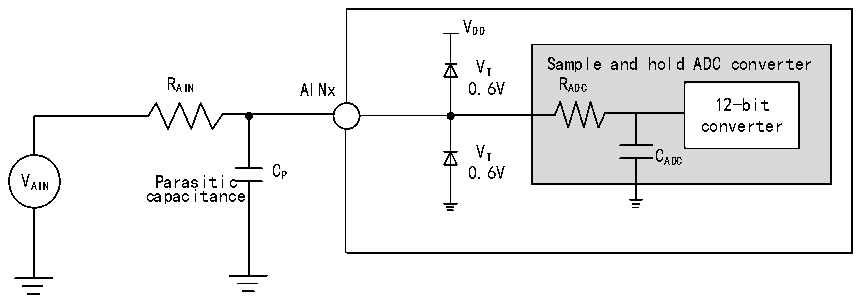
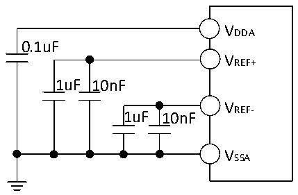

<!-- source-page: 43 -->

[← p.42](0042.md) · [index](../README.md) · [PDF p.43](https://ch32-riscv-ug.github.io/CH32X315/datasheet_zh/CH32X315DS0.PDF#page=43) · [p.44 →](0044.md)

<!-- header: CH32X315、X305数据手册 https://wch.cn -->

<!-- p43-table-001 (table-3-27@1) -->
<table><caption>表3-27 ADC误差（fADC= 80MHz）</caption><tr><th>符号</th><th>参数</th><th>条件</th><th>最小值</th><th>典型值</th><th>最大值</th><th>单位</th></tr><tr><td>ET</td><td>整体误差</td><td rowspan="3" style="text-align:left">R ＜ 1kΩ, AIN V = 3.3VDDA</td><td></td><td>±3.5</td><td></td><td rowspan="3">LSB</td></tr><tr><td>ED</td><td>微分非线性误差</td><td></td><td>±3</td><td></td></tr><tr><td>EL</td><td>积分非线性误差</td><td></td><td>±4</td><td></td></tr></table>

注：以上均为设计参数保证。  
Cp 表示PCB与焊盘上的寄生电容（大约5pF），可能与焊盘和PCB布局质量有关。较大的Cp 数值将  
降低转换精度，解决办法是降低fADC 值。  

图3-23 ADC典型连接图  
 <!-- rendered from the PDF; verify at https://ch32-riscv-ug.github.io/CH32X315/datasheet_zh/CH32X315DS0.PDF#page=43 -->

🖼 Text parsed from the figure above

VDD  
VT Sample and hold ADC converter  
R AIN AINx 0.6V R ADC  
12-bit  
converter  
V T C ADC  
VAIN Parasitic C P 0.6V  
capacitance  

图3-24 模拟电源及退耦电路参考  
 <!-- rendered from the PDF; verify at https://ch32-riscv-ug.github.io/CH32X315/datasheet_zh/CH32X315DS0.PDF#page=43 -->

🖼 Text parsed from the figure above

VDDA  
0.1uF  
VREF+  
1uF 10nF  
VREF-  
1uF 10nF  
VSSA  

<!-- image: p43-draw-image-00001 bbox=[502.8, 786.36, 522.24, 796.68] -->
<!-- footer: V1.2 41 -->
