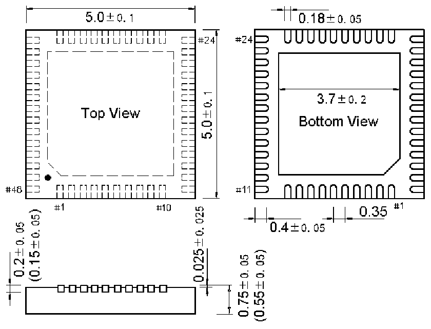
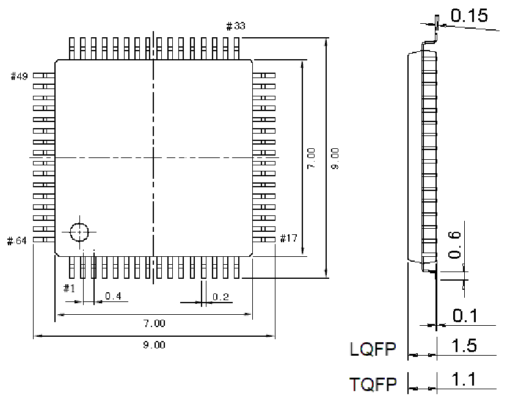

<!-- source-page: 46 -->

[← p.45](0045.md) · [index](../README.md) · [PDF p.46](https://ch32-riscv-ug.github.io/CH32X315/datasheet_zh/CH32X315DS0.PDF#page=46) · [p.47 →](0047.md)

<!-- header: CH32X315、X305数据手册 https://wch.cn -->

## 4.3 QFN48封装

 <!-- p46-draw-image-00002 rendered from the PDF -->

## 4.4 LQFP64封装

 <!-- p46-draw-image-00003 rendered from the PDF -->

<!-- image: p46-draw-image-00001 bbox=[502.8, 779.28, 522.24, 789.6] -->
<!-- footer: V1.2 44 -->
