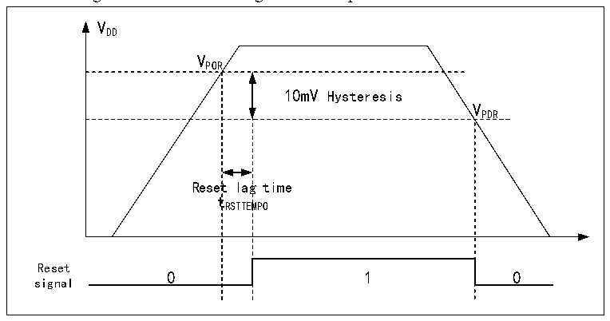

<!-- source-page: 8 -->

[← p.7](0007.md) · [index](../README.md) · [PDF p.8](https://ch32-riscv-ug.github.io/CH32X315/datasheet_en/CH32X315RM.PDF#page=8) · [p.9 →](0009.md)

<!-- header: CH32X315/X305 Reference Manual https://wch-ic.com -->

# Chapter 2 Power Control (PWR)

## 2.1 Overview

The system operating voltage VDD range is 2.8~3.6V, which supplies power to I/O pins, system voltage regulator  
LDO and built-in USB2.0 PHY. During normal operation, VDD supplies power to the built-in system voltage  
regulator LDO and outputs regulated power on the VDDK pin.  
VDDK powers the core circuitry and the built-in USB3.0 PHY.  
VDDA supplies power to the high-frequency RC oscillator, ADC, and analog portion of the PLL. The VDDA voltage  
must be the same as the VDD voltage.  
VREF+ and VREF- serve as the positive and negative reference voltages of the ADC respectively, and VREF+ must not  
be higher than the VDDA voltage.  

## 2.2 Power Management

### 2.2.1 Power-on Reset and Power-down Reset

The system integrated a power-on reset POR and a power-down reset PDR circuit. When the chip supply voltage  
VDD falls below the corresponding threshold voltage, the system is reset by the relevant circuit, and no additional  
external reset circuit is required. Please refer to the corresponding datasheet for the parameters of the power-on  
threshold voltage VPOR and the power-down threshold voltage VPDR.  

Figure 2-1 Schematic diagram of the operation of POR and PDR  
 <!-- rendered from the PDF; verify at https://ch32-riscv-ug.github.io/CH32X315/datasheet_en/CH32X315RM.PDF#page=8 -->

🖼 Text parsed from the figure above

VDD  
VPOR  
10mV Hysteresis  Reset  lag t RSTTEM  g time MPO  
VPDR  
tRSTTEMPO  
Reset  
signal  

### 2.2.2 Programmable Voltage Detector

The programmable voltage detector, PVD, is mainly used to monitor the change of the main power supply of the  
system, compared with the threshold voltage set by PLS[10] of the power control register PWR_CTLR, can be  
generated in order to notify the system to carry out the pre-dropout operation.  
The specific configuration is as follows:  
1) Set the PLS[1:0] fields of the PWR_CTLR register to select the voltage threshold to be monitored.  
2) Set the PVDE bit of the PWR_CTLR register to enable the PVD function.  
4) Read the PVD0 bit of PWR_CSR status register to obtain the relationship between the current system main  
<!-- image: p8-draw-image-00001 bbox=[506.76, 783.48, 526.2, 793.8] -->
<!-- footer: V1.1 6 -->
