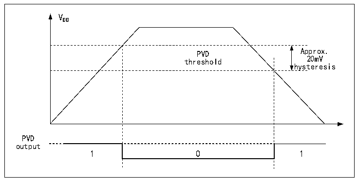

<!-- source-page: 9 -->

[← p.8](0008.md) · [index](../README.md) · [PDF p.9](https://ch32-riscv-ug.github.io/CH32X315/datasheet_en/CH32X315RM.PDF#page=9) · [p.10 →](0010.md)

<!-- header: CH32X315/X305 Reference Manual https://wch-ic.com -->
power supply and the threshold value set by PLS[1:0], and perform the corresponding soft processing. When the  
VDD voltage is higher than the PLS[1:0] setting threshold, the PVD0 position is 0; when the VDD voltage is lower  
than the PLS[1:0] setting threshold, the PVD0 position is 1.  

Figure 2-2 Schematic diagram of PVD operation  
 <!-- rendered from the PDF; verify at https://ch32-riscv-ug.github.io/CH32X315/datasheet_en/CH32X315RM.PDF#page=9 -->

🖼 Text parsed from the figure above

VDD  
PVD threshold  0  
hysteresis  
PVD  
output  

## 2.3 Low-power Modes

After a system reset, the microcontroller is in a normal operating state (run mode), where system power can be  
saved by reducing the system main frequency or turning off the unused peripheral clock or reducing the operating  
peripheral clock. If the system does not need to work, you can set the system to enter low-power mode and let the  
system jump out of this state by specific events.  
Microcontrollers currently offer 2 low-power modes, divided in terms of operating differences between processors,  
peripherals, voltage regulators, etc.  
● Sleep mode: The core stops running and all peripherals (including core private peripherals) are still running.  
● Stop mode: Stops all clocks and the system continues to run after waking up.  

<!-- p9-table-002 (table-2-1@1) -->
<table><caption>Table 2-1 Low-power mode list</caption><tr><th>Mode</th><th>Entry</th><th>Wake-up source</th><th>Effect on clock</th><th>Voltage regulator</th></tr><tr><td rowspan="2">SLEEP</td><td>WFI</td><td>Any interrupt</td><td rowspan="2" style="text-align:left">Core clock OFF, no effect on other clocks</td><td rowspan="2">Normal</td></tr><tr><td>WFE</td><td>Wake-up event</td></tr><tr><td>STOP</td><td style="text-align:left">Set SLEEPDEEP to 1 WFI or WFE</td><td style="text-align:left">Any external interrupt/event (EXTI signal), external reset signal on NRST, IWDG reset, where the EXTI signal includes one of the 64 external I/O ports, the output of PVD, RTC alarm clock, USBPD wake-up signal, USART wake-up signal or USB wake-up signal.</td><td style="text-align:left">Disable HSE, HIS, PLL and peripheral clock</td><td style="text-align:left">Normal: LPDS=0 or low-power consumption: LPDS=1</td></tr></table>

<!-- image: p9-draw-image-00001 bbox=[506.76, 783.48, 526.2, 793.8] -->
<!-- footer: V1.1 7 -->
