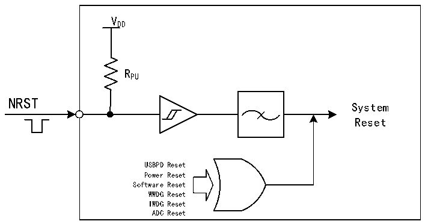

<!-- source-page: 14 -->

[← p.13](0013.md) · [index](../README.md) · [PDF p.14](https://ch32-riscv-ug.github.io/CH32X315/datasheet_en/CH32X315RM.PDF#page=14) · [p.15 →](0015.md)

<!-- header: CH32X315/X305 Reference Manual https://wch-ic.com -->
ADC reset: With the ADC Watchdog reset enabled, ADC reset occurs when ADC data is greater than the  
watchdog high threshold or less than the watchdog low threshold.  

Figure 3-1 System reset structure  
 <!-- rendered from the PDF; verify at https://ch32-riscv-ug.github.io/CH32X315/datasheet_en/CH32X315RM.PDF#page=14 -->

🖼 Text parsed from the figure above

VDD  
RPU  
NRST  
System  
Reset  
USBPD Reset  
Power Reset  
Software Reset  
WWDG Reset  
IWDG Reset  
ADC Reset  

<!-- image: p14-draw-image-00001 bbox=[511.32, 783.48, 530.76, 793.8] -->
<!-- footer: V1.1 12 -->
