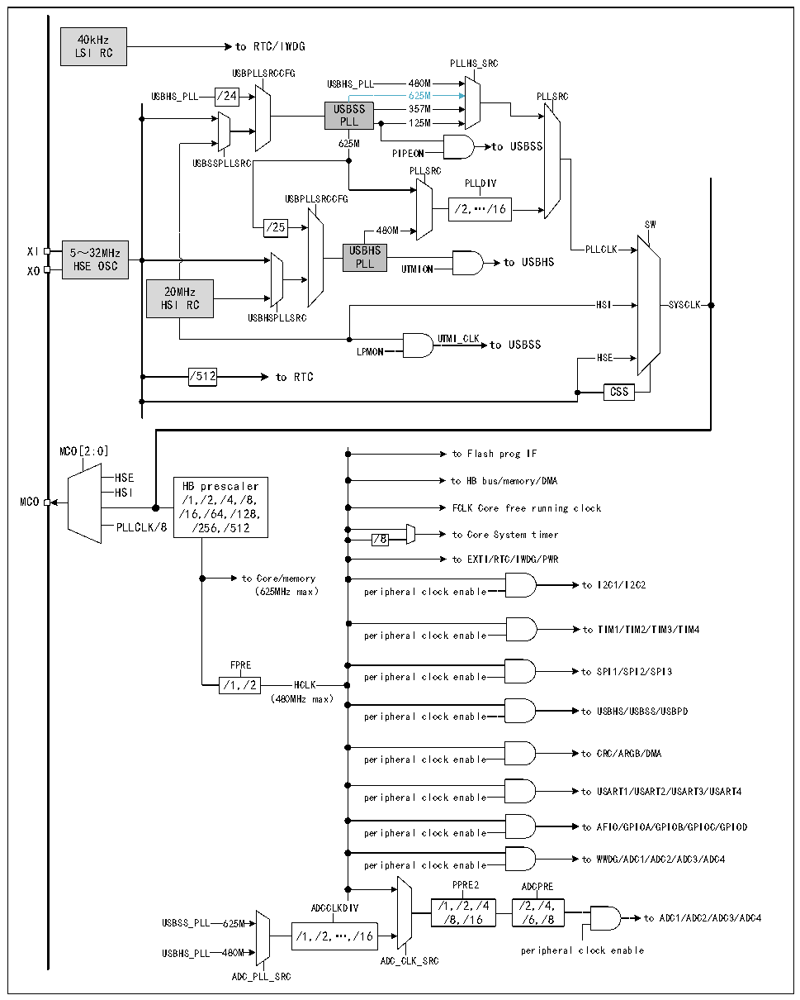

<!-- source-page: 15 -->

[← p.14](0014.md) · [index](../README.md) · [PDF p.15](https://ch32-riscv-ug.github.io/CH32X315/datasheet_en/CH32X315RM.PDF#page=15) · [p.16 →](0016.md)

<!-- header: CH32X315/X305 Reference Manual https://wch-ic.com -->

## 3.3 Clock

### 3.3.1 System Clock Structure

Figure 3-2 Clock tree block diagram  
 <!-- rendered from the PDF; verify at https://ch32-riscv-ug.github.io/CH32X315/datasheet_en/CH32X315RM.PDF#page=15 -->

🖼 Text parsed from the figure above

40kHz  
to RTC/IWDG  
LSI RC  
PLLHS_SRC  
USBPLLSRCCFG  
USBHS_PLL 480M  
USBHS_PLL /24 625M PLLSRC  
USBSS 357M  
PLL 125M  
625M to USBSS  
PIPEON  
USBSSPLLSRC  
PLLSRC  
PLLDIV  
USBPLLSRCCFG  
/2,…/16  
/25 480M SW  
XI 5～32MHz USBHS PLLCLK  
XO HSE OSC PLL UTMION to USBHS  
20MHz  
HSI RC HSI SYSCLK  
USBHSPLLSRC  
UTMI_CLK to USBSS  
LPMON  
HSE  
/512 to RTC  
CSS  
MCO[2:0] to Flash prog IF  
HSE HB prescaler to HB bus/memory/DMA  
HB prescaler /1,/2,/4,/8, /16,/64,/128, /256,/512  PLLCLK/8  PLLCLK/8  
/16,/64,/128, FCLK Core free running clock  
/8 to Core System timer  
to EXTI/RTC/IWDG/PWR  
to Core/memory  
to I2C1/I2C2  
（625MHz max） peripheral clock enable  
to TIM1/TIM2/TIM3/TIM4  
peripheral clock enable  
FPRE  
peripheral clock enable to SPI1/SPI2/SPI3  
/1,/2 HCLK  
（480MHz max）  
to USBHS/USBSS/USBPD  
peripheral clock enable  
to CRC/ARGB/DMA  
peripheral clock enable  
to USART1/USART2/USART3/USART4  
peripheral clock enable  
to AFIO/GPIOA/GPIOB/GPIOC/GPIOD  
peripheral clock enable  
to WWDG/ADC1/ADC2/ADC3/ADC4  
peripheral clock enable  
PPRE2 ADCPRE  
ADCCLKDIV /1,/2,/4 /2,/4,  
USBSS_PLL 625M /8,/16 /6,/8 to ADC1/ADC2/ADC3/ADC4  
/1,/2,…,/16  
USBHS_PLL 480M peripheral clock enable  
ADC_CLK_SRC  
ADC_PLL_SRC  

Note: The blue marked part in the above picture only applies to chips whose fifth digit of the lot number is greater  
than 0.  
<!-- image: p15-draw-image-00001 bbox=[511.32, 783.48, 530.76, 793.8] -->
<!-- footer: V1.1 13 -->
