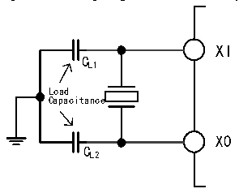
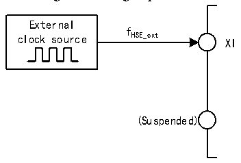

<!-- source-page: 16 -->

[← p.15](0015.md) · [index](../README.md) · [PDF p.16](https://ch32-riscv-ug.github.io/CH32X315/datasheet_en/CH32X315RM.PDF#page=16) · [p.17 →](0017.md)

<!-- header: CH32X315/X305 Reference Manual https://wch-ic.com -->

### 3.3.2 High-speed Clock (HIS/HSE)

HSI is a high-speed clock signal generated by the RC oscillator of 20MHz in the system. The HIS RC oscillator  
can provide the system clock without any external devices. Its start-up time is very short, but the clock frequency  
accuracy is poor. The HSI is turned on and off by setting the HSION bit in the RCC_CTLR register, and the  
HSIRDY bit indicates whether the HSIRC oscillator is stable. The system defaults to HSION and HSIRDY setting  
1 (it is recommended that you do not turn it off). If the HSIRDYIE bit of the RCC_INTR register is set, the  
corresponding interrupt will be generated.  
<em>Note: If the HSE crystal oscillator fails, the HSI clock will be used as a backup clock source (clock security</em>  
<em>system).</em>  
HSE is an external high-speed clock signal, including external crystal/ceramic resonator generation or external  
high-speed clock input.  
● External Crystal/Ceramic Resonator (HSE Crystal): An external oscillator provides a more accurate clock  
source for the system. Further information can be found in the Electrical Characteristics section of the data  
sheet. The HSE crystal can be turned on and off by setting the HSEON bit in the RCC_CTLR register. The  
HSERDY bit indicates whether the HSE crystal oscillation is stable. The hardware only sends the clock to  
the system after the HSERDY bit is set to 1.  
If the HSERDYIE bit in the RCC_INTR register is set, the appropriate interrupt will be generated.  

Figure 3-3 High-speed external crystal circuit  
 <!-- rendered from the PDF; verify at https://ch32-riscv-ug.github.io/CH32X315/datasheet_en/CH32X315RM.PDF#page=16 -->

🖼 Text parsed from the figure above

XI  
CL1  
Load  
Capacitance  
XO  
CL2  

<em>Note: The load capacitance needs to be as close as possible to the oscillator pins and the capacitance value</em>  
<em>selected according to the crystal manufacturer&#x27;s parameters.</em>  
● External High Speed Clock Source (HSE Bypass): this mode feeds the clock source directly from the  
external source to the OSC_IN pin, with the OSC_OUT pin dangling. A maximum frequency of 25MHz is  
supported. The application program needs to set the HSEBYP bit to turn on the HSE bypass function with  
the HSEON bit at 0, and then set the HSEON bit again.  

Figure 3-4 High-speed clock source circuit  
 <!-- rendered from the PDF; verify at https://ch32-riscv-ug.github.io/CH32X315/datasheet_en/CH32X315RM.PDF#page=16 -->

🖼 Text parsed from the figure above

External  
f  
clock source HSE_ext  
XI  
(Suspended)  

<!-- image: p16-draw-image-00001 bbox=[511.32, 783.48, 530.76, 793.8] -->
<!-- footer: V1.1 14 -->
